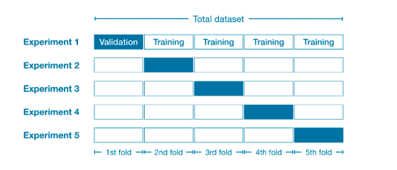

<samp>

# A Unified Theory of ML/AI

## Table of Contents

- [A Unified Theory of ML/AI](#a-unified-theory-of-mlai)
  - [Table of Contents](#table-of-contents)
  - [ML Engineering \& ML Lifecycle](#ml-engineering--ml-lifecycle)
  - [Pre-processing](#pre-processing)
    - [Understanding the Data](#understanding-the-data)
    - [Handling Missing Data](#handling-missing-data)
    - [Data Cleaning](#data-cleaning)
    - [Scaling/Normalization](#scalingnormalization)
    - [Data Leakage](#data-leakage)
    - [Encoding Categorical Variables](#encoding-categorical-variables)
    - [Splitting Data \& Cross Validation](#splitting-data--cross-validation)
    - [Handling imbalanced datasets](#handling-imbalanced-datasets)
  - [Feature Engineering](#feature-engineering)
    - [PCA](#pca)
  - [Model Training](#model-training)
    - [Model Selection](#model-selection)
    - [Model Performance](#model-performance)
    - [Metrics](#metrics)
      - [Accuracy](#accuracy)
      - [F1](#f1)
      - [Precision](#precision)
      - [Recall](#recall)
      - [ROC](#roc)
      - [Mean squared error](#mean-squared-error)
      - [R²](#r)
      - [Log-likelihood](#log-likelihood)
  - [Machine Learning Models](#machine-learning-models)
    - [Linear Regression](#linear-regression)
    - [Logistic Regression](#logistic-regression)
    - [Multiple Logistic Regression](#multiple-logistic-regression)
    - [Support Vector Machines](#support-vector-machines)
    - [Tree-Based Models](#tree-based-models)
    - [Neural Networks](#neural-networks)
    - [Transfer Learning](#transfer-learning)
  - [Mathematics](#mathematics)
    - [Linear Algebra](#linear-algebra)
      - [Importance of linear dependence and independence: Linear Algebra](#importance-of-linear-dependence-and-independence-linear-algebra)
    - [Statistics](#statistics)

## ML Engineering & ML Lifecycle

- Scoping
  - Define which type of problem to work on
  - Decide on key metrics: accuracy, latency, throughput
  - Estimate resources and timeline
- [Data](#pre-processing)
  - Define data: is data labeled consistently? How to performance data normalization?
  - Stablish baseline
  - Label and organize data
- Modeling ([Model Training](#model-training) & [Machine Learning Models](#machine-learning-models))
  - Code
  - Optimizing the hyperparameters and the data: high performing model
- Deployment
  - Deploy in production: Prediction Server API responding the prediction output
  - Monitor & mantain system
  - Concept and data drift: how has the (test) data changed?
    - Concept drift occurs when the relationship between the input data (x) and the target variable (y) changes over time.
      - e.g. when the price of a house changes over time due to factors like inflation or a change in the market, even if the size of the house remains the same
    - Data drift occurs when the distribution of the input data (x) changes over time, while the relationship between x and y remains the same.
      - e.g. when the input data itself changes, such as people building larger or smaller houses over time, which changes the distribution of house sizes in the data
  - Software engineering issues/checklist
    - It should be ran in realtime or in batch?
    - It runs in the cloud or in the browser/edge?
    - Compute resources: CPU, GPU, memory
    - Latency, throughput (QPS - queries per second) requirements
    - Logging: for analysis and review
    - Security and privacy

## Pre-processing

- **Understanding the Data**: Graph the data, distribution, domain knowledge
- **Handling Missing Data**: Filling missing values (e.g., using mean, median, mode, or interpolation).
- **Data Cleaning**: Removing duplicates, fixing incorrect labels, correcting inconsistencies.
- **Scaling/Normalization**: Standardizing or normalizing numerical features to ensure consistency.
- **Data Leakage**: Separate training, validation, and test sets before processing data
- **Encoding Categorical Variables**: Converting categorical data into numerical form (e.g., one-hot encoding, label encoding).
- **Handling Outliers**: Removing or transforming extreme values that may distort the model.
- **Splitting Data & Cross Validation**: Dividing data into training, validation, and test sets.
- **Handling imbalanced datasets**: Using transformations and other techniques.

### Understanding the Data

- Graph the data to analyse the distribution: find if the dataset is asymetrical and if it will generate a bias
- Domain knowledge about the data: understand its features, default values, missing values, the importance or unimportance of each feature
- Correlations: multicollinearity (independent variables in a regression model are highly correlated)
- Mean, Central Limit Theorem, Confidence interval (standard error)

### Handling Missing Data

- Dropping columns with missing values or adding values by infering from the dataset or using default values for a given feature
- Use `SimpleImputer` to fill missing values with the mean
- **Insight**: understand the data so you can reason what's the best decision — using the mean value, 0 or dropping the column

### Data Cleaning

- Removing duplicates
- Fixing incorrect labels
- Correcting inconsistencies
- Formatting the values (e.g. using float when the data is object)

### Scaling/Normalization

- Transformation (via `FunctionTransformer(np.log1p)` for example) is done to adjust the distribution of the dataset
  - e.g. when there's more houses with low prices, it will be difficult to the model learns from houses with high prices (low volume) and predict on the test data
- Standardizing or normalizing numerical features to ensure consistency
- Use separate scalers for X and Y
  - X and Y have different distributions (different scales and meanings)
  - You can scale Y if it's a regression problem. Don't scale if it's a classification problem, since it's categorical
  - Tree-based models like XGBoost, Decision Trees, or Random Forests usually don't need scaling because these models are not sensitive to feature scaling

### Data Leakage

- Data leakage (or leakage) happens when your training data contains information about the target, but similar data will not be available when the model is used for prediction
  - This leads to high performance on the training set (and possibly even the validation data), but the model will perform poorly in production
  - There are two main types of leakage: target leakage and train-test contamination.
- **Target leakage**: occurs when your predictors include data that will not be available at the time you make predictions.
  - e.g. after having pneumonia, a patient usually takes antibiotic medicines, so a "took_antibiotic_medicine" information has a strongl relationship with "got_pneumonia". The value of "took_antibiotic_medicine" is usually changed after the value for got_pneumonia is determined
  - In this case, this feature (or any "variable updated (or created) after the target value") should be excluded from the training and validation set
- **Train-Test Contamination**: when you don't distinguish training data from validation data
  - Validation is meant to be a measure of how the model does on data that it hasn't considered before
  - Running preprocessing before splitting data into train and validation would lead to the model getting good validation scores, giving you great confidence in it, but perform poorly when you deploy it to make decisions
  - The idea is to exclude the validation data from any type of fitting, including the fitting of preprocessing steps
  - A Pipeline helps handling this kind of leakages
- Divide training and test into separate datasets before performing scaling the features
  - The mean and standard deviation used for scaling will be computed from the entire dataset.
  - This means that information from the test set is indirectly influencing the training data.
  - Your model will learn from statistics that it would not have access to in a real-world scenario.
  - This can lead to overfitting and poor generalization.

### Encoding Categorical Variables

- Drop Categorical Variables: This approach will only work well if the columns did not contain useful information.
  - Get all the data without the categorical values: `X.select_dtypes(exclude=['object'])`
- Ordinal Encoding: assigns each unique value to a different integer
  - e.g. `OrdinalEncoder`
- One-Hot Encoding: creates one column for each categorical variable and assigns the value 1 to the column that the example holds (one-hot) and 0 to the other columns
  - e.g. `OneHotEncoder`

### Splitting Data & Cross Validation

- When splitting the data into training and validation, the model can perform well on the 20% validation data and bad in the 80% (or vice-versa)
  - In larger validation sets, there is less randomness ("noise")
- Cross validation makes you do experiments in different folds
  - e.g. Divide training and validation into 80-20
    - Experiment 1: first 20% fold will be the validation set and the other 80% will be the training set
    - Experiment 2: second 20% fold will be the validation set and the other 80% will be the training set
    - The same for the experiments 3, 4, and 5, until it gets to all folds
  - When should you use each approach?
    - For small datasets, where extra computational burden isn't a big deal, you should run cross-validation.
    - For larger datasets, a single validation set is sufficient. Your code will run faster, and you may have enough data that there's little need to re-use some of it for holdout.



- Use `cross_val_score` from `model_selection`:
  - estimator: model or pipeline that implements the `fit` method
  - input `X` and `y`
  - cv: number of folds in cross validation
  - [scoring](https://scikit-learn.org/stable/modules/model_evaluation.html#scoring-parameter): model evaluation rules, e.g. mae, accuracy, recall, mse, etc

### Handling imbalanced datasets

- data augmentation: generating more examples for the ML model to train on (e.g. rotating images)
- oversampling: increase the number of data points of a minority class via synthetic generation
- undersampling: reduces examples from the majority class to balance the number of data points
- ensemble methods: combine multiple individual models to produce a single, more robust, and often more accurate predictive model

## Feature Engineering

### PCA

- Use PCA to reduce dimensionality
  - Always scale the predictors before applying PCA
  - PCA relies on the variance of the data to identify the principal components. If your predictors are on different scales, PCA may disproportionately weigh the features with larger scales
- [ ] What's covariance matrix?
  - A covariance matrix is a square matrix that contains the covariances between pairs of variables in a dataset.
  - Covariance measures the degree to which two variables change together

## Model Training

Analysis

- Model fits the training data well but fail to generalize to new examples
  - The cost is low for the training set because it fits well, but the cost for the test set will be high because it doesn't generalize well
  - Split the dataset into two parts
    - 70%: training set - fit the data
    - 30%: test set - test the model to this data

### Model Selection

Which model is better? It depends on the problem at hand. If the relationship between the features and the response is well approximated by a linear model as in, then an approach such as linear regression will likely work well, and will outperform a method such as a regression tree that does not exploit this linear structure. If instead there is a highly non-linear and complex relationship between the features and the response as indicated by model, then decision trees may outperform classical approaches.


### Model Performance

- Improving model performance and generalization
  - Regularization
  - Dropout
  - More data
  - Data augmentation
  - Early stopping
  - Learning rate decay
- Prefer choosing models that have good cross-validation and test accuracy
  - The test cost estimates how well the model generalizes to new data (compared to the training cost)
  - training/cross-validation/test
    - cross-validation is also called dev or validation set
    - It improves the robustness and reliability of your model evaluation and hyperparameter tuning process
    - Cross-validation involves splitting your training data into multiple subsets (folds). The model is trained on a subset of these folds and then evaluated on the remaining fold. This process is repeated multiple times, with each fold serving as the validation set once. This gives you multiple performance estimates on different "held-out" portions of your training data.
    - By averaging the performance across all the validation folds, you get a more stable and less biased estimate of how well your model is likely to generalize to unseen data compared to relying on a single test set evaluation during development.
  - Good Cross-Validation Accuracy: a good cross-validation accuracy indicates good stability and generalization across different subsets of data
  - Good Test Accuracy: the model generalizes well on unseen data
- Bias/Variance tradeoff
  - High bias: underfit
    - Simple model
    - If the cost of the training set is high, the costs of cross validation and test sets will also be high
    - It doesn't matter if we collect more data, the model is too simple and won't learn more
  - High variance: overfitting
    - Complex model
    - High variability of the model
    - The training cost will be low and the cross validation and test costs will be high
    - Increasing the training size can help training and cross validation error
  - Balanced bias/variance: optimal
    - The costs of training, cross validation, and test will be low: it performs well
  - Model complexity vs Cost 
    - Training cost: when the degrees of the polynomial (or the model complexity) increases, the cost decreases
    - Cross validation cost: with the increase of model, the cost will decrease until one point where the model is overfitting and the cost will start increase again
  - Regularization influence in bias/variance
    - Regularization adds a penalty to the cost function that discourages the model from learning overly complex patterns and prevent overfitting
    - As the lambda increases, the bias gets higher
    - As the lambda decreases, the variance gets higher
    - L1 (Lasso): shrinks the model parameters toward zero
    - L2 (Ridge Regression): add a penalty term to the objective function (loss function) with the intention of keeping the mode parameters smaller and prevent overfitting
    - Elastic net: a combination of L1 and L2 techniques
- Establishing a baseline level of performance
  - Human error (or competing algorithm or guess based on prior experience) as the baseline vs Training Error vs Cross validation error: analyse gaps between these errors
  - High variance: 0.2% gap between baseline and training / 4% gap between training and cross-validation (overfitting to the training data)
    - baseline: 10.6%
    - training: 10.8%
    - cross-validation: 14.8%
  - High bias: 4.4% gap between baseline and training (not performing well) / 0.5% gap between training and cross-validation (performing similarly in training and cross validation)
    - baseline: 10.6%
    - training: 15%
    - cross-validation: 15.5%
- Debugging a learning algorithm
  - Get more training examples -> fixes high variance
  - Try smaller set of features -> fixes high variance
  - Try getting additional features -> fixes high bias
  - Try adding polynomial features -> fixes high bias
  - Try decreasing the regularization term lambda -> fixes high bias
  - Try increasing the regularization term lambda -> fixes high variance
- In classification models, the way to measure performance is based on accuracy, precision, recall (sensitivity), specificity, and f1 score
  - **Precision**: Out of all the instances that the model predicted as positive, how many were actually positive?
    - Precision = TP / (TP + FP)
      - TP = True positive
      - FP = False positive
    - **High Precision**: Indicates that when the model predicts a positive class, it is often correct. This is crucial in applications where the cost of a false positive is high.
    - **Low Precision**: Suggests that the model frequently predicts positive incorrectly, leading to many false alarms.
    - e.g. Cancer tumor is malignant
      - High precision: when the model predicts that cancer tumor is malignant, it's often correct. It's a high change a person has malignant cancer
      - Low precision: the model predicting that a person has malignant cancer is probably incorrect, leading to false alarms, and in this particular case, anxiety
  - **Recall (Sensitivity)**: Measures the proportion of actual positives that were correctly identified.
    - Recall = TP / (TP + FN)
    - True positive: correctly identified as positive
    - False negative: incorrectly identified as negative (it's actually positive)
  - Precision-Recall tradeoff
    - The bigger the threshold, the bigger the precision and smaller the recall
      - Predict Y=1 only if very confident. e.g. a very rare disease
    - The smaller the threshold, the bigger the recall and smaller the precision
      - Avoiding too many cases of rare disease
    - We need to specify the threshold point
  - **F1 Score**: The "harmonic mean" of precision and recall, providing a balance between the two.
    - F1 Score = 2 x (Precision x Recall / (Precision + Recall))
  - Importance in applications: In medical diagnosis, the diseases where a false positive can cause unnecessary stress or treatment, high precision is essential.

### Metrics

#### Accuracy

TODO

#### F1

TODO

#### Precision

TODO

#### Recall

TODO

#### ROC

TODO

#### Mean squared error

```python
def mean_squared_error(y_true, y_pred):
    return np.mean((Y_test - prediction) ** 2)
```

#### R²

R² (coefficient of determination): measures how well your model explains the variance in the target variable

```python
def r2_score(Y_true, Y_pred):
   residual_sum_of_squares = np.sum((Y_true - Y_pred) ** 2)
   total_sum_of_squares = np.sum((Y_true - np.mean(Y_true)) ** 2)
   return 1 - (residual_sum_of_squares / total_sum_of_squares)
```

#### Log-likelihood

TODO

## Machine Learning Models

**Supervised Learning**: Labeled data, finding the right answer

- Linear Regression
- Logistic Regression
- Support Vector Machines
- Decision Trees: XGBoost, LightGBM, CatBoost
- Neural Networks

**Unsupervised Learning**: Unlabeled data, finding patterns

- Clustering: k-means
- Dimensionality Reduction: PCA
- Autoencoders

### Linear Regression

- [ ] How a linear regression behaves
  - Illustration of a graph
  - Equation
  - What do we use to estimates the βs?
- [WIP] add infos here: https://github.com/imteekay/linear-regression

### Logistic Regression

- [ ] How a logistic regression behaves
  - Illustration of a graph
  - Equation
  - What do we use to estimates the βs?
- [WIP] add infos here: https://github.com/imteekay/logistic-regression

### Multiple Logistic Regression

- [ ] How a multiple logistic regression behaves
  - Illustration of a graph
  - Equation
  - What do we use to estimates the βs?

### Support Vector Machines

- [ ] Theory on Support Vector Machines

### Tree-Based Models

- Decision Trees
  - Decision 1: decide which feature to use in the root node
  - Decision 2: when to stop splitting: Making the tree smaller, avoid overfitting
    - when a node is 100% one class
    - when splitting a node will result in the tree exceeding a maximum depth
    - when improvements in purity score are below a threshold
    - when a number of examples in a node is below a threshold
  - Measuring purity
    - Purity: Purity in a decision tree refers to the homogeneity of the labels within a node. A node is considered "pure" if all the data points it contains belong to the same class
    - Entropy is a measure of impurity
      - The smaller the fraction of examples, the more pure it is because it has more examples with the same class
      - The bigger the fraction of examples, the more pure it is because it has more examples with the same class
      - If the fraction is around 0.5, the impurity is high because it doesn't have homoeneity
  - To choose a split or to choose which feature to use first, we need to calculate the information gain (the highest information gain, which will increase the purity of the subsets)
  - The whole process
    - Measure the information gain for the root node to choose the feature
      - Split the dataset into two "nodes" (subtrees) based on the feature
      - Calculate the weight for each subtree for the weighted entropy
        - THe proportion of the number of examples in that child subset relative to the total number of examples in the parent node
      - Calculate the weighted entropy
      - Calculate the information gain
      - Do for each feature to choose the feature with the larger information gain
    - Ask for the left subtree if it can stop the split
      - If so, stop
      - If not, measure the information gain for the this subtree node to choose the feature
    - Ask for the right subtree if it can stop the split
      - If so, stop
      - If not, measure the information gain for the this subtree node to choose the feature
    - Keep doing that until you reach the stop criteria
  - Trees are highly sensitive to small changes of the data: not robust
    - Tree Ensemble: a collection of decision trees
- Tree Ensembles
  - Sampling with replacement
    - Sample an example (with features): selecting individual data points (including their features and the target variable) from your dataset
    - Replace: After an example is selected, it is put back into the original dataset. This means that the same example can be selected again in subsequent sampling steps
    - Sample again and keep doing this process: repeat the selection process multiple times, and each time, the original dataset remains unchanged due to the replacement
  - Decision trees work well in tabular (structured) data but recommended for unstructured data (images, audio, text)
  - Fast and good interpretability
  - In bagging, the trees are grown independently on random samples of the observations. Consequently, the trees tend to be quite similar to each other. Thus, bagging can get caught in local optima and can fail to thoroughly explore the model space.
    - Bagging trains multiple models on different subsets of the training data and combines their predictions to make a final prediction.
    - In classification problems, it uses the mode for the most common label
    - In regression problems, it uses the average of all predictions
  - In random forests, the trees are once again grown independently on random samples of the observations. However, each split on each tree is performed using a random subset of the features, thereby decorrelating the trees, and leading to a more thorough exploration of model space relative to bagging.
    - For B (B = number of trees to be generated), use sampling with replacement to create a new subset, and train a decision tree on the new dataset
    - For big Bs, it won't hurt but will have diminishing returns
    - In the sampling with replacement, it chooses k features out of n (total number of features)
      - k = √n is a very common and often effective default value for k
  - In boosting, we only use the original data, and do not draw any random samples. The trees are grown successively, using a “slow” learning approach: each new tree is fit to the signal that is left over from the earlier trees, and shrunken down before it is used.
    - Boosting trains a series of models where each model tries to correct the mistakes made by the previous model. The final prediction is made by all the models.
    - Similar to random forest, but instead of picking from all m examples, make it increase the weight for misclassified examples from previously trained trees and decrease the weight for correctly classified examples
    - The misclassified examples means that the tree algorithm is not doing quite well for these examples and the model should be training more to correctly classify them
  - In Bayesian Additive Regression Trees (BART), we once again only make use of the original data, and we grow the trees successively. However, each tree is perturbed in order to avoid local minima and achieve a more thorough exploration of the model space.

### Neural Networks

- Activation functions
  - Why do we need activation functions?
    - Using a linear activation function or no activation, the model is just a linear regression
    - If using a linear activation function, the forward prop will be a linear combination leading to an output equivalent to a linear regression
  - Argmax: the largest value in a sequence of numbers
  - Softmax
    - Output the probability for the N classes, so we can compute the loss for each class
    - The largest value in the sequence of probability shows the model prediction
    - The intuition behind the exponentiation: uses exponentiation to compute the probability of each class in a multiclass classification problem
      - Transforms arbitrary real-valued scores into positive values.   
      - Amplifies the differences between scores, emphasizing the most likely class.   
      - Allows for the subsequent normalization step to create a valid probability distribution.
      - Provides mathematical convenience for optimization algorithms like gradient descent.

### Transfer Learning

- Learn parameters with a ML model for a given dataset
- Download the pre-trained parameters
- Train/fine-tune the model on the new data
  - If you first trained in a big dataset, the fine tuning can be done with a smaller dataset
- Training the model
  - Train all model parameters
  - Train only the output parameters, leaving the other parameters of the model fixed

## Mathematics

### Linear Algebra

#### Importance of linear dependence and independence: Linear Algebra

1. Understanding Vector Spaces:
   - Linear Independence: A set of vectors is linearly independent if no vector in the set can be written as a linear combination of the others. This means that each vector adds a new dimension to the vector space, and the set spans a space of dimension equal to the number of vectors.
   - Linear Dependence: If a set of vectors is linearly dependent, then at least one vector in the set can be expressed as a linear combination of the others, meaning the vectors do not all contribute to expanding the space. This reduces the effective dimensionality of the space they span.
2. Basis of a Vector Space:
   - A basis of a vector space is a set of linearly independent vectors that span the entire space. The number of vectors in the basis is equal to the dimension of the vector space. Identifying a basis is essential for understanding the structure of the vector space, and it simplifies operations like solving linear systems, performing coordinate transformations, and more.
3. Dimensionality Reduction:
   - In machine learning, high-dimensional data can often be reduced to a lower-dimensional space without losing significant information. This reduction is based on identifying linearly independent components (e.g., via techniques like PCA). Understanding linear independence helps in determining the minimum number of vectors needed to describe the data fully, leading to more efficient computations and better generalization.
4. Solving Linear Systems:
   - When solving systems of linear equations, knowing whether the vectors (or the columns of a matrix) are linearly independent is critical. If they are independent, the system has a unique solution. If they are dependent, the system may have infinitely many solutions or none, depending on the consistency of the equations.
5. Eigenvalues and Eigenvectors:
   - In linear algebra, the concepts of linear dependence and independence are central to understanding eigenvalues and eigenvectors, which are crucial in many applications, such as in principal component analysis (PCA), stability analysis in differential equations, and more.
6. Geometric Interpretation:
   - Geometrically, linearly independent vectors point in different directions, and no vector lies in the span of the others. This concept is fundamental in understanding the shape and orientation of geometric objects like planes, spaces, and hyperplanes in higher dimensions.
7. Optimizing Computations:
   - In numerical methods, computations are often more efficient when working with linearly independent vectors. For example, when inverting matrices, working with a basis (a set of linearly independent vectors) avoids redundant calculations.
8. Rank of a Matrix:
   - The rank of a matrix is the maximum number of linearly independent column (or row) vectors in the matrix. This concept is crucial in determining the solutions to linear systems, understanding the properties of transformations, and more.

### Statistics

- [ ] Standard Error (SE)
  - How to interpret this concept
  - What's the range of SE?
- [ ] z-statistic
  - How to interpret this concept
  - What's the range of z-statistic?
- [ ] p-value
  - How to interpret this concept: what's the meaning of a low/high p-value
  - What's the range of p-value?
- [ ] collinearity
  - How to interpret this concept
- [ ] probability density
  - How to interpret this concept
    - it describes how the probability of a random variable is distributed over a range of values
- [ ] Degrees of Freedom
- [ ] Bayesian Inference

</samp>
