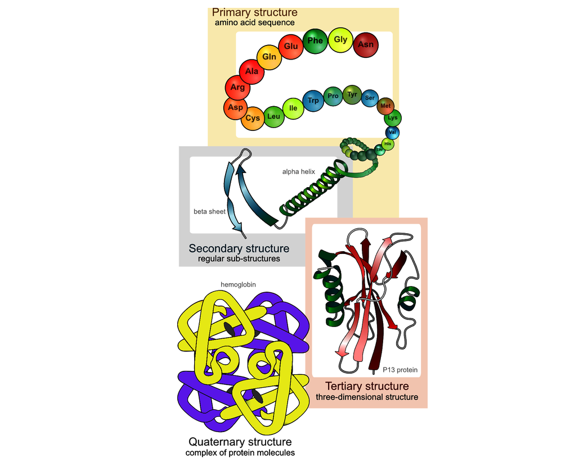

# Deep Learning for Biology

## Success Criteria

**Performance metric (e.g., accuracy, AUC, F1)**: You might aim to match the performance of a human expert, achieve a correlation with experimental results comparable to a technical replicate, or keep the false-positive rate below a certain number.

**Level of interpretability**: In many applications, it’s important not only that a model performs well, but also that its decisions can be understood by domain experts. For instance, you may prioritize well-calibrated uncertainty estimates or interpretable feature attributions, especially when trust and explainability are critical.

**Model size or inference latency**: If your model needs to operate in a resource-constrained environment (e.g., smartphones or embedded devices) or meet real-time throughput targets (e.g., process 20 frames per second), your success criterion might focus on efficiency—such as achieving high performance per floating point operation (FLOP), which measures how effectively the model uses computational resources. In such cases, metrics like inference time, memory usage, or energy consumption may matter more than raw accuracy.

**Training time and efficiency**: When compute is limited—or for educational contexts—you may prioritize fast training or minimal hardware requirements. Since training deep learning models typically involves large matrix operations, they are often accelerated using graphics processing units (GPUs). In low-resource settings, developing a simpler model that trains quickly on a CPU may be a more practical goal than maximizing performance.

**Generalizability**: In some cases, the goal is to build a model that works well across many datasets or tasks, rather than one that is finely tuned to a single benchmark. For example, foundational models—large models trained on broad datasets that can be adapted to many downstream applications—prioritize flexibility and reuse. In such settings, broad applicability may be more valuable than squeezing out the best possible performance on a specific task.

## Invest Heavily in Evaluations

Thinking carefully about precisely how you’ll measure progress—including what metrics you’ll use, how you’ll validate results, and which baselines you’ll compare against. Without a clear, well-designed evaluation strategy, even a technically impressive model can fail to produce meaningful conclusions.

## Designing Baselines

### Classification tasks

**Random prediction**: Assign labels completely at random, with equal probability for each class. This tells you what performance looks like with no information at all.

**Random prediction weighted by class frequencies**: Sample labels randomly, but in proportion to how often they occur in the training data. This is useful for imbalanced datasets.

**Majority class**: Always predict the most common class. This can be a surprisingly hard baseline to beat in highly class imbalanced settings.

**Nearest neighbor**: Predict the label of the most similar example in the training data (e.g., 1-nearest neighbor using Euclidean distance). This is often effective when inputs are low dimensional or well structured.

### Regression tasks

**Mean or median of the target**: Always predict the average or median target value from the training set. This often matches what a model would do if it’s not learning anything meaningful.

**Linear regression with a single feature**: Fit a line using just the strongest individual predictor (e.g., one biomarker). This helps gauge how much a more complex model improves over a simple signal.

**K-nearest neighbor regression**: Predict the target as the average (or weighted average) of the k most similar data points. This is simple to implement and often surprisingly competitive on structured datasets.

### For both

**Simple heuristics**: Use straightforward rules based on domain knowledge. For example, in diagnostics, classify a patient as positive if a single biomarker or measurement exceeds a threshold. For skin cancer images, rank lesions by average pixel intensity. In genomics, if the task is to predict which gene a mutation affects, a simple baseline is to assume it affects the nearest gene in the genome.

## Learning the Language of Proteins

- A protein can be represented as a sequence of its constituent building blocks, called amino acids.
- Proteins use an alphabet of 20 amino acids to form long chains with specific shapes and jobs.
- train a model to predict a protein’s function given its amino acid sequence. For example:
  - Given the sequence of the `COL1A1` collagen protein (`MFSFVDLR...`), we might predict its function is likely `structural` with probability 0.7, `enzymatic` with probability 0.01, and so on.
  - Given the sequence of the `INS` insulin protein (`MALWMRLL...`), we might predict its function is likely `metabolic` with probability 0.6, `signaling` with probability 0.3, and so on.
- Accurate protein function prediction is an extremely challenging problem
  - How amino acid sequence determines 3D structure
  - How structure enables function
  - How these functions operate in the dynamic, crowded environment of the cell.

### Biology Primer 

- A protein’s function is very closely tied to its 3D structure, which in turn is determined by its primary amino acid sequence.
- A gene encodes the primary amino acid sequence of a protein. That sequence determines the protein’s structure, and the structure governs its function.

**Protein Structure**

- **Primary structure**: The linear sequence of amino acids
- **Secondary structure**: Local folding into structural elements such as alpha helices and beta sheets
- **Tertiary structure**: The overall 3D shape formed by the complete amino acid chain
- **Quaternary structure**: The assembly of multiple protein subunits into a functional complex (not all proteins have this)

The importance of amino acids in proteins: a single substitution in the amino acids sequence can dramatically alter how a protein folds or functions—sometimes with serious effects

e.g. Many genetic diseases are caused by such point mutations. An example is sickle cell anemia, which is caused by a single-letter change in the gene for hemoglobin that replaces a hydrophilic amino acid (E) with a hydrophobic one (V), which ultimately leads to misshapen red blood cells.

**Protein Function**

Functions: catalyze chemical reactions, transmit signals, transport molecules, provide structural support, and regulate gene expression

- **Biological process**: This contributes to—like cell division, response to stress, carbohydrate metabolism, or immune signaling.
- **Molecular function**: This describes the specific biochemical activity of the protein itself—such as binding to DNA or ATP (a molecule that stores and transfers energy in cells), acting as a kinase (an enzyme that attaches a small chemical tag called a phosphate group to other molecules to change their activity), or transporting ions across membranes.
- **Cellular component**: This indicates where in the cell the protein usually resides—such as the nucleus, mitochondria, or extracellular space. Although it’s technically a location label and not a function per se, it often provides important clues about the protein’s role (e.g., proteins in the mitochondria are probably involved in energy production).

**Why Predicting Protein Function?**

- **Biotechnology and protein engineering**: If we can reliably predict function from sequence, we can begin to design new proteins with desired properties. This could be useful for designing enzymes for industrial chemistry, therapeutic proteins for medicine, or synthetic biology components.
- **Understanding disease mechanisms**: Many diseases are caused by specific sequence changes (variants, or mutations) that disrupt protein function. A good predictive model can help identify how specific mutations alter function, offering insights into disease mechanisms and potential therapeutic targets.
- **Genome annotation**: As we continue sequencing the genomes of new species, we’re uncovering vast numbers of proteins whose functions remain unknown. For newly identified proteins—especially those that are distantly evolutionarily related to any known ones—computational prediction is essential for assigning functional hypotheses.
- **Metagenomics and microbiome analysis**: When sequencing entire microbial communities, such as gut bacteria or ocean microbiota, many protein-coding genes have no close matches in existing databases. Predicting function from sequence helps uncover the roles of these unknown proteins, advancing our understanding of microbial ecosystems and their effects on hosts or the environment.

### Machine Learning Primer

**Embeddings**

- An embedding is a numerical vector—a list of floating-point numbers—that encodes the meaning or structure of an entity like a word, sentence, or protein sequence. 
- A protein might be represented by an embedding such as [0.1, -0.3, 1.3, 0.9, 0.2], which could capture aspects of its biochemical or structural properties in a compact numerical form.
- Similar inputs result in similar embeddings: protein sequences with similar structure or function — such as collagen I and collagen II — will tend to have embeddings that are close together in what we might call a “protein space.”
