# Understanding Deep Learning

## Table of Contents

- [Understanding Deep Learning](#understanding-deep-learning)
  - [Table of Contents](#table-of-contents)
  - [What's a Neural Network?](#whats-a-neural-network)
  - [Supervised Learning](#supervised-learning)
  - [Why is Deep Learning taking off?](#why-is-deep-learning-taking-off)
  - [Binary Classification](#binary-classification)
  - [Logistic Regression](#logistic-regression)
  - [Logistic Regression Cost Function](#logistic-regression-cost-function)
  - [Gradient Descent](#gradient-descent)
    - [Intuition about Derivatives](#intuition-about-derivatives)
  - [Computation Graph](#computation-graph)
  - [Gradient Descent](#gradient-descent-1)
  - [Vectorization](#vectorization)
  - [Neural Network](#neural-network)
  - [Intuition about deep representation](#intuition-about-deep-representation)
  - [Train, Dev, Test sets](#train-dev-test-sets)
  - [Bias/Variance](#biasvariance)
  - [Basic Recipe for ML](#basic-recipe-for-ml)
  - [Input Normalization](#input-normalization)
  - [Regularization](#regularization)
  - [Mini Batch Gradient Descent](#mini-batch-gradient-descent)
  - [Exponentially Weighted Averages](#exponentially-weighted-averages)
  - [Gradient Descent with Momentum and RMSprop](#gradient-descent-with-momentum-and-rmsprop)
  - [Adam optimization algorithm](#adam-optimization-algorithm)
  - [Learning rate decay](#learning-rate-decay)
  - [Batch Normalization](#batch-normalization)
  - [Computer Vision](#computer-vision)
  - [Edge Detection](#edge-detection)
  - [Padding](#padding)
  - [Stride convolution](#stride-convolution)
  - [Convolutions in 3D images](#convolutions-in-3d-images)
  - [Multiple filters](#multiple-filters)
  - [Convolutional Networks](#convolutional-networks)
  - [Pooling layers](#pooling-layers)
  - [ResNet](#resnet)
  - [Inception Network](#inception-network)
  - [Sequence Models](#sequence-models)
  - [Recurrent Neural Network](#recurrent-neural-network)
  - [RNN Notation \& Dimensions](#rnn-notation--dimensions)
  - [Gated Recurrent Unit (GRU)](#gated-recurrent-unit-gru)
  - [Long short-term memory (LSTM)](#long-short-term-memory-lstm)
  - [Bidirectional RNN](#bidirectional-rnn)
  - [Deep RNN](#deep-rnn)
  - [RNN Implementation](#rnn-implementation)
  - [Transformers \& LLMs](#transformers--llms)
    - [Tokenization](#tokenization)
    - [Bag of Words](#bag-of-words)
    - [Word Embedding](#word-embedding)
    - [Positional Encoding](#positional-encoding)
    - [Attention \& Transformers](#attention--transformers)

## What's a Neural Network?

- For a house price prediction, we want to predict the price of a house based on their sizes
  - The size is the `x` (`x` could also be a combination of size, #bedrooms, zip code (postal code), wealth)
    - The family size, walkability, and school quality will be figure out by the neural network (they are also called `hidden units`)
    - size/#bedrooms: family size
    - zip code: walkability
    - zip code/wealth: school quality
  - The price is the `y`
  - The circle in between is a "neuron" and it implements a function that takes the input (size), compute its linear function, takes a max of zero, and output the estimated price

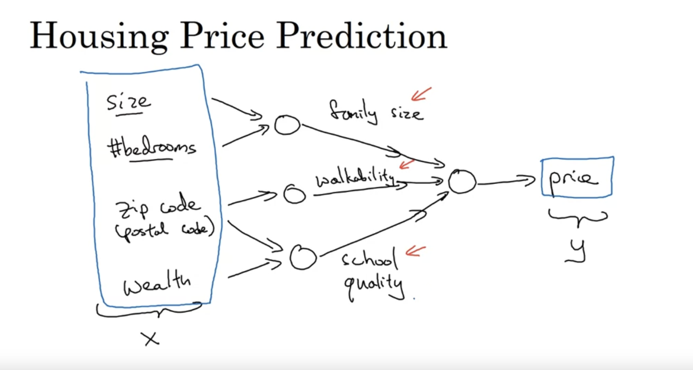

## Supervised Learning

- structure data: e.g. table
- unstructure data: e.g. audio, image, text

## Why is Deep Learning taking off?

- For traditional machine learning algorithms, the performance improves with the increase of the amount of data but it plateaus with huge amounts of data.
- We went from a small amount of data to a huge amount of data (IoT, smartphones)
- From small neural net to a medium to a large neural net, with the increase of data, the performance is getting better and better
- Scale drives the deep learning progress
  - The size of the neural network (a lot of hidden units, parameters, connections)
  - The size of data
  - Scale of computation
  - Better algorithms. e.g. going from sigmoid to relu makes gradient descent runs much faster
  - With all this, the iteration of the idea -> experiment -> code cycle is much faster which also contributes to the deep learning progress

## Binary Classification

- e.g. input as an image -> whether it's cat (1) or non cat (0)

## Logistic Regression

- Given x, we want the y^ (prediction, estimate of y): the P(y=1|x)
  - Given a picture, what's the probability of this picture to be a cat
- Instead of a linear regression, logistic regressions use a sigmoid function to predict a binary classification
  - z = w⋅x+b
  - if 𝜎(𝑧) > 0.5, the model may predict class 1
  - if 𝜎(𝑧) < 0.5, it may predict class 0

## Logistic Regression Cost Function

- The loss function computes the error for a single training example
- The cost function is the average of the loss functions of the entire training set.

## Gradient Descent

- Repeat
  - w = w - α (dJ(w) / dw)
    - α = learning rate
    - J(w) = cost function
    - dJ(w) / dw = how much the cost function changes with respect to w -> the slope of the function

### Intuition about Derivatives

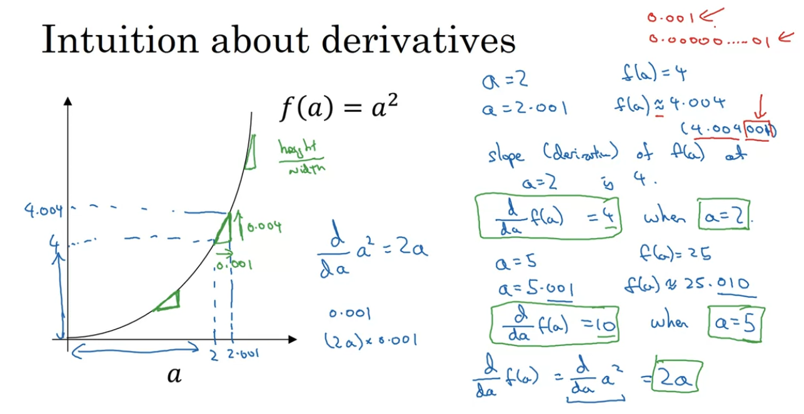

- Derivatives are the slope of a function, in other words, it's how much the function changes if we change its variable
  - How much `f(x)` changes, if we change the `x`
  - The slope is a segment of y (height) divided by the segment of x (width): df(x)/dx
  - For a linear function, the slope is always the same
  - For a exponential, the slope keeps changing. e.g. f(x) = x², the rate of change (derivative) is `2x`, which means that if we shift 1 to the right, we shift 2 upwards. The slope is different for different values of x

## Computation Graph

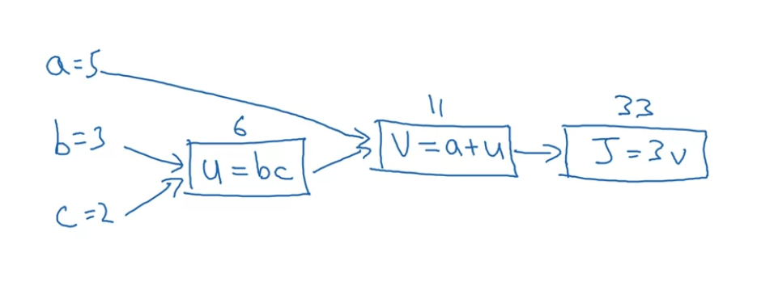

- Computing J
  - J(a, b, c) = 3 (a + bc)
    - bc = u
    - a + bc = v
  - u = bc
  - v = a + u
  - J = 3v
- Computing derivatives
  - Using chain rule to calculate how much one variable changes the output
  - e.g. how much `J` changes if we change `a`
  - dJ/da = dJ/dv * dv/da
    - dJ/dv: how much `J` changes if we change `v`
    - dv/da: how much `v` changes if we change `a`
    - we need to propagate backwards to calculate the derivatives of each

## Gradient Descent

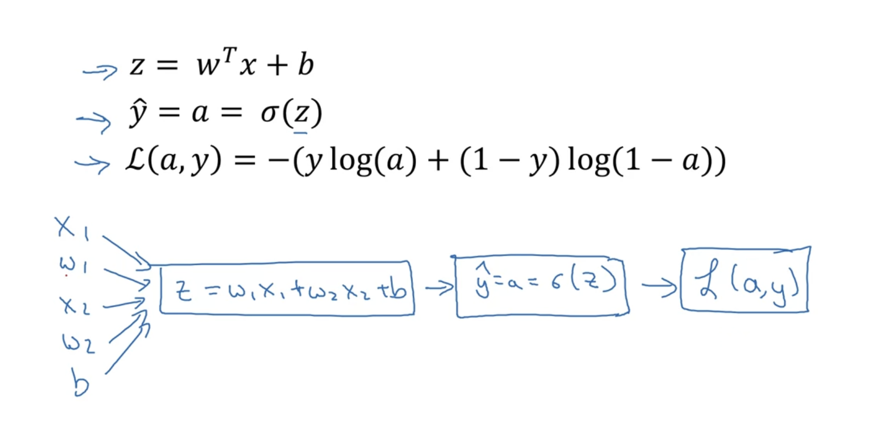

- `z` is the linear transformation: `wt * x + b`
- `a` is the prediction, the activation function applied to `z` (sigmoid in this case)
- The loss function is computed this way with respect to `a`
- We go backwards using the derivative of the loss function with respect to `a`, `z`, `w1`, and `w2`

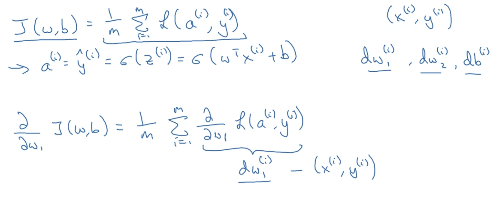

- Cost function `J` is the mean of the sum of all loss functions
- Gradient descent is the derivative of the cost function with respect to the weight
  - Compute the linear combination `z`
  - Compute the applied activation function `a` 
  - Compute the loss function
    - And then the cost function (mean of the sum of all loss functions)
  - Compute the derivative of `z`
  - Compute the derivative of `w1`
  - Compute the derivative of `w2`
  - Compute the derivative of `b`
  - Update the `w1`, `w2`, and `b`
- Forward propagation
  - First layer
    - Z1 = W1.X + B1
    - A1 = g1(Z1)
  - Second layer
    - Z2 = W2.A1 + B2
    - A2 = g2(Z2)
- Backwards propagation
  - dZ2 = A2 - Y
  - dW2 = 1/m * dZ2 A1.T
  - dB2 = 1/m * SUM(dZ2)
  - dZ1 = W2.T * dZ2 * dg(Z1)
  - dW1 = 1/m * dZ1 X.T
  - dB1 = 1/m * SUM(dZ1)
- Repeat to update the weights and biases based on dW2, dW1, dB2, and dB1
- Random initialization
  - If initializing with weights all zeros, we compute similar functions in backpropagation, in other words, it computes only one hidden unit (all the hidden units are symmetric)
  - W1 = np.random.randn((2, 2)) * 0.01
  - B1 = np.zero((2, 1))
  - small values for weight initialization (common to use "times 0.01" for example)
    - Activation Saturation: If the weight values are too large, the activations of the neurons in deeper layers may saturate. Saturation happens when the input to these activation functions is too large or too small, causing the output to be very close to either 0 or 1 (in the case of sigmoid), or -1 or 1 (in the case of tanh). This saturation can make the gradients very small (the gradients vanish), which slows down or even stops learning during backpropagation, a problem known as the vanishing gradient problem.

## Vectorization

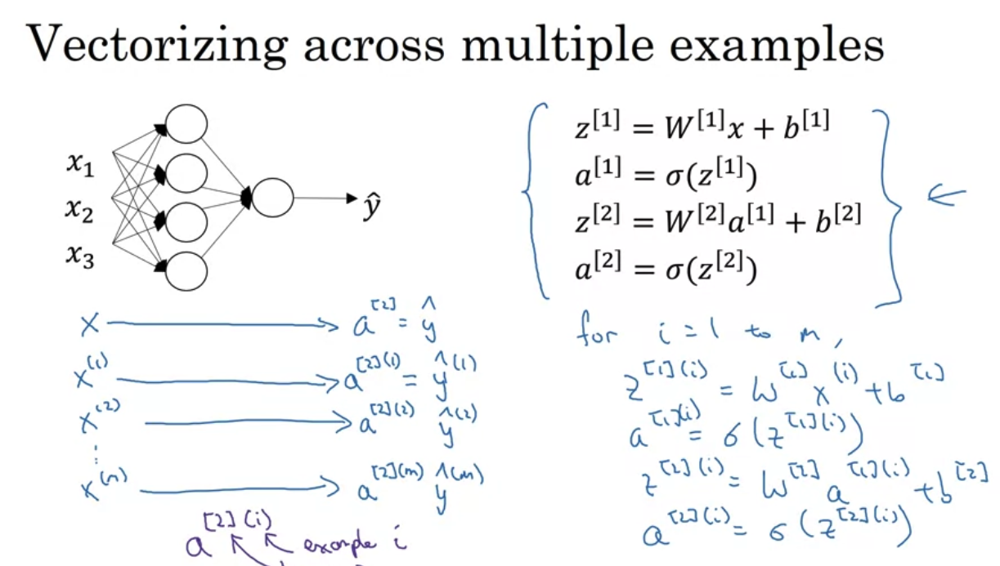

- Vectorization is getting rid of explicit for loops in code

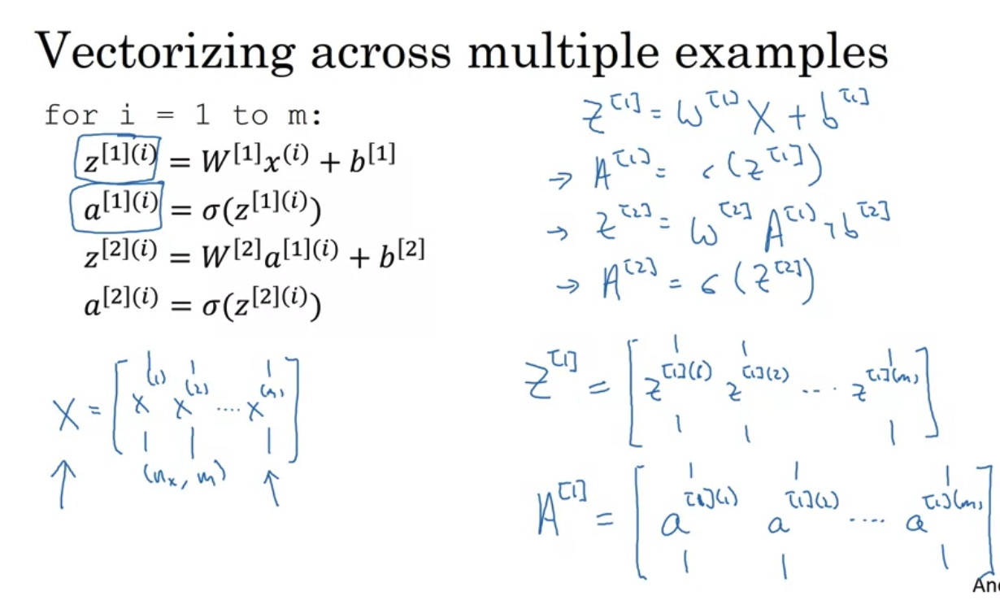

## Neural Network

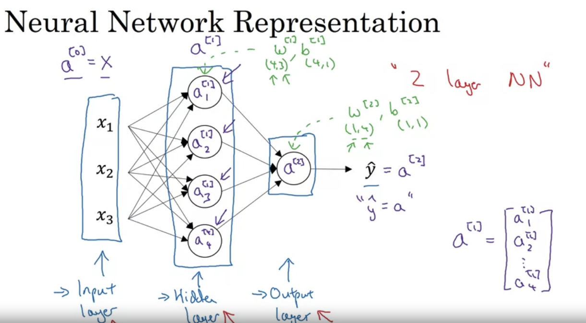

- Each node does two things
  - Compute the linear combination
  - Compute the activation function
- A superscript is the layer and the subscript is the node in the layer

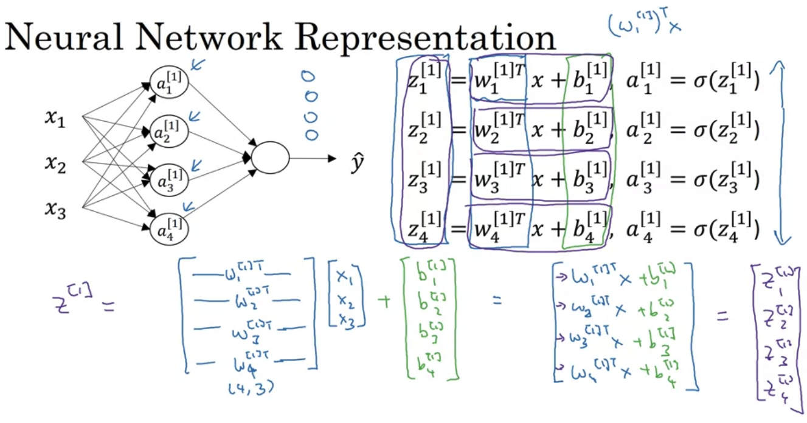

- For X,
  - the horizontal is all the training examples
  - the vertical is each feature
- When computing Z and A, 
  - the horizontal is all the training examples
  - the vertical is the hidden units (nodes) in the hidden layer

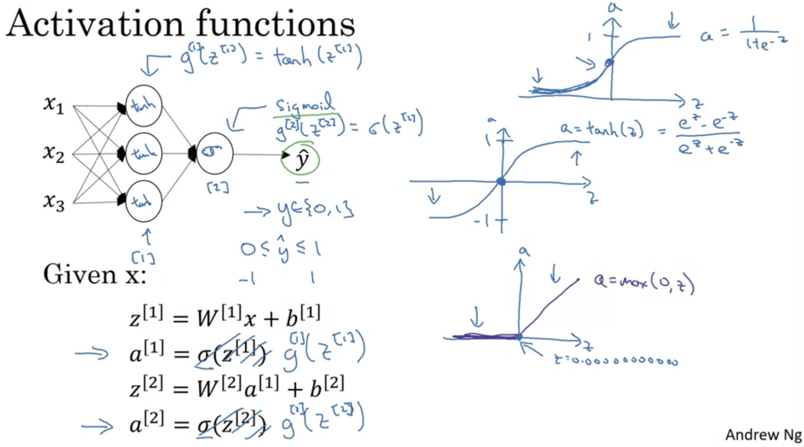

- An activation function is a non-linear function: sigmoid, tanh (superior than sigmoid), relu (most common)
  - tanh: from -1 to 1 -> the mean of the activation function for a given hidden layer is 0 and it makes the learning for the next layer a little bit easier
  - It helps the network maintain a balance of positive and negative values, reducing bias shifts in the network as it learns
  - When the mean of the activation is closer to zero (as with tanh), each neuron in the subsequent layer receives a more balanced input, making gradient-based optimization more stable and effective
- The activation function can be different for different layers
- Importance of activation functions in neural networks
  - Ability to Model Complex Patterns: Activation functions allow the network to learn and represent complex patterns by introducing non-linearities, enabling it to approximate complex functions.
  - Enabling Deep Networks to Generalize: Non-linear activation functions enable deep neural networks to capture intricate dependencies in data. Each hidden layer with non-linear activations can learn progressively abstract features, moving from low-level patterns (like edges in an image) to higher-level concepts (like objects).
  - Ensuring Backpropagation Works: Backpropagation relies on gradients to update weights. Activation functions with non-linear derivatives allow these gradients to be meaningful. Functions like ReLU provide gradients that can be propagated through multiple layers, enabling efficient learning.
- Derivatives 
  - ReLU: max(z, 0)
  - derivative of ReLU:
    - 0 if z < 0
    - 1 if z >= 1
    - `Z >= 1` (vectorizing approach)

## Intuition about deep representation

- Different layers can represent parts of the input
  - e.g. face image: first layer represents nose, second layer represents edges, etc
  - e.g. audio: phonemes -> words -> sentence/phrase

## Train, Dev, Test sets

- Train and dev to do cross validation
- Test to test the performance of the trained model
- Mismatched train/dev distribution
  - Make sure the dev and test sets come from the same distribution
  - e.g. a training set with high quality cat images and the dev set with low quality cat images

## Bias/Variance

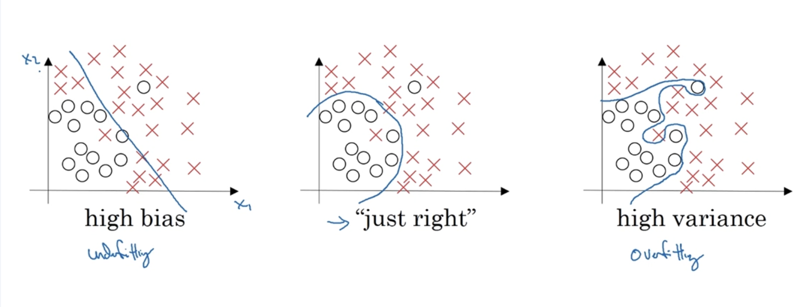

- Bias/Variance tradeoff
  - High bias: underfitting
  - Just right
  - High variance: overfitting
- Cat classification example
  - Example 1
    - training set error: 1%
    - dev set error: 11%
    - high variance (overfitting)
  - Example 2
    - training set error: 15%
    - dev set error 16%
    - high bias because the error percentage is high and it's not fitting the data well
  - Example 3
    - training set error: 15%
    - dev set error 30%
    - high bias and high variance
  - Example 4
    - training set error: 0.5%
    - dev set error 1%
    - low bias and low variance
- With the training set, we can check the bias influence
- Together with the dev set, we can check the influence of variance

## Basic Recipe for ML

- High bias: look at the trainint data because it's not really fitting the data well
  - Bigger network (hidden layers and hidden units)
  - Training longer (more iterations)
  - Different neural network architecture
- High variance: look at the dev set performance because it's overfitting
  - More data
  - Try regularization
  - Different neural network architecture
- It's not much more about tradeoff, we can improve bias with a bigger neural network without influencing variance and improve variance having more data without influencing bias

## Input Normalization

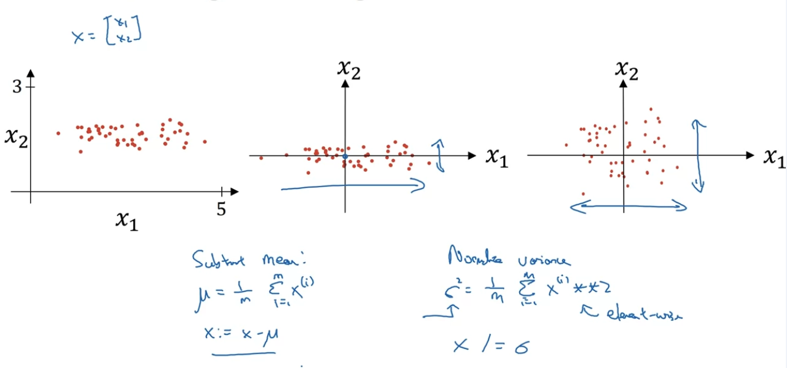

- two steps
  - subtract the mean: `x = x - μ` (μ is the mean and x is each training example)
  - normalize the variance (the variance of one feature — x1 — is much larger than the variance of other — x2): divide each training data by the standard deviation: `x = x / σ` (where x is each training data and σ is the standard deviation)

## Regularization

- Regularization penalizes big weights in a model
- Large weights can make a model overly sensitive to small changes in input features, leading to poor generalization on unseen data

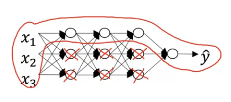

- Almost always help the overfitting problem
- ƛ: the regularization (hyper)parameter
- The intuition for why regularization helps prevent overfitting
  - With a big lambda, we set W to be near zero
  - With most of the hidden units as zero, the neural network becomes simpler and smaller

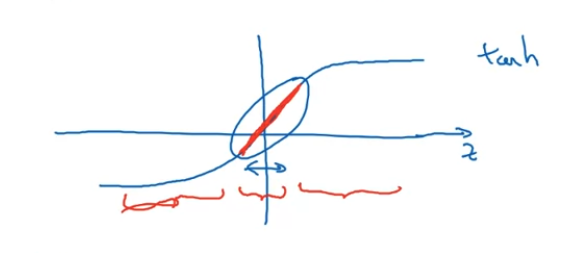

- With a big lambda, we have a smaller W
- Z = W a + b
- With a smaller W, we have a smaller Z
- A smaller Z will be in the region of the function that will be roughly linear

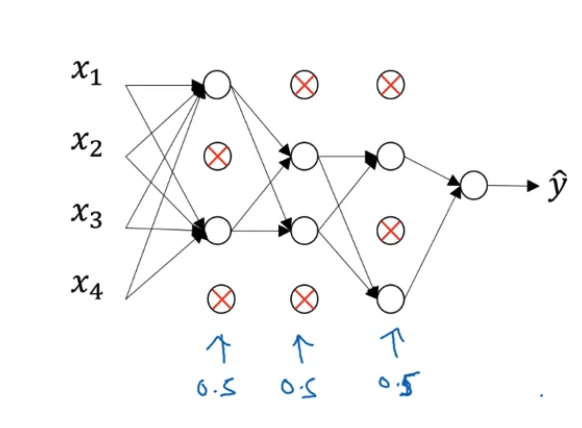

- Drop some of the hidden units
- Make the neural network model smaller and simpler

## Mini Batch Gradient Descent

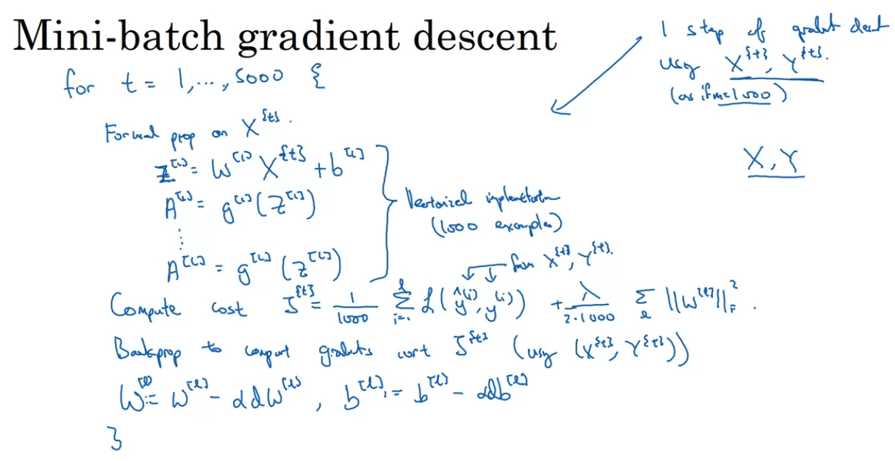

- The idea of the mini batch is to apply gradient descent in mini batches so we can update the parameters and iterate faster
- Mini batch process
  - Divide the training set into mini batches (e.g. 5000 batchs of 1000 training points)
  - Do the forward prop and backward prop
  - Update the weights and biases

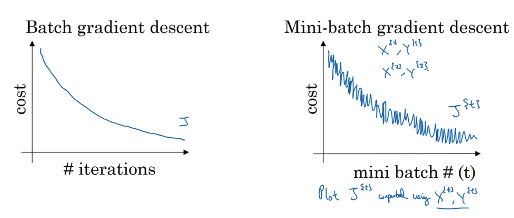

- if mini batch size = m: batch gradient descent (too long, too much time)
- if mini batch size = 1 (on every example): stochastic gradient descent (lose speedup from vectorization)

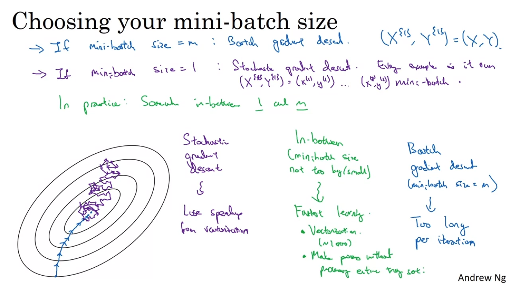

- The size of each mini batch
  - size in between 1 and m (not too big or too small): fastest learning
    - still use vectorization
  - if the training set is small, use batch gradient descent (there's no need for mini batch) (m <= 2500)
  - typical mini batch sizes (power of 2): 64, 128, 256, 512

## Exponentially Weighted Averages

- Exponentially Weighted Averages are effective for capturing trends and smoothing noisy data in various optimization and training processes.
- EWA prioritizes recent gradient directions while retaining a memory of past gradients.
- Bias correction is used to account the initialization phase

## Gradient Descent with Momentum and RMSprop

- Gradient descent oscilates and because of that it can have slow learning. What we want is faster learning
- Momentum:
  - On iteration T
  - Compute dW, dB on current mini-batch
  - Compute the Exponentially Weighted Averages
  - Update the parameters
- Because it averages the oscilations, they become more smoother and then faster to learn
- RMSprop
  - With oscilations, what we want is to have slower learning in the vertical direction and faster learning in the horizontal direction. This is what RMSprop does.
  - It is an algorithm to adjust the learning rate for each parameter

## Adam optimization algorithm

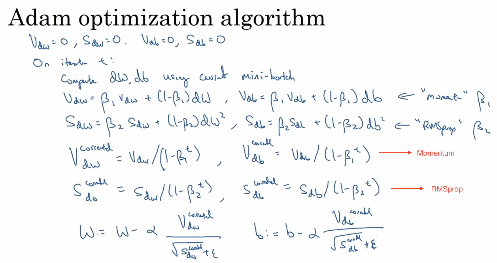

- Adam (Adaptive Moment Estimation) optimization is a combination of Momentum and RMSProp techniques
- Great to overcome the problem of local optima and plateau

## Learning rate decay

- Slowling the learning rate over time so it can oscilate less when converging to the global maxima

## Batch Normalization

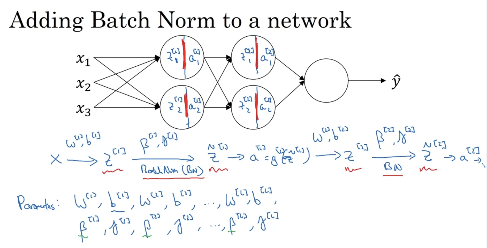

- Normalizing input features can speed up learning
- For deep neural nets, we have not only the input layer but also the activations
- Question: For each hidden layer, can we normalize the values of A1, so as to train W3 and B3 faster?
- To fit the batch normalization into the neural network we follow this idea:
  - We have the `X` input, compute `Z1`, then normalize it and output `Z_TILDA1`, that will be used on the activation function. We do the same process for the following hidden layers
  - Beta and gamma are also model's parameters together with `W` and `B`
  - Because of that, we also need to have `dBeta` and `dGamma` gradients in each iteration of backprop to update beta and gamma.
- It has regularization effect: it adds noise to each hidden layer's activations, helping with the problem of overfitting

## Computer Vision

- Computer vision problems
  - Image classification: 0 / 1
  - Object detection: object is in the image, draw rectangle around the object
  - Neural style transfer: merge two images and produce a new one with the style of one into the other. e.g. picasso painting style into a real photo
- Fully connected networks can overfit with a lot of parameters (e.g. cat images with 3M input data (pixels) so the `W` will be huge too)

## Edge Detection

- In image recognition:
  - Detect vertical edges
  - Detect horizontal edges
- For edge detection, we use filters or kernels with convolutions

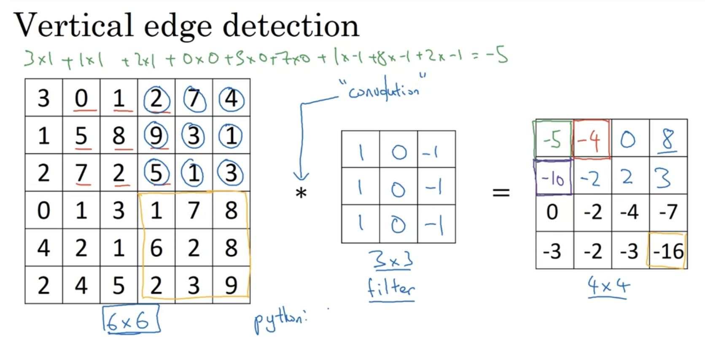

- Build a filter (matrix N x N, e.g. 3x3) and apply a convolution operation in the input data that will output a 4x4 matrix
  - A 6x6 matrix convolved with 3x3 matrix outputs a 4x4 matrix
- The output matrix produced by the convolution operation will be a way for the neural net to figure out that there's an edge
- We can have different values for the filter matrix so we put more weight to specific parts of the image. e.g. add bigger values in the center to put more weight in the center
- We can also treat the filter matrix values as parameters and make a neural net learn that for us
- Vertical edges
  - Sober filter
  - Scharr filter

## Padding

- When applying the convolution filter, usually the first pixel will be used way less than a pixel in the center of the image so we throwing away a lot of the information of the edges of the images
- A valid convolution has an output of n - f + 1 x n - f + 1, where n = matrix (n x n) and f = filter (f x f)
- We use paddings for the image so instead of a N x N image, we have a N + 2p - f + 1 x N + 2p - f + 1 image

## Stride convolution

- For stride = 2, instead of shifting one square to right, we shift two
- If padding is `p` and stride is `s`, if we have an N x N image and an f x f filter, the output will have `(N + 2p - f) / 2 + 1 x (N + 2p - f) / 2 + 1`

## Convolutions in 3D images

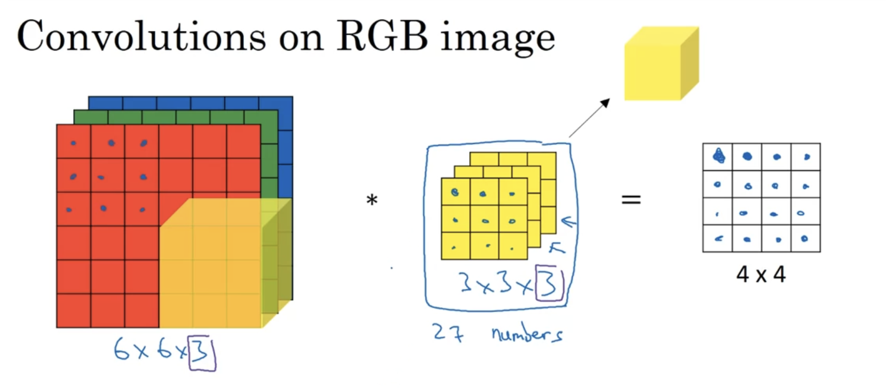

- For a 3D image (e.g. RGB image), we need a 3D filter
  - 6 x 6 x 3: height, width, channels (red, green, blue)
- It has the convolution operation shifting one pixel at a time but now it has the channel factor

## Multiple filters

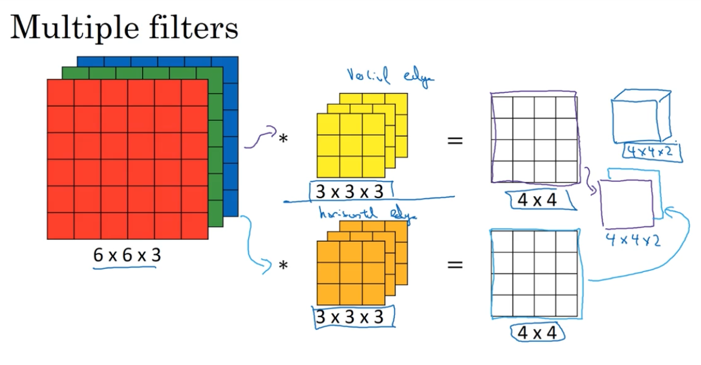

- Apply multiple filters (convolutions) in a convolutional neural network (CNN), an output stack is created. This stack is called "feature map"
- Each convolutional filter is designed to detect specific patterns or features

## Convolutional Networks

- Apply filters to the input
  - Stack the outputs (feature map)
- Apply an activation function to the output of each filter and add a bias
  - The filters play a role of the weights in CNN: they are learnable parameters
- Types of layers in a convolutional network
  - Convolution
  - Pooling
  - Fully connected
- A common pattern:
  - Layer 1: Convolutional layer + Pooling layer
  - Layer 2: Convolutional layer + Pooling layer
  - Layer 3: Fully connected layer
  - Layer 4: Fully connected layer
  - Layer 5: Fully connected layer
  - Output layer: softmax
- Summary of notation
  - f[l] = filter size
  - p[l] = padding
  - s[l] = stride
  - n[l] = number of filters
  - input: Nh x Nw x Nc (height x width x channel)
  - output: Nh x Nw x Nc
  - volume: 
    - Nh[l] = ((Nh[l-1] + 2p[l] - f[l]) / s[l]) + 1
    - Nw[l] = ((Nw[l-1] + 2p[l] - f[l]) / s[l]) + 1

## Pooling layers

- Define regions (or substs) of the input based on f (fxf) and s (stride).
- The max pooling gets the highest number in each region and output a matrix (or cube if the number of channels is greater than 1)
- Average pooling: instead of getting the highest number, we average the numbers in each region.

## ResNet

ResNet introduces skip connections (also known as residual connections or shortcut connections) that add the output of an earlier layer to the output of a later layer.

- Residual Block: The fundamental building block of a ResNet is the residual block. A typical residual block consists of a few convolutional layers (usually two or three), batch normalization, and activation functions.
- Skip Connection: The key innovation is the skip connection. This connection takes the input of the residual block and directly adds it to the output of the convolutional layers within that block.
  - The skip connection adds the input of the entire block only to the output of the very last layer within that block

Benefits

- Addresses the Vanishing/Exploding Gradient Problem: By providing a direct path for the gradient to flow backward during training, skip connections help to mitigate the vanishing and exploding gradient problems that plague very deep networks. The gradient can effectively "skip" over several layers, ensuring that earlier layers still receive a meaningful gradient signal.   
- Facilitates Learning Identity Mappings: In very deep networks, some layers might not learn useful features. With skip connections, if the convolutional layers in a block learn close to zero, the block effectively acts as an identity function (output is approximately equal to the input). This makes it easier to train deeper networks, as adding more layers doesn't necessarily hurt performance.
  - With hidden layers and hidden units, the network can even learn better and also improve performance.
  - It lets the network gets bigger and because it gets bigger, it can learn better.
- Improved Information Flow: Skip connections allow information from earlier layers to be directly passed to later layers, helping to preserve important features and details that might be lost through multiple transformations.   

## Inception Network

In the parallel approach of Inception, the network can simultaneously extract features at different scales from the exact same spatial location in the input. These different perspectives are then directly combined in the output of the module. This allows the subsequent layers to have access to a much richer and more immediately multi-scale representation.

In the sequential approach, the network has to learn to infer relationships across scales through the transformations applied by successive layers. While it can achieve multi-scale understanding, it's a more indirect process and might not capture the same level of nuanced interaction between features at different scales as the parallel approach.

## Sequence Models

- For a problem that 'request' a sequence model, a standard neural network doesn't work well
  - Standard networks require a fixed input size. Inputs and outputs can be of different lengths in different examples for sequence problems
  - The model doesn't share features learned across different positions (of text, for example)
- Example (motivation): based on a text (e.g. sentence), output where are the people's names in the sentence
  - There's a dictionary with all the texts
  - Input: for each word in the sentence input, compute the one-hot-encoding, so we know which word is that based on the dictionary
  - In layer represents the 'one-hot-encoded' word 
    - one hot encode the sentence word X[1]
    - apply the activation function
    - outputs the probability of the input being a person's name
    - use the output of this unit as the input for the following unit
      - use the learned parameters to the following unit
      - use parameters from earlier in the sequence but later in the sequence

## Recurrent Neural Network

- Cell forward
  - Input x<t>: linear combination Wax * x<t>
  - Previous hidden state a<t-1>: linear combination Waa * a<t-1>
  - Activation function g1: g1(Wax * x<t> + Waa * a<t-1> + Ba)
    - It produces a<t> and passed to the following time step
  - Hidden state a<t>: linear combination a<t> * Wya + By and apply activation g2
    - It outputs a probability (classification) or numerical value (regression)
- Important concepts
  - Each time step outputs a probability (classification) or numerical value (regression)
  - The following time step will always receive the learned parameters from previous time steps
    - Weights are shared across time: Waa, Wax, and Way are shared
  - Backpropagation through time: 
    - The cost function is calculated based on all loss functions output from each layer
    - backpropagation can update the parameters W and B based on the cost function
- RNNs suffer from vanishing gradient problems (decrease exponentially)
  - If it's a very deep neural network, the gradient for the output Y will have a very hard time propagating back to affect the weights of earlier layers
    - Partial derivatives (chain rule): the gradients at earlier time steps are computed by multiplying the gradients from later time steps
    - If the values in the weight matrices or the derivatives of the activation functions are consistently less than 1, then with each multiplication through the time steps, the gradient becomes progressively smaller over time
    - Activation functions can contribute to the shrinking gradient problem because they have derivatives that are always less than or equal to 1
  - For exploding gradients, we may see "NaN" (numerical overflow) values and it will be easier to spot the problem

## RNN Notation & Dimensions

- Input `X` has a 3D Tensor Shape (n, m, T)
  - `n` is the number of units. e.g. for sentence as input, `n` is the size of the word embedding
    - A word embedding is a vectorial representation of a word
    - A word embedding is made up of trainable similarity values
    - The length of a word embedding is the number of words in our vocabulary
    - A word embedding can have any of the following interpretations:
      - It uncovers a semantic meaning of the words in our vocabulary
      - It approximates the similarity of certain words in our vocabulary
      - It represents a hidden semantic relationship
  - `T` is the size of time steps
  - `m` is the batch size (training examples for each mini batch)
- Hidden state `a` has a 3D Tensor Shape (n, m, T)

## Gated Recurrent Unit (GRU)

- c = memory cell
- c<t> = a<t>
- use the memory cell later in the sentence
- Two gates
  - Update Gate (z): it determines how much of the previous hidden state should be passed along to the next time step. It helps the GRU retain long-term dependencies.
  - Reset Gate (r): it decides how much of the past hidden state to forget. It allows the GRU to discard irrelevant information. The reset gate doesn't delete memory directly. Instead, it controls how much of the previous memory (represented by the hidden state) is considered when forming a new potential memory (the candidate hidden state)
    - When the reset gate is close to 0, it effectively makes the GRU "forget" the past hidden state. The computation of the candidate hidden state will primarily depend on the current input x
    - When the reset gate is close to 1, the previous hidden state has a strong influence on the calculation of the candidate hidden state. This allows the GRU to incorporate information from the past.   

## Long short-term memory (LSTM)

- It's a more general case of GRU
- The "memory cell" is passed through the units/layers and used in each forget and update gate
- It has three gates
  - update
  - forget
  - output
- The gates will alter the value of the c (memory cell) and it will be passed to the next layers

## Bidirectional RNN

- It builds an acyclic graph
- Backwards computation: last layer used the input, applies the activation function, produces a probability output and pass the information to the previous layer. This flows backward all the way to the first layer
- It computes the probability outputs forward and backward, that way, a layer can get information from the past (forward) and the future (backward)

## Deep RNN

- In a standard RNN, we have one layer for each input
- In a deep RNN, we have a stack of layers
- It can also be combined with bidirection RNN, GRU, and LSTM

## RNN Implementation

- RNN Cell: RNN time step
  - Receives the input `Xᵗ`
  - Receives the previous hidden state `aᵗ⁻¹`
  - Computes the linear combination for `Xᵗ`
  - Computes the linear combination for the previous hidden state
  - Applies the tahn activation function to produce the new hidden state `aᵗ`
  - Computes the output of the cell `Yᵗ` applying the softmax function to the new hidden state `aᵗ`
- RNN Forward Pass: Loop over T time steps for all inputs
  - If the input sequence is 10 time steps long, we use the RNN cell 10 times
  - Calls `rnn_cell_forward` to produce `aᵗ` (`a_next`), `Yᵗ` (`yt_pred`), and `cache`
  - Reuses the weight and bias parameters `Waa`, `ba`, `Wax`, `bx` in each time step
  - Stores all hidden states computed by the RNN
  - Stores all predictions
  - Stores the cache of each time step (used for backprop, where it will learn — update the parameters)

## Transformers & LLMs

- `Tokenization`: breaks the input and separate it into tokens (IDs from vocabulary)
- `Word Embedding`: converts tokens into embedding vectors - lookup vector
- `Positional Encoding`: add positional information of each token to the embedding vector
- `Attention`/`Self-Attention`: how each word is similar to all of the other words in the sentence

### Tokenization

- Token: a unit of text. Can be a word or a subword
- Encode: transform text into tokens
- Decode: transform tokens into text

### Bag of Words

- Breakdown a sentence into words, in other words, have a bag of words (tokens)
  - Bag of words: counting each word in the vocabulary, building the numerical representation with a specific order

### Word Embedding

- `word2vec` is static regardless of the context
- One hot encoding for words: transform a word into a vector of 1s and 0s where 0 represents that it's not the word for that index and 1 it is the word for the position
  - One hot representations treat each word as an isolated entity, so it's difficult to find similarity meaning among words
- Featurized word embeddings: make associations, relationships to build similarity among all words.
  - e.g. apple and oragen can have a high correlation when it comes to the fruits "feature"
  - Use the t-sne to group data points into positions and build clusters. Each cluster has many similarities. We can plot this into a graph to see the groups in the featurized word embeddings
- In word embedding, it uses feature representations to measure similarity to reason and compare
  - This comparison is how each word is compared to all other words in the entire vocabulary of the training process
  - e.g. for man -> woman, what's the missing word for king -> ?. Based on the feature similarities, the missing word is queen
  - It uses the cosine similarity to measure the similarity of these vectors
  - Each columns represents a (latent) "feature", which is not interpretable because it's an abstract way to capture the essence of the input through learned properties.
  - In latent space, similar words will be closer
- The primary purpose of an embedding matrix is to transform sparse, high-dimensional representations of words (like one-hot encodings) into dense, lower-dimensional, and more meaningful continuous vector representations
  - Capturing Relationships
  - Reducing Dimensionality
  - Improved Generalization

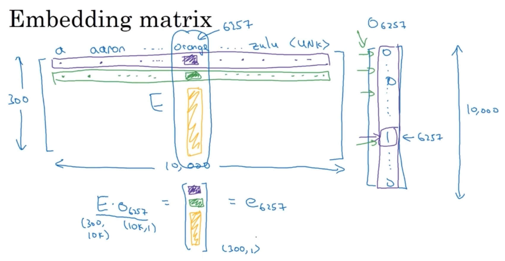

The embedding matrix is a lookup table that stores vector representations for words. In this case, 300 features for 10,000 words

- E (300, 10,000): embedding matrix
- O₆₂₅₇ (10,000, 1): one hot encoding for the word orange on the index 6257
- The product of this multiplication is e₆₂₅₇ (300, 1), also called word embedding

An example of word embedding usage is to be build a language model that predicts the next token for a given sentence

- Each word is transformed into a word embedding `e` through the process of the product of the one hot encoding `O` and the embedding matrix `E`
- The input of the network is all the word embedding in the sentence
- The model uses a softmax activation function to compute the probability of all possible tokens and output the best prediction

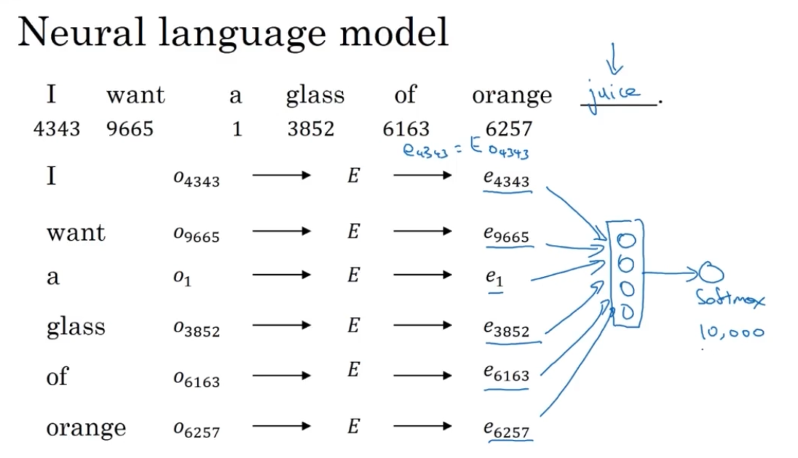

### Positional Encoding

The purpose of positional encoding is:

- Injecting Order Information: The core self-attention mechanism in the Transformer is inherently agnostic to the order of words in a sequence. If you shuffle the input words, the attention outputs (without positional encoding) would remain the same, because attention simply calculates relationships based on content. However, word order is critical for understanding language (e.g., "dog bites man" vs. "man bites dog").
- Unique Positional Signature: Positional encodings provide a unique "signature" for each position in the sequence. These encodings are added directly to the word embeddings at the input. By doing so, the model's input for each word now contains information about both its semantic meaning and its position within the sentence.
- Enabling Positional Awareness: This positional information allows the attention mechanism to implicitly learn to distinguish between words based on their position relative to others, even though the attention calculation itself doesn't explicitly use position. For example, the model can learn that words at the beginning of a sentence might play a different role than words at the end.

### Attention & Transformers

- In the transformer block, there are two important pieces: self-attention and the feed forward neural network
- Associate each token with a high dimensional vector, an embedding
  - An embedding has semantic meaning
  - Initially, the embedding is just a look up table with no reference to the context
  - With attention, the surrounding embeddings can pass information to one another
- Attention Pattern
  - The query Q asks questions how the other tokens relate to the one in question
  - The key K answers the query Q for each token. It applies softmax to normalize K for each token, as if it was a probability distribution. It gives weights according to how relevant each surrounding token is to the token in question.
  - The Query-Key relationship measure the similarity of each token related to the other tokens
    - Query for token 1: 
      - Key of token 2 + Value of token 2
      - Key of token 3 + Value of token 3
      - Key of token 4 + Value of token 4
    - Query for token 2: 
      - Key of token 1 + Value of token 1
      - Key of token 3 + Value of token 3
      - Key of token 4 + Value of token 4
  - The division by √dₖ to rescale the similarity scores
  - Apply softmax so the sum of the probabilities leads to 1
  - Weighted sum: the values with the probability

Attention(Q, K, V) = SoftMax(QKᵗ/√dᴷ) . V

Q = Query = Input x Wq
K = Key = Input x Wₖ
V = Value = Input x Wᵥ

- QKᵗ: relevance score between tokens
- √dᴷ: scaling — prevents the dot product values from growing too large in high dimensions
- SoftMax: transform scores into probabilities
- V: weighted sum of the values

**Encoder**: 

- Self-attention produces an encoded token embeddings with contextual awareness
- Feedforward after the multi-head attention in the encoder
  - Non-linearity and Feature Transformation: While the multi-head attention mechanism effectively captures relationships between words (contextual information), it's primarily a weighted sum. The feedforward network introduces non-linearity, allowing the model to learn more complex patterns and transformations of the attention outputs. It acts as a sub-layer that processes each position independently and identically.
  - Enriching Representation: After the self-attention layer has aggregated information from all other words based on their relevance, the feedforward network can further refine and enrich this contextual representation for each word. It essentially applies a more traditional neural network processing step to the features extracted by the attention mechanism. This allows the model to learn higher-level abstract features from the attention-weighted inputs.
- Output embedding: 
  - `token-aware`: Feed-Forward Network -	Semantic refinement; processing the specific features of that position
  - `position-aware`: Positional Encoding -	Sequential meaning; where the token sits in the string
  - `context-aware`: Multi-Head Attention -	Relational meaning; how tokens relate to each other

**Decoder**:

Masked Self Attention

- The first attention layer in the decoder provides "what has been translated so far" context
- Each token attends to all tokens that was generated (e.g. translated)
- They don't look at the tokens that will be generated (right side tokens)

Cross Attention

- The second attention layer provides "what was in the original source sentence" context, allowing the decoder to effectively combine both to generate an accurate translation
- Each token (in the decoder) attends to the tokens from the input source (from the encoder)
- Query for the decoder's tokens
- Key and Value for the encoder's tokens
