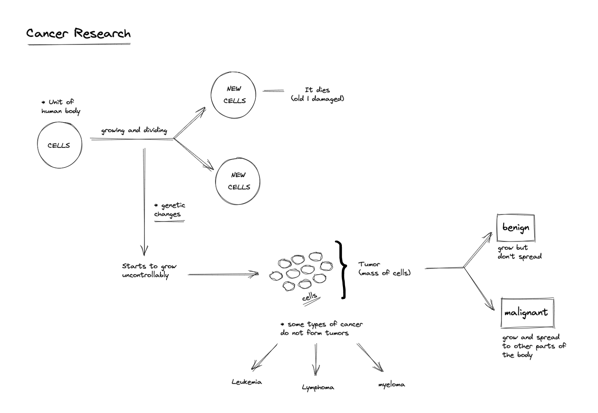

# Cancer

It's a group of more than 100 different diseases.

- Cells are the basic units that make up the human body.
- Cells grow and divide into new cells, which die when they get old or damaged.
- When there are genetic changes, cells start to grow uncontrollably.
- And because of that growth, it creates a mass of cells, also called "tumor".
- This tumor can be benign or malignant
  - `benign`: grow but don't spread
  - `malignant`: grow and spread to other parts of the body
- Some types of cancer do not form tumors:
  - Leukemia
  - Lymphona
  - Myeloma

## How cancer spreads

- Cancer tumors grow and the bloodstream or lymphatic system carry some cancer cells to other parts of the body.
- These cancer cells grow into new tumor in different parts of the body. This process is called metastasis.
- Cancer can spread to distant parts of the body, for example, bones, liver, lungs, or brain.
