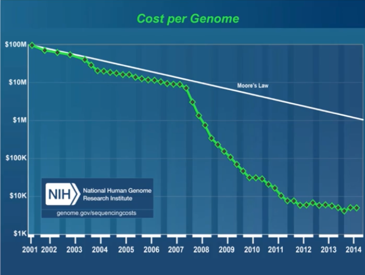
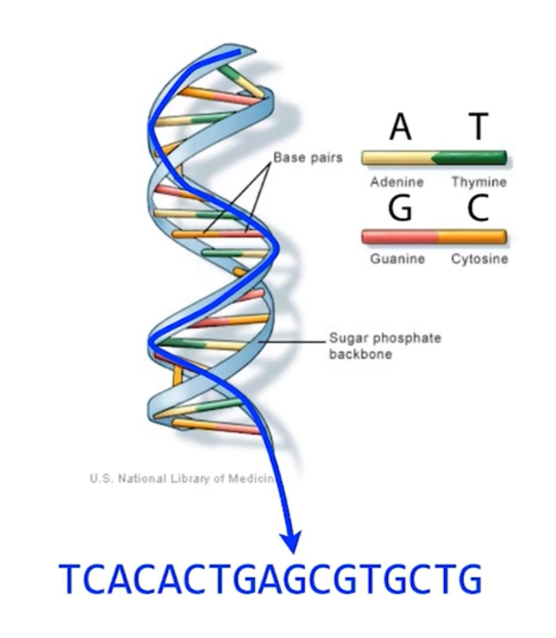
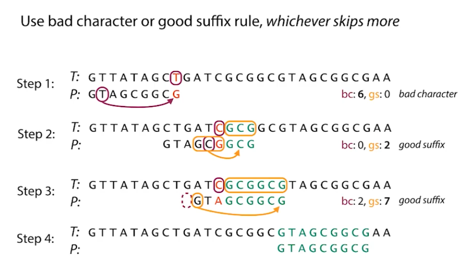

# Algorithms for DNA Sequencing

Next Generation Sequencing (NGS) in 2007 (second generation sequencing or massive parallel sequencing)



Get the sequence of DNA as a string getting the side of the double helix at a time

- double helix
- base pairs: A-T and C-G



DNA sequencing

- short snippets of DNA (reads): genome is orders of magnitude larger than these shorts snippets
  - chromosomes (1.000.000) vs reads (100)
- use massive parallel sequencing

## String definitions

- String `S` is a finite sequence of characters and { A, T, C, G }
- number of characters using `len(S)`
- empty string when `len(S)` is 0

If we have double stranded DNA, and we knew the sequence along one of those strands from top to bottom, the reverse complement would give us the sequence of the other strand from bottom to top:

```python
def reverse_complement(s):
  complement = { 'A': 'T', 'C': 'G', 'G': 'C', 'T': 'A' }
  return ''.join(complement[char] for char in reversed(s))
```

## How DNA gets copied

Second-generation sequencing, also known as sequencing by synthesis, mimics the natural process of DNA replication. During cell division, the double-stranded DNA unwinds and separates into two single strands, each carrying the genetic sequence.

These single strands act as templates for creating new complementary strands. An enzyme called DNA polymerase facilitates this process by adding the appropriate complementary base to the template strand. For instance, if the template has a G, the polymerase will add a C, and if it has an A, it will add a T. This step-by-step addition of bases by DNA polymerase results in two identical double-stranded copies of the original DNA molecule.

Second-generation sequencing leverages this natural DNA copying mechanism. By observing the activity of the DNA polymerase as it builds the new complementary strand, scientists can deduce the sequence of the template DNA molecule. Importantly, this process is performed simultaneously on millions or even billions of template molecules, allowing for high-throughput sequencing.

## How second-generation sequencers work

High-throughput DNA sequencing method

- DNA sample is fragmented and made single-stranded, resulting in many short single-stranded templates that are then attached to a flat surface (a slide) at random locations.
- DNA polymerase and modified bases with terminators (and fluorescent labels) are added. The polymerase adds only one complementary base to each template because the terminator prevents further extension. 
- A photo is taken, capturing the fluorescent signal that identifies the incorporated base for each template.
  - Template strands are amplified to create clusters of identical copies. This amplification is necessary to generate enough light for detection when fluorescently labeled terminator bases are incorporated. However, errors can occur when a non-terminated base is accidentally added during a sequencing cycle. This causes some strands within a cluster to become out of sync with others, leading to mixed signals (multiple colors of light) during imaging.
- The terminators are then removed, and the process is repeated. 
  - Sometimes a base isn't terminated so it doesn't block the polymerase and the polymerase keeps going. Another base is added on top of the current base and one of the templates is out of sync with the others: there is not just one color when taking the photo
- By taking a series of photos over multiple cycles, the sequence of each individual template can be determined by tracking the color changes at its specific location on the slide. This method allows for the simultaneous sequencing of billions of templates, making it a massively parallel process. 
  - Software called a "base caller" analyzes these images to determine the sequence. To account for the uncertainty arising from mixed signals, the base caller assigns a "base quality" score (Q) to each base call.
  - The base quality information is crucial for downstream analysis, allowing researchers to identify and account for potentially unreliable base calls
- Key aspects include attaching billions of templates to a single slide, photographing them simultaneously, and using terminators to control the polymerization and enable base identification through fluorescence.

## Sequencing reads in FASTQ format

- A FASTQ file has many reads and each read has a format of `name`, `sequence`, `placeholder`, and `base quality`
  - Read Name: Contains information about the experiment but is generally ignored for downstream analysis.
  - Sequence: The actual DNA sequence reported by the base caller. This is the crucial information.
  - Placeholder Line: This line is typically ignored.
  - Base Quality Line: A string of characters that encodes the quality score for each corresponding base in the sequence line.
- The base quality is represented by a value Q, which is related to the probability P of an incorrect base call (higher Q means higher confidence). These Q values are ASCII-encoded into characters. The specific encoding used in the class is Phred 33.

```python
def QtoPhred33(Q):
  """ Turn Q into Phred+33 ASCII-encoded quality """
  return chr(Q + 33)

def phred33toQ(qual):
  """ Turn Phred+33 ASCII-encoded quality into Q """
  return ord(qual) - 33
```

## Sequencers give pieces to genomic puzzles

Sequencing produces short reads of DNA, which are insufficient to answer questions about genome differences or disease predispositions because genes are much longer. Therefore, the initial challenge in analyzing sequencing data is to reconstruct the original DNA sequence by assembling these short reads.

This process is analogous to putting together a puzzle. In many cases, we have a "picture" of the completed puzzle in the form of a reference genome – a previously assembled genome from the same or a closely related species. Human genomes, for instance, are highly similar (99.8-99.9%), allowing us to use a reference human genome as a guide.

The process of aligning sequencing reads to a reference genome involves taking each short read and finding the best matching location on the reference sequence. Reference genomes are available for numerous species.

However, in cases where a reference genome is unavailable, such as when studying a novel species, a different approach is needed. This is like assembling a puzzle without the picture. In this scenario, we must look for overlaps between the sequencing reads themselves and try to piece them together based on these overlaps.

## Read alignment and why it's hard

Sequencing reads, which are short DNA fragments, are like puzzle pieces that need to be placed back together using a reference genome, which acts as the completed puzzle's picture. This process leverages the high similarity between the genomes of different individuals within the same species.

The core task involves taking each sequencing read and searching for the most closely matching location within a potentially enormous reference genome (e.g., the 3 billion bases of the human genome). This search is repeated for billions of reads generated in a single sequencing run, making it a computationally intensive task, akin to finding billions of needles in a very large haystack.

Both sequencing reads and the reference genome can be treated as strings and computer science has developed numerous efficient algorithms and data structures for string manipulation, such as searching, indexing, and compression.

## Boyer-Moore basics

The key insights of Boyer-Moore are:

- Learning from Comparisons: The algorithm uses information gained during character comparisons to determine how far to shift the pattern.
- Right-to-Left Comparison: Unlike the naive method, Boyer-Moore compares characters within a given alignment from right to left.

Two main rules used by the Boyer-Moore algorithm to achieve these skips



- **Bad Character Rule**: Upon encountering a mismatch between a character in the pattern and a character in the text, this rule suggests shifting the pattern to the right until either:
  - The mismatched text character aligns with an occurrence of the same character in the pattern.
  - The pattern moves completely past the mismatched text character (if the mismatched character doesn't exist in the pattern).
- **Good Suffix Rule**: After a successful match of a suffix of the pattern with a substring of the text, and then a mismatch, this rule suggests shifting the pattern to the right until either:
  - Another occurrence of the matched suffix appears in the pattern, aligned with the previously matched text substring.
  - A prefix of the pattern matches a suffix of the previously matched text substring.
  - The pattern moves completely past the matched text substring.
- In Boyer-Moore, it builds lookup tables to pre-calculate the number of skips for the bad character rule

## Diversion: Repetitive Elements

The human genome is highly repetitive, a result of complex evolutionary processes, rather than random generation. A major contributor to this repetitiveness are transposable elements, small DNA sequences capable of copying and pasting themselves throughout the genome. Approximately 45% of the human genome consists of these elements, with a particularly prominent example being the Alu element, which accounts for about 11% of the genome and appears over a million times.

These repetitive elements pose a significant challenge for read alignment and genome assembly algorithms. When a sequencing read comes from a repetitive region, such as an Alu element, it becomes difficult or impossible to determine its exact original location due to the presence of numerous identical copies.
