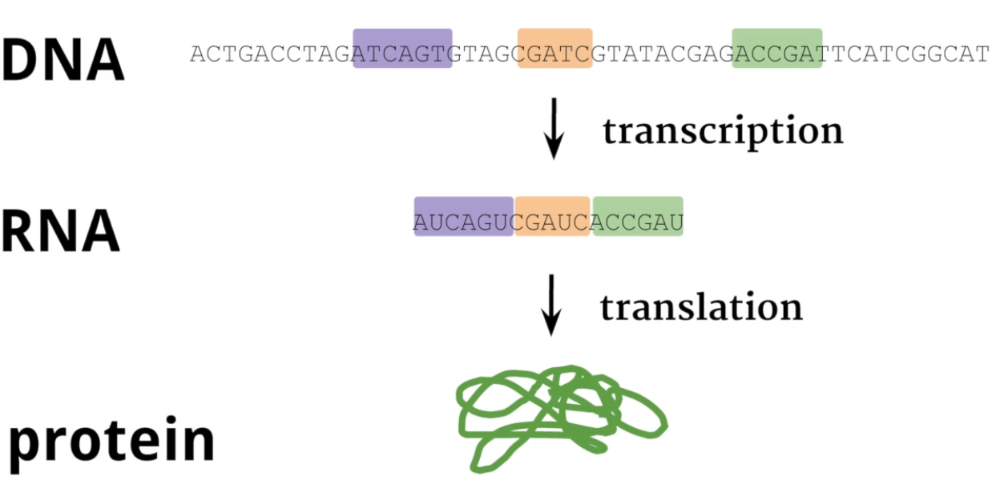

# Introduction to Genomics

- Genomics is the study of genomes

- DNA -> RNA -> Protein
- Messenger RNA (mRNA) carries the genetic information from DNA to ribosomes
- Codons are sequences of three consecutive nucleotides in an mRNA molecule
- Amino acid is encoded by a specific triplet of RNA nucleotides (a codon)
- Protein contain amino acids, so they are the building blocks of proteins
- Protein does all the functional work: metabolizing, digesting food
- We can generate the genome sequences but we need powerful computers to analyse the data
  - analysis: what are the mutations of this cell compare to the mutations of other cells for the same person?

## What's genomics?

The branch of molecular biology concerned with the structure, function, evolution and mapping of genomes.

- Structure: the sequences of A, C, G, T
- Function: what the DNA does - how the organs evolve
- Evolution: how the sequences change over evolutionary time

And the application of this knowledge in medicine, pharmacy, agriculture, etc

## What Is Genomic Data Science?

- Process
  - Collect samples
  - Generate sequences: genome
  - Align to the reference genome (how they differ): how much of that gene was present
  - Preprocessing and normalization of the data: the sequencing machines make mistakes, the process of collecting data can introduce bias - apply computational and statistical methods to correct these kinds of systematic errors
  - Statistical and ML Models

## Molecular Biology

- Cell -> Nucleus -> Chromosome -> DNA
- Mitosis: DNA replication and cell division and multiplication
- DNA: four different nucleotides (molecules): AGCT
  - Adenine
  - Guanine
  - Cystosine
  - Thymine
  - A and G are similar and bigger
  - C and T are similar and smaller
- In RNA, T is replaced by U (uracil)

## From genotype to phenotype

- Genotype: all the sequences of genes in the cells
- Phenotype: all the traits that can be observed (personality, physical traits)
- Genotype -> Phenotype
  - AA -> 85% chance of brown eyes; 14% chance of green eyes; 1% chance of blue eyes
  - AG -> 56% chance of brown eyes; 37% chance of green eyes; 7% chance of blue eyes
  - GG -> 72% chance of brown eyes; 27% chance of green eyes; 1% chance of blue eyes
- e.g. a particular genetic variation can be associated with a disease
  - It's a significant association but it doesn't mean if you have that gene in that position, you have a disease
  - It's more likely you have the disease

## Polymerase Chain Reaction (PCR)

- Primers: a sequence of DNA bases that's complementary to the DNA we want to copy
- DNA polymerase: catalyzes the creation of DNA molecules
- PCR: amplify specific DNA sequences, or make many, many copies of a particular segment of DNA
  - Cycles of heating and cooling to repeatedly denature the DNA
