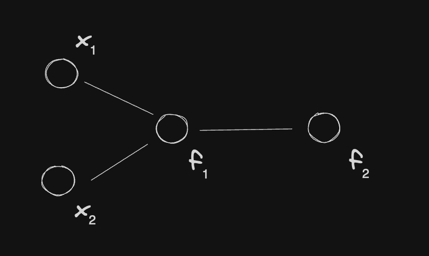
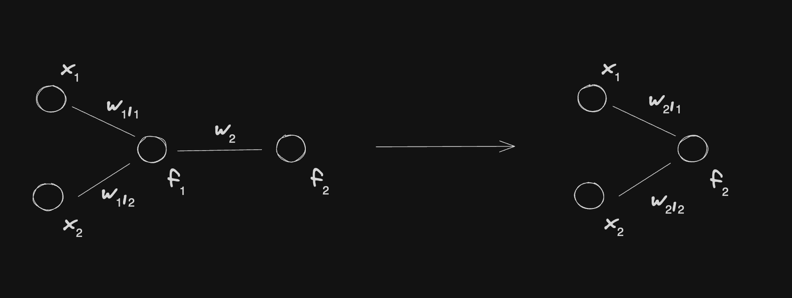
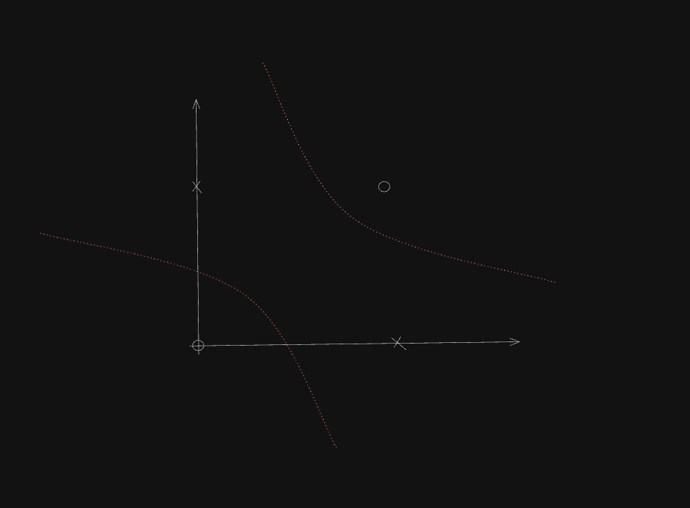
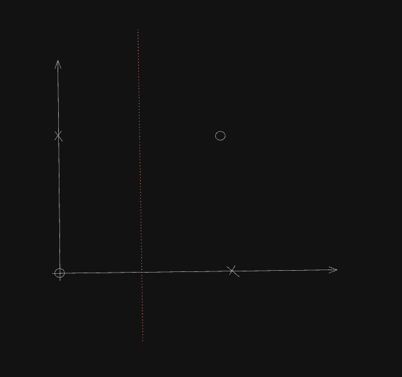
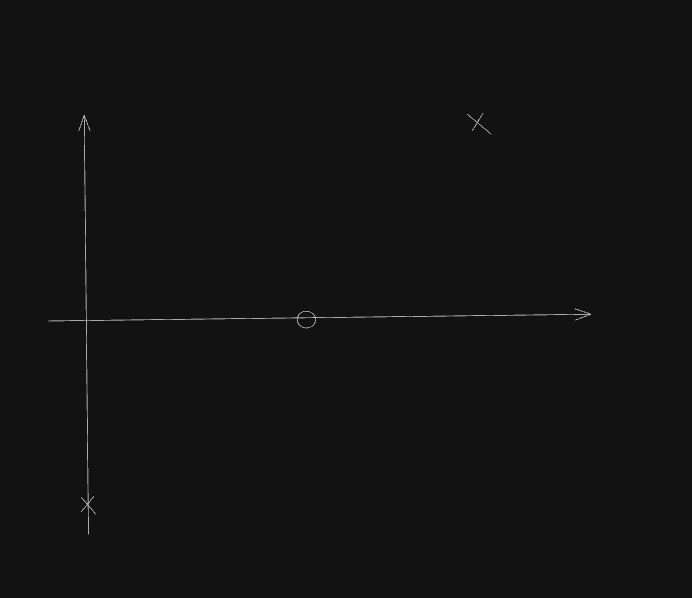
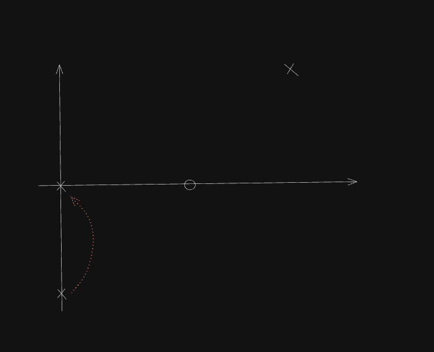

# Introduction to Deep Learning

- [Introduction to Deep Learning Course](https://www.edx.org/learn/engineering/purdue-university-introduction-to-deep-learning-2)

## Learning

- Learning is using past experience (not necessarily identical, or even very similar to new situations) for 2 things:
  - Changing the belief system or the world view
  - And then change the behavior
- The experience needs to be stored somewhere: we call it memory
  - Implicit memory: e.g. used for driving, we could not explicitly recall that memory
  - Explicit memory: can recall from memory
- The ambition: make computers learning in the same level we learn
  - 3 factors that built the current paradign for Machine Learning Algorithms
    - Technology advances: invention of computers > data abundance > data-driven computation
    - Knowledge: Principa Mathematica — generalize and formalize all the concepts behind mathematics > advances in logic, probability & neuroscience observations > research paper "A Logical Calculus of the Ideas Immanent in Nervous Activity"
    - Optimization Algorithms

## Deep Learning

Imagine we have this representation:



Let's say that f₁:

```bash
f₁(x₁, x₂) = w₁,₁ x₁ + w₁,₂ x₂ + b₁
```

And f₂:

```bash
f₂(f₁(x₁, x₂)) = w₂ f₁(x₁, x₂) + b₂
```

Now we say that:

```bash
f₂(x₁, x₂) = w₂ w₁,₁ x₁ + w₂ w₁,₂ x₂ + w₂ b₁ + b₂
f₂(x₁, x₂) = w₂,₁ x₁ + w₂,₂ x₂ + b́₂
```

Where:

```bash
w₂,₁ = w₂ w₁,₁
w₂,₂ = w₂ w₁,₂
b́₂ = w₂ b₁ + b₂
```

And this forms this transformation:



`f₂(x₁, x₂)` is also a linear function, so the depth is not needed.

- Why do we need depth?
  - The depth is not needed if only linear functions can be used
  - So the question is: do we need or not linear functions
  - In some cases we would non-linear discriminators (decision boundary) in classification problems: no need for linear functions
- A typical supervised deep classifier
  - **Input**: example vector + label
    - The vector is a numerical representation of an input instance
    - The label is the true outcome or target value associated with an input instance
  - **Cost**: Function that penalizes the difference between predicted and provided labels
    - the cost (also known as loss or error) is a measure of how well the model's predictions match the actual labels in the training data.
  - **Training**: the algorithm that selects network parameters such that the expected cost is minimized

## Why Is Non-Linearity Useful?

Imagine we have two variables `x₁` and `x₂` that are binary variables. In this case, they are `0` or `1` following these conditions:

$$
\begin{align}
  \text{f}(x₁,x₂)=
\begin{cases}
  0 & \text{if $x₁ = x₂$} \\
  1 & \text{if $x₁ ≠ x₂$} \\
\end{cases}
\end{align}
$$

For this function, we cannot have all the `Xs` in one side and all `Os` in another side. We need a non-linear decision boundary.



The cost of this function is:

$$
J(\theta) = \frac{1}{4} \sum_{\text{$x \in X$}} (f(x) - f^*(x))^2
$$

Where:

$$
\theta = {\text {model parameters}}
$$

$$
\frac{1}{4} = {\text {all the possibilities}}
$$

$$
f(x) = {\text {predicted label}}
$$

$$
f^*(x) = {\text {true label}}
$$

$$
f(x) - f^*(x) = {\text {the error}}
$$

The paremeters are:

$$
\theta = \begin{bmatrix} w_{1} & w_{2} & b \end{bmatrix}
$$

With that, we have the prediction of the model with parameters θ:

$$
f(x,\theta) = f(x,w_1,w_2,b) = w_1x_1 + w_2x_2 + b
$$

And here's the cost of the model with parameters θ:

$$
J(\theta) = \frac{1}{4} \begin{bmatrix} b^2 + (w_1+b-1)^2 + (w_2+b-1)^2 + (w_1+w_2+b)^2 \end{bmatrix}
$$

Where:

$$
[0,0] → b^2
$$

$$
[1,0] → (w_1+b-1)^2
$$

$$
[0,1] → (w_2+b-1)^2
$$

$$
[1,1] → (w_1+w_2+b)^2
$$

To optimize this cost function, we set:

$$
w_1^* = 0, w_2^* = 0
$$

Then we have:

$$
\frac{1}{4} \begin{bmatrix} 2(b - 1)^2 + 2b^2 \end{bmatrix}
$$

Which is minimized by setting `b = 1/2`.

If we draw this decision boundary, it looks like this now:



It's as good as random guessing because, there's 1 `x` in the right and 1 `x` in the left. There's 1 `o` in the right and 1 `o` in the left.

The optimal linear decision boundary gives a performance the same as random guessing.

Now we are going to consider a following solution with non-linear Rectified Linear Unit (ReLU) activation.

In ReLU, we have an intermediate process. It looks like this:


In an example, we can represent the data like this:

$$
W = \begin{bmatrix}
1 & 1 \\
1 & 1 \\
\end{bmatrix}
$$

$$
w = \begin{bmatrix}
1 \\
-2 \\
\end{bmatrix}
$$

The `c` vector represents the `c₁ = 0` and `c₂ = -1`:

$$
c = \begin{bmatrix}
0 \\
-1 \\
\end{bmatrix}
$$

`x` is the data vector. And each column is called features:

$$
X = \begin{bmatrix}
0 & 0 \\
0 & 1 \\
1 & 0 \\
1 & 1 \\
\end{bmatrix}
$$

With X · W, we have a new matrix:

$$
XW = \begin{bmatrix}
0 & 0 \\
1 & 1 \\
1 & 1 \\
2 & 2 \\
\end{bmatrix}
$$

And now we add `c` and we get:

$$
XW + c = \begin{bmatrix}
0 & -1 \\
1 & 0 \\
1 & 0 \\
2 & 1 \\
\end{bmatrix}
$$

This output is called the hidden layer before activation.

Plotting this new output, we have this graph:



Still, we cannot distinguish the points through a linear decision boundary.

And now we are going to use the ReLU activation.

ReLU is an element by element maximizer. It pushes all the negative features into becoming zero. This is what happens after the activation:



The `o` and top-most `x` stay in the same position. But the `x` in the negative side will be pushed to 0. So we get this vector:

$$
h = \begin{bmatrix}
0 & 0 \\
1 & 0 \\
1 & 0 \\
2 & 1 \\
\end{bmatrix}
$$

Here's how it works: we need to multiply this output after the activation, `h`, by the weights `w`.

$$
hw = \begin{bmatrix}
0 \\
1 \\
1 \\
0 \\
\end{bmatrix}
$$

Here's how we interpret this vector:

$$
f^*(0,0) = 0 \\
f^*(0,1) = 1 \\
f^*(1,0) = 1 \\
f^*(1,1) = 0
$$

The mean squared error (MSE) is 0 because `f(x) = f*(x)`

Now depth became useful.
