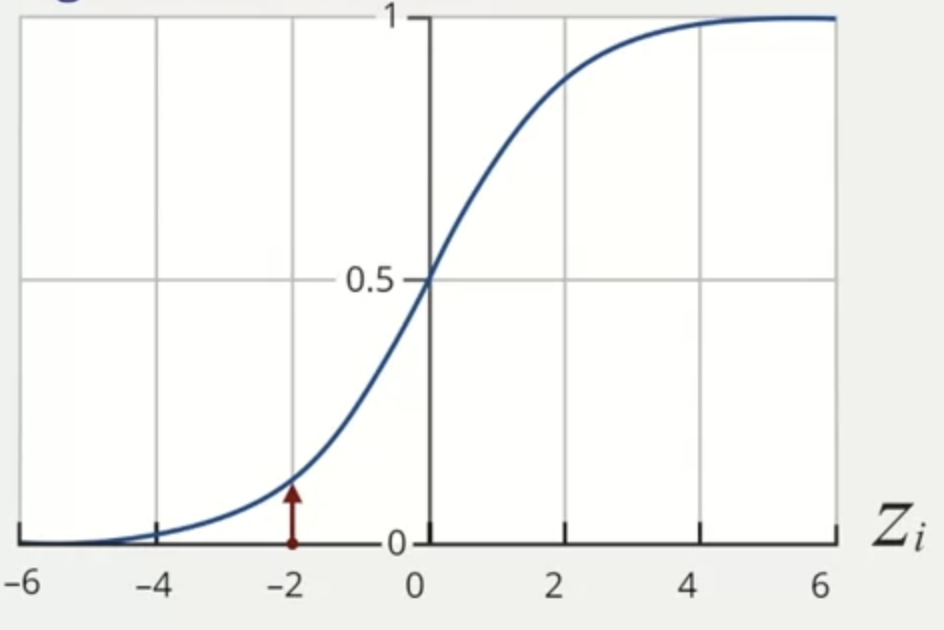
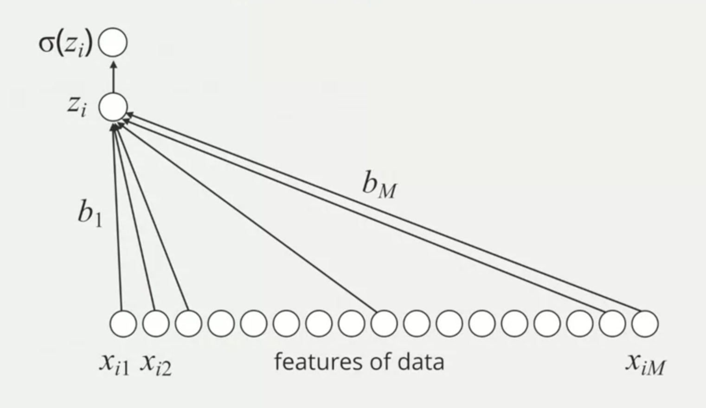
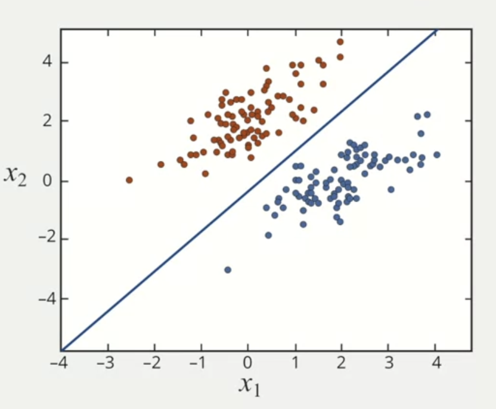
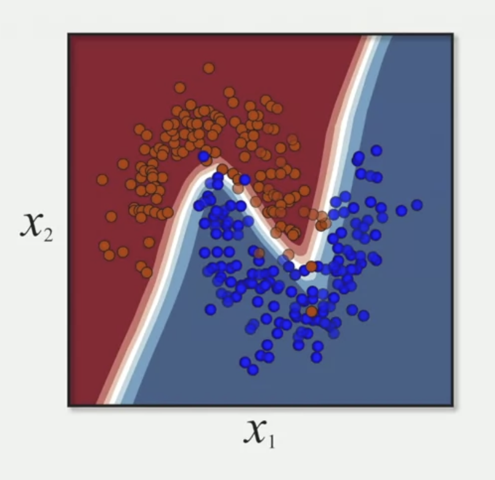

# Logistic Regression

## Why Machine Learning Is Exciting

Machine learning and deep learning are now solving very complex tasks, often with a level of performance that exceeds that of humans.

## What Is Machine Learning?

We want to teach a machine to learn. Give the machine examples, and examples are characterized by data samples and then we want the machine to predict of that data.

Learning a predictive model based on label data:

- X = data/features for a subject
- Y = associated label, in this case a binary label: 0/1

An example is `X` being the data that represents an image and `Y` the label that represents if the image is benign or malignant.

Another example: will it rain or not?

- `features`: cloud cover, humidity, temperature, air pressure
- `outcome`: did it rain?

The features are a set of data

- cloud cover: 0.5
- humidity: 80%
- temperature: 75
- air pressure: 1.2

And the outcome is a binary label: it rained (1) / it didn't rain (0).

A training set is a series of examples (features → outcome).

The mathematical model (algorithm) predicts the outcome from a new data example based on the training set.

## Logistic Regression

Learning: infers what parameters of the model are consistent with the training data.

### Linear Predictive Model

The data is a vector of features: each feature is an important component to predict the outcome.

```jsx
[_,  _,  _,  _,  _,  _,  _,  ...,  _]
Xi1 Xi2 Xi3 Xi4 Xi5 Xi6 Xi7  ...  Xim
```

What are parameters? the values the learning algorithm can change independently as it learns. It determines how input data is transformed into the desired output. The parameters tell us how important data variables are to the prediction.

To get the output, a simple idea is to multiply each feature with a parameter, sum all, and add a constant called bias.

```jsx
(b1 * Xi1) + (b2 * Xi2) + ... + (bm * Xim) + b0    =    Zi
                                              ^          ^
                                              |          |
                                            (bias)    (outcome)
```

`b1`, `b2`, and so on stand for each parameter and `b0` is the bias (the constant).

If we don't want just a binary result (it will rain / it won't rain) but also the percentage (it has 70% of chance to rain in the day X), we use a logistic function. It converts to a probability.

The logistic function is represented by the sigma symbol (σ). The sigmoid function always live between 0 and 1.



If the `Zi` is in the rightmost part of the graph (positive), the probability is close to 1, which means that we have high confidence that it will happen (e.g. high probability of raining in the day X). If `Zi` is small, the sigmoid function generates a result closer to 0, which means low probability of something happening (e.g. low probability of not raining in the day X).

- `Zi` = large and positive: `Yi` is likely close to 1
- `Zi` = large and negative: `Yi` is likely close to 0



### Limitations of Logistic Regression



Logistic regression is linear classifier or linear model. These models solve a binary problem because they can only represent limited relationships.

Sometimes there are situations in which the data is not well separated by a linear classifier.



Logistic regression is only effective when a linear classifier can easily distinguish between class 1 and 0. If the decision boundary is much more complicated, the logistic regression will have limitations and it won't be effective.
