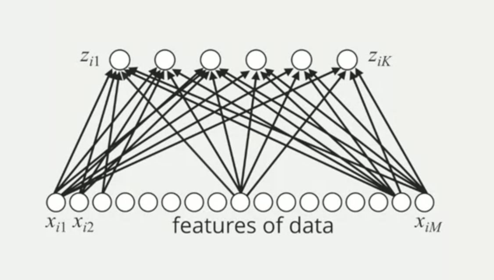

# Multilayer Perceptron Concepts

In logistic regression, the predictive model does a multiplication of each feature with parameters, sum all together with a constant value (bias) and use this result as the input for the sigmoid function to have the probability outcome.

In multilayer perceptron, the predictive model does this same process K times.

