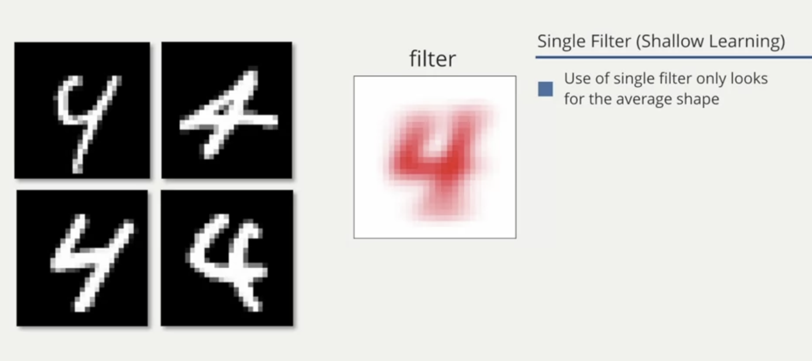
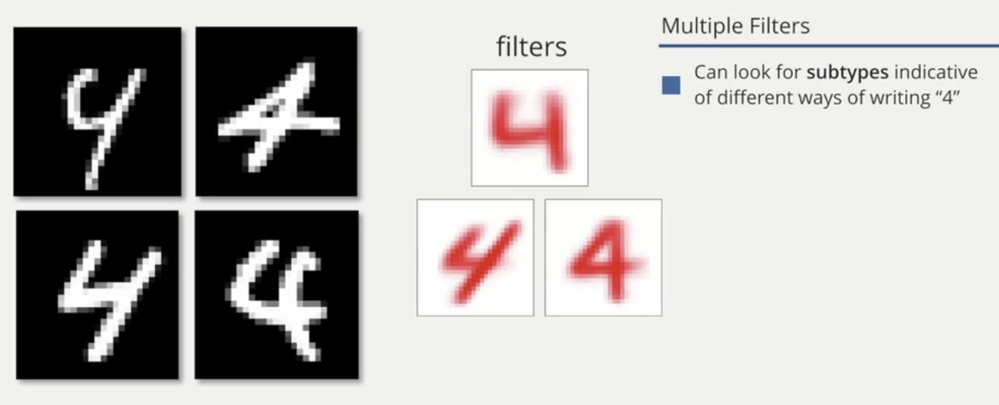
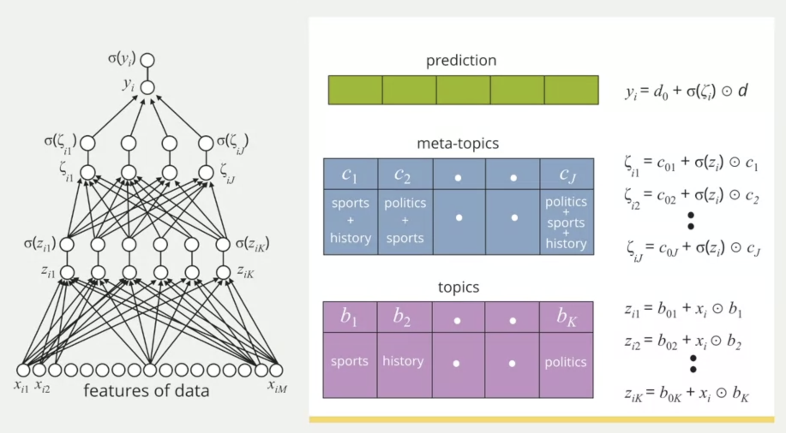

# Multilayer Perceptron

In logistic regression, the predictive model does a multiplication of each feature with parameters, sum all together with a constant value (bias) and use this result as the input for the sigmoid function to have the probability outcome.

In the multilayer perceptron, the predictive model does this same process K times.


This model gets the data and generates a vector of Zi from 1 to K, pass each Zi into the sigmoid function to get the first outcome called "the probability of K latent processes/features".


And then each latent feature (also called `filters`) is used as the input for a logistic regression model to generate a binary probability of a particular outcome.

### Example: Handwritten numbers

For handwritten number 4, we can have different examples of it. With a single filter, it gives an average number 4 (average shape). This is a shallow learning because the average 4 can have different examples in the data that may not look like the average number.



So building a classifier based on a single filter seems undesirable.

We can consider a model to have three (or multiple) intermediate filters.



In this case, the data is the pixels of the image of each handwritten number 4, it applies K filters, in this case K = 3, and then it generates the probability outcome based on the 3 filters (is it the number 4 or not?).

```
(b11 * Xi1) + (b12 * Xi2) + ... + (b1m * Xim) + b01 = Zi1
(b21 * Xi1) + (b22 * Xi2) + ... + (b2m * Xim) + b02 = Zi2
                            ...
(bK1 * Xi1) + (bK2 * Xi2) + ... + (bKm * Xim) + b0K = ZiK
```

This intermediate model adds more sofistication and flexibility to the predictive model. It allows us consider non-linear decision boundaries in feature space and in most cases more effective than a simple logistic regression.

### Example: Document Analysis

In this example, documents are the data or the input for the predictive model. The result we want is the probability of a person likes the document or not.

The features are counts of each word in the document. And the outcome is the probability of a given person like or not the document.



The first step is to generate the latent features from the count of each word in the document: given the words that we see in the document, what's the probability of this document is about "topic X"?

In this case, the topics are the filters. And let's say these filters can be "Sports", "Math", "History", and so on.

Moving "deeper" in the model, we do the same process again. Pass the outcome from the first layer to a new series of filters. These filters are "meta topics", or the combination of each topic we saw in the first layer. e.g. "Sports + Math", "Sports + History", "Math + History". And the outcome of this second layer is the probability of the document to be each meta-topic (measured again from 0 to 1).

Finally, at the top, we do a logistic regression, meaning pass the second layer's outcome to a sigmoid function to have the probability of the person of interest is gonna like the document or not (measured from 0 to 1).
