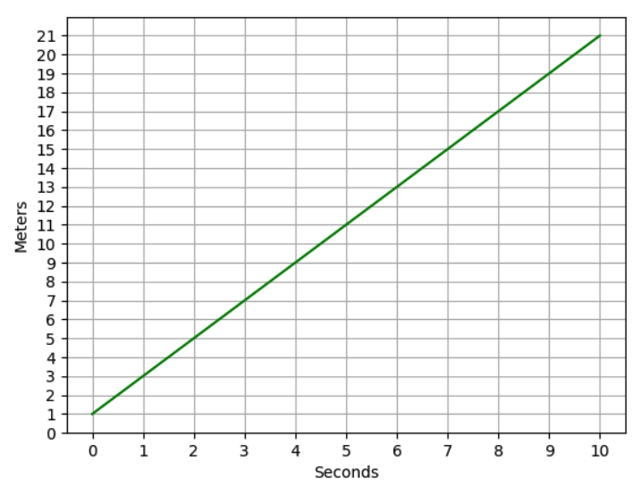
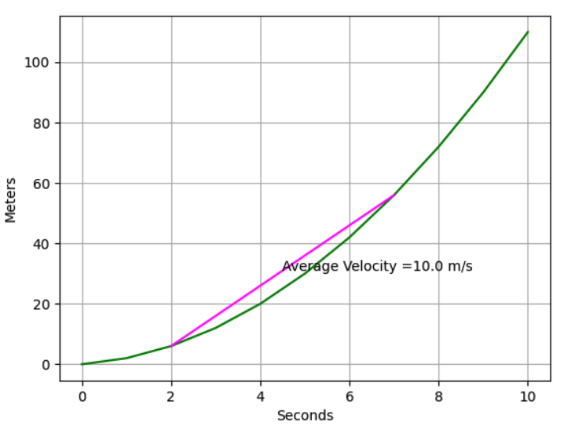
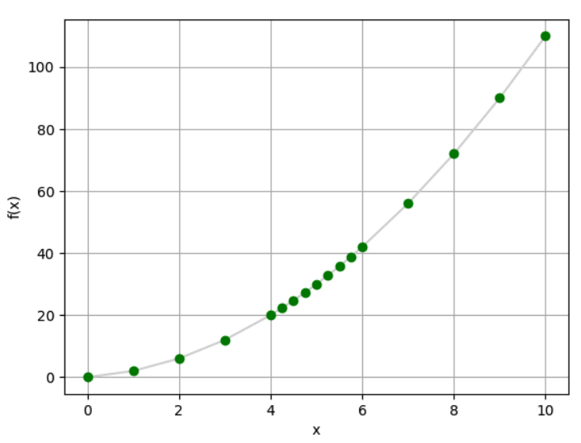
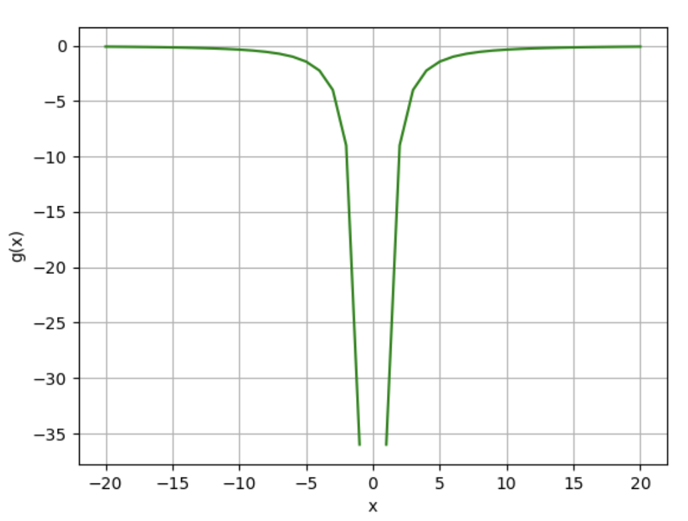
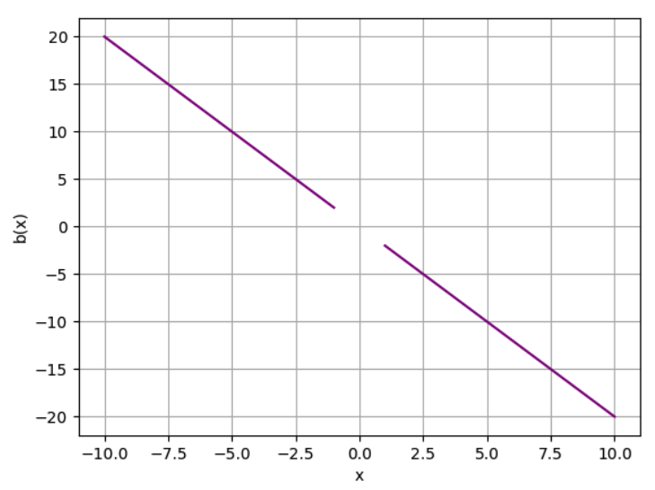
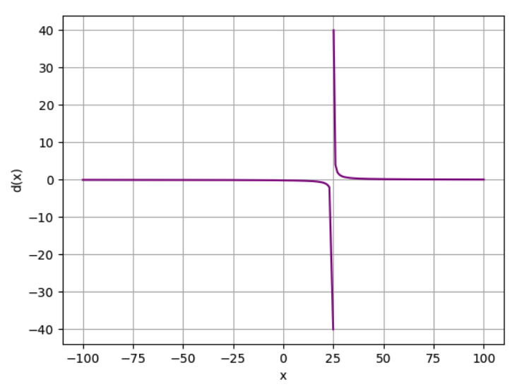

# Math for Machine Learning with Python

- [Algebra Fundamentals](#algebra-fundamentals-equations-graphs-and-functions)
  - [Intro to equations](#intro-to-equations)
  - [Linear Equations](#linear-equations)
  - [Systems of Equations](#systems-of-equations)
  - [Exponentials & Logarithms](#exponentials--logarithms)
  - [Polynomials](#polynomials)
  - [Factorization](#factorization)
  - [Quadratic Equations](#quadratic-equations)
  - [Functions](#functions)

## Algebra Fundamentals: Equations, Graphs, and Functions

### Intro to equations

Starting with an equation: `2x + 3 = 9` to find the the `x`. `x = 3`

```python
x = -41
x + 16 == -25 # True
```

Working with fractions

```python
x = 45
x / 3 + 1 == 16 # True
```

Variables in both sides

```python
x = 1.5
3 * x + 2 == 5 * x -1 # True
```

### Linear Equations

Creating a dataframe with the `x` and `y` columns and their values

```python
import pandas as pd
from matplotlib import pyplot as plt

df = pd.DataFrame({'x': range(-10, 11)})
df['y'] = (3 * df['x'] - 4) / 2
```

Simple way to plot and show the graph

```python
plt.plot(df.x, df.y, color="grey")
plt.xlabel('x')
plt.ylabel('y')
plt.grid()
plt.show()
```


Annotate the points when x = 0 and y = 0

```python
plt.annotate('x-intercept', (1.333, 0))
plt.annotate('y-intercept', (0, -2))
plt.show()
```


Finding the slope through the equation:

```
slope = Δy/Δx
```

Slope is usually represented by the letter `m`

```
m = (y2 - y1) / (x2 - x1)
```

Getting these two points, we can infer the slope value: (0, -2), (6, 7)

```
m = (7 - (-2)) / (6 - 0)
m = 1.5
```

It means that when moving one unit to the right (x-axis), we need to move 1.5 units up (y-axis) to get back to the line.

```python
m = 1.5
yInt = -2
mx = [0, 1]
my = [yInt, yInt + m]
```

### Systems of Equations

In equations with two variables `x` and `y`, we can use elimination to find the values when the intersect with each other

```
x + y = 16
10x + 25y = 250
```

With elimination, you'll find out that `x = 10` and `y = 6` when the lines intersect.

```python
x = 10
y = 6
print((x + y == 16) & ((10 * x) + (25 * y) == 250))
```

When plotting the lines of those equations, we get this graph


Here's how we generate the code

```python
chipsAll10s = [16, 0]
chipsAll25s = [0, 16]

valueAll10s = [25, 0]
valueAll25s = [0, 10]

plt.plot(chipsAll10s, chipsAll25s, color='blue')
plt.plot(valueAll10s, valueAll25s, color="orange")
plt.xlabel('x (£10 chips)')
plt.ylabel('y (£25 chips)')
plt.grid()

plt.show()
```

### Exponentials & Logarithms

Exponentials have a simple case that's squaring a number: `2² = 2 x 2 = 4`.

```python
2 ** 2 # 4
```

Radicals (roots) is useful to calculate a solution for exponential

```
?² = 9
√9 = 3
∛64 = 4
```

In Python we can use `math.sqrt` to get the square root of a number and a trick to get the cube root.

```python
math.sqrt(25) # 5
round(64 ** (1. / 3)) # 64 ^ 1/3 = ∛64 = 4
```

To find the exponent for a given number and base, we use the logarithm

```
4 ^ ? = 16
log₄(16) = 2
```

The `math` module has a `log` function that receive the number and the base

```python
math.log(16, 4) # 2.0
math.log(29) # 3.367295829986474
math.log10(100) # 2.0
```

Solving equations with exponentials:

```
2y = 2(x^4)((x^2 + 2x^2) / x^3)
2y = 2(x^4)(3x^2 / x^3)
2y = 2(x^4)(3x^-1)
2y = 6(x^3)
y = 3(x^3)
```

We can exemplify this with Python

```python
df = pd.DataFrame ({'x': range(-10, 11)})

# add a y column by applying the slope-intercept equation to x
df['y'] = 3 * df['x'] ** 3 # this is the equation we simplified above

plt.plot(df.x, df.y, color="magenta")
plt.xlabel('x')
plt.ylabel('y')
plt.grid()
plt.axhline()
plt.axvline()
plt.show()
```

It generates this graph:


### Polynomials

A polynomial is an algebraic expression containing one or more _terms_.

```
12x³ + 2x - 16
```

The terms themselves include:

- Two coefficients(12 and 2) and a constant (-16)
- A variable (x)
- An exponent (<sup>3</sup>)

Simplifying the polynomial:

x<sup>3</sup> + 2x<sup>3</sup> - 3x - x + 8 - 3
3x<sup>3</sup> - 4x + 5

And we can compare both equations in Python

```python
from random import randint
x = randint(1,100)

(x**3 + 2 * x**3 - 3 * x - x + 8 - 3) == (3 * x**3 - 4 * x + 5)
# True
```

### Factorization

`Factorization` is the process of restating an expression as the _product_ of two expressions.

-6x<sup>2</sup>y<sup>3</sup>

You can get this value by performing the following multiplication:

(2xy<sup>2</sup>)(-3xy)

So, we can say that **2xy<sup>2</sup>** and **-3xy** are both factors of **-6x<sup>2</sup>y<sup>3</sup>**.

```python
from random import randint
x = randint(1,100)
y = randint(1,100)

(2 * x * y**2) * (-3 * x * y) == -6 * x**2 * y**3
```

The `Greatest Common Factor` (GCF) is the highest value that is a multiple of both number `n1` and number `n2`.

We can apply this idea to polynomials too.

15x<sup>2</sup>y
9xy<sup>3</sup>

The GCF of these polynomial is `2xy`

Factorization is useful for expressions like the differences of squares:

x<sup>2</sup> - 9
x<sup>2</sup> - 3<sup>2</sup>
(x - 3)(x + 3)

We generalize this idea to this expression: a<sup>2</sup> - b<sup>2</sup> = (a - b)(a + b)

Ensure this is true:

```python
from random import randint
x = randint(1,100)

(x**2 - 9) == (x - 3) * (x + 3)
```

This is also true for perfect squares

x<sup>2</sup> 10x + 25
(x - 5)(x + 5)
(x + 5)<sup>2</sup>

And we can generalize to this expression: (a + b)<sup>2</sup> = a<sup>2</sup> + 2ab + b<sup>2</sup>

Ensure this with Python

```python
from random import randint
a = randint(1,100)
b = randint(1,100)

a**2 + b**2 + (2 * a * b) == (a + b)**2
```

### Quadratic Equations

Use the complete the square method to solve quadratic equations. Take this following equation as an example:

x<sup>2</sup> + 24x + 12<sup>2</sup>

Can be factored to this:

(x + 12)<sup>2</sup>

OK, so how does this help us solve a quadratic equation? Well, let's look at an example:

y = x<sup>2</sup> + 6x - 7

Let's start as we've always done so far by restating the equation to solve **_x_** for a **_y_** value of 0:

x<sup>2</sup> + 6x - 7 = 0

Now we can move the constant term to the right by adding 7 to both sides:

x<sup>2</sup> + 6x = 7

OK, now let's look at the expression on the left: _x<sup>2</sup> + 6x_. We can't take the square root of this, but we can turn it into a trinomial that will factor into a perfect square by adding a squared constant. The question is, what should that constant be? Well, we know that we're looking for an expression like _x<sup>2</sup> + 2**c**x + **c**<sup>2</sup>_, so our constant **c** is half of the coefficient we currently have for **_x_**. This is **6**, making our constant **3**, which when squared is **9** So we can create a trinomial expression that will easily factor to a perfect square by adding 9; giving us the expression _x<sup>2</sup> + 6x + 9_.

However, we can't just add something to one side without also adding it to the other, so our equation becomes:

x<sup>2</sup> + 6x + 9 = 16

So, how does that help? Well, we can now factor the trinomial expression as a perfect square binomial expression:

(x + 3)<sup>2</sup> = 16

And now, we can use the square root method to find x + 3:

x + 3 = √16

So, x + 3 is **-4** or **4**. We isolate **_x_** by subtracting 3 from both sides, so **_x_** is **-7** or **1**:

x = -7, 1

### Functions

Functions are usually the same how it's in programming. Data in, data out.

f(x) = x<sup>2</sup> + 2
f(3) = 11

```python
def f(x):
  return x**2 + 2

f(3) # 11
```

Bounds of function: domain

Imagine a function `g(x)` = (12 / 2x)<sup>2</sup>, where `{x ∈ ℝ | x ≠ 0}`

In Python:

```python
def g(x):
  if x != 0:
    return (12 / 2 * x)**2

x = range(-100, 101)
y = [g(a) for a in x]
```

Conditional: for `k(x)`

```
{
  0, if x = 0,
  1, if x = 100
}
```

In Python:

```python
def k(x):
  if x == 0:
    return 0
  elif x == 100:
    return 1

x = range(-100, 101)
y = [k(a) for a in x]
```

## Derivatives and Optimization

### Rate of Change

`q(x) = 2x + 1`

In a period of 10s, we can plot this into a graph with Python

```python
def q(x):
  return 2 * x + 1

x = np.array(range(0, 11))
plt.xlabel('Seconds')
plt.ylabel('Meters')
plt.xticks(range(0, 11, 1))
plt.yticks(range(0, 22, 1))
plt.grid()
plt.plot(x, q(x), color='green')
plt.show()
```

Plotting this graph:



For this equation `q(x) = 2x + 1`, we can say the rate of change is `2`. Generalizing, we having `f(x) = mx + C`, `m` is the rate of change.

We calculate the rate of change the same as the slope:

```
m = Δy/Δx
```

We can calculate the average rate of change between two points for a quadratic function like `r(x) = x² + x`.

It's possible to do it between the first and the last point of the function or in a period of time.

```python
x = np.array(range(0, 11))
s = np.array([2,7])

x1 = s[0]
x2 = s[-1]
y1 = r(x1)
y2 = r(x2)
a = (y2 - y1)/(x2 - x1)

plt.xlabel('Seconds')
plt.ylabel('Meters')
plt.grid()
plt.plot(x,r(x), color='green')
plt.plot(s,r(s), color='magenta')
plt.annotate('Average Velocity =' + str(a) + ' m/s',((x2+x1)/2, (y2+y1)/2))
plt.show()
```

This plots the behavior of the function and average velocity:



### Limits

In a quadratic equation we have a bunch of points in the curve and we can plot like this:

```python
def f(x):
  return x**2 + x

x = list(range(0,5))
x.append(4.25)
x.append(4.5)
x.append(4.75)
x.append(5)
x.append(5.25)
x.append(5.5)
x.append(5.75)
x = x + list(range(6,11))

y = [f(i) for i in x]

plt.xlabel('x')
plt.ylabel('f(x)')
plt.grid()
plt.plot(x,y, color='lightgrey', marker='o', markeredgecolor='green', markerfacecolor='green')
plt.show()
```

Generating this graph:



But we can still see gaps between points. And now we need to understand the concept of limits.

Not all functions are continuous. Take this function as example:

```
g(x) = -(12/2x)², where x ≠ 0
```

`x` can't be `0` because any number divided by `0` is `undefined`.

```python
def g(x):
  if x != 0:
    return -(12/(2 * x))**2

x = range(-20, 21)
y = [g(a) for a in x]

plt.xlabel('x')
plt.ylabel('g(x)')
plt.grid()
plt.plot(x,y, color='green')
plt.show()
```

Plotting `g(x)`, we get this graph:



The function `g(x)` is non-continuous at `x = 0`

Limits can be applied to continous functions like `a(x) = x² + 1`

When `x` is approaching `0`, `a(x) = 1`.

That's because when `x` is slightly greater than `0` and slightly smaller than `0` (e.g. 0.000001 and -0.000001), the result will be slightly greater than `1` and slightly smaller than `1`, respectively.

This is how we write it: when `x` approaching `0`, the limit of `a(x)` is `1`.

`lim x->0 a(x) = 1`

We can also apply this concept to non-continuous points. Take this function as example: `b(x) = -2x²/x`, where `x ≠ 0`.

Let's plot it with Python

```python
def b(x):
  if x != 0:
    return (-2*x**2) * 1/x

x = range(-10, 11)
y = [b(i) for i in x]

plt.xlabel('x')
plt.ylabel('b(x)')
plt.grid()
plt.plot(x,y, color='purple')
plt.show()
```

Here's how it looks like in a graph:



`x` approaching `0` from positive and negative sides equals `0`

- `lim x -> 0⁺ b(x) = 0`
- `lim x -> 0⁻ b(x) = 0`

We can also approach infinite. Take this function: `d(x) = 4 / (x - 25)`, where `x ≠ 25`

```python
def d(x):
  if x != 25:
    return 4 / (x - 25)

x = list(range(-100, 24))
x.append(24.9)
x.append(25)
x.append(25.1)
x = x + list(range(26, 101))
y = [d(i) for i in x]

plt.xlabel('x')
plt.ylabel('d(x)')
plt.grid()
plt.plot(x,y, color='purple')
plt.show()
```

We plot this graph:



Approaching from negative and positive sides result in infinite.

- -♾️ when approaching from the negative side: lim x->25 d(x) = -♾️
- +♾️ when approaching from the positive side: lim x->25 d(x) = +♾️
