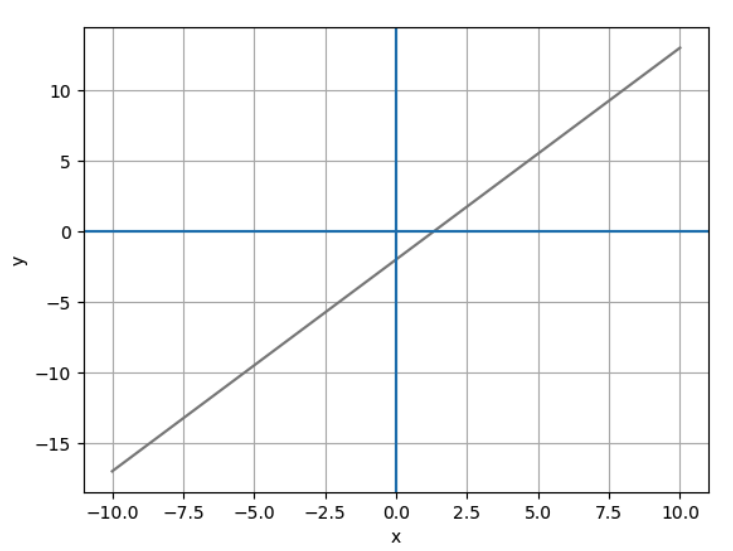
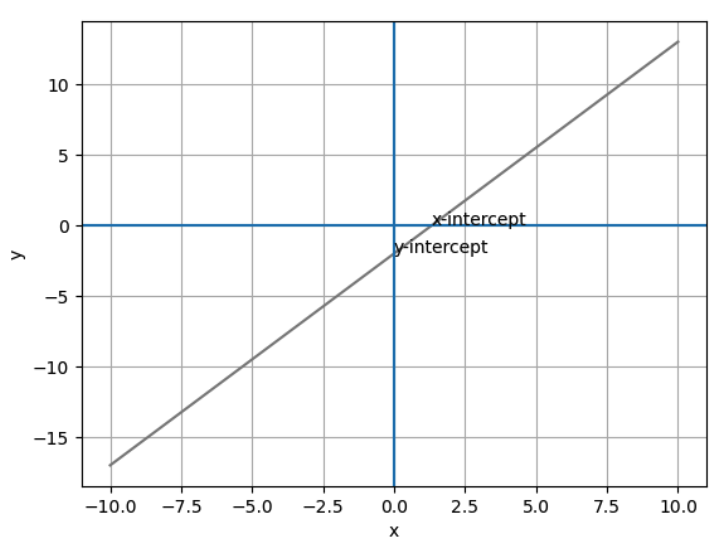
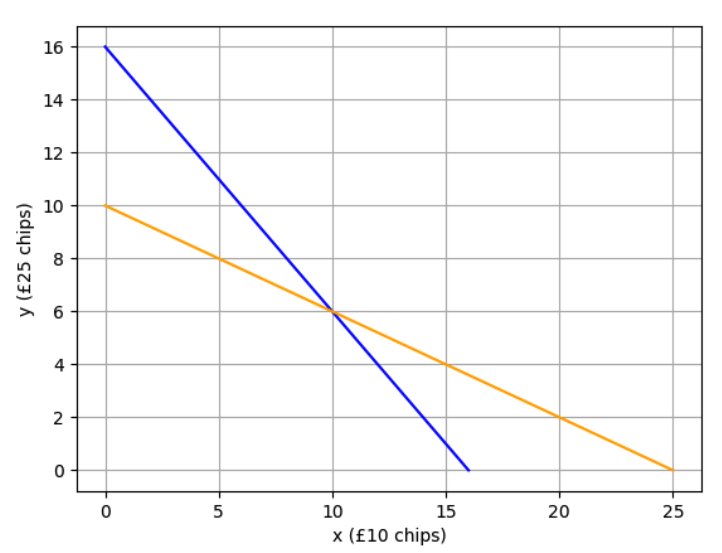
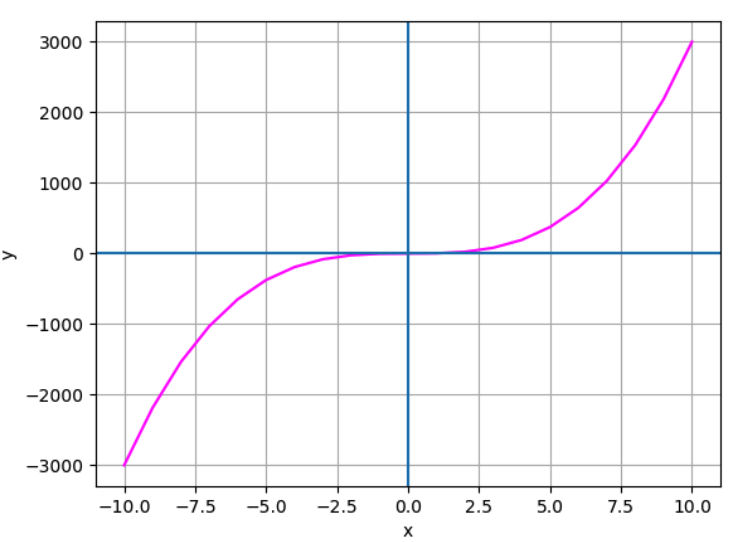

# Math for Machine Learning with Python

## Algebra Fundamentals: Equations, Graphs, and Functions

Starting with an equation: `2x + 3 = 9` to find the the `x`. `x = 3`

```python
x = -41
x + 16 == -25 # True
```

Working with fractions

```python
x = 45
x / 3 + 1 == 16 # True
```

Variables in both sides

```python
x = 1.5
3 * x + 2 == 5 * x -1 # True
```

Creating a dataframe with the `x` and `y` columns and their values

```python
import pandas as pd
from matplotlib import pyplot as plt

df = pd.DataFrame({'x': range(-10, 11)})
df['y'] = (3 * df['x'] - 4) / 2
```

Simple way to plot and show the graph

```python
plt.plot(df.x, df.y, color="grey")
plt.xlabel('x')
plt.ylabel('y')
plt.grid()
plt.show()
```



Annotate the points when x = 0 and y = 0

```python
plt.annotate('x-intercept', (1.333, 0))
plt.annotate('y-intercept', (0, -2))
plt.show()
```



Finding the slope through the equation:

```
slope = Δy/Δx
```

Slope is usually represented by the letter `m`

```
m = (y2 - y1) / (x2 - x1)
```

Getting these two points, we can infer the slope value: (0, -2), (6, 7)

```
m = (7 - (-2)) / (6 - 0)
m = 1.5
```

It means that when moving one unit to the right (x-axis), we need to move 1.5 units up (y-axis) to get back to the line.

```python
m = 1.5
yInt = -2
mx = [0, 1]
my = [yInt, yInt + m]
```

In equations with two variables `x` and `y`, we can use elimination to find the values when the intersect with each other

```
x + y = 16
10x + 25y = 250
```

With elimination, you'll find out that `x = 10` and `y = 6` when the lines intersect.

```python
x = 10
y = 6
print((x + y == 16) & ((10 * x) + (25 * y) == 250))
```

When plotting the lines of those equations, we get this graph



Here's how we generate the code

```python
chipsAll10s = [16, 0]
chipsAll25s = [0, 16]

valueAll10s = [25, 0]
valueAll25s = [0, 10]

plt.plot(chipsAll10s, chipsAll25s, color='blue')
plt.plot(valueAll10s, valueAll25s, color="orange")
plt.xlabel('x (£10 chips)')
plt.ylabel('y (£25 chips)')
plt.grid()

plt.show()
```

Exponatials have a simple case that's squaring a number: `2² = 2 x 2 = 4`.

```python
2 ** 2 # 4
```

Radicals (roots) is useful to calculate a solution for exponential

```
?² = 9
√9 = 3
∛64 = 4
```

In Python we can use `math.sqrt` to get the square root of a number and a trick to get the cube root.

```python
math.sqrt(25) # 5
round(64 ** (1. / 3)) # 64 ^ 1/3 = ∛64 = 4
```

To find the exponent for a given number and base, we use the logarithm

```
4 ^ ? = 16
log₄(16) = 2
```

The `math` module has a `log` function that receive the number and the base

```python
math.log(16, 4) # 2.0
math.log(29) # 3.367295829986474
math.log10(100) # 2.0
```

Solving equations with exponentials:

```
2y = 2(x^4)((x^2 + 2x^2) / x^3)
2y = 2(x^4)(3x^2 / x^3)
2y = 2(x^4)(3x^-1)
2y = 6(x^3)
y = 3(x^3)
```

We can exemplify this with Python

```python
df = pd.DataFrame ({'x': range(-10, 11)})

# add a y column by applying the slope-intercept equation to x
df['y'] = 3 * df['x'] ** 3 # this is the equation we simplified above

plt.plot(df.x, df.y, color="magenta")
plt.xlabel('x')
plt.ylabel('y')
plt.grid()
plt.axhline()
plt.axvline()
plt.show()
```

It generates this graph:



A polynomial is an algebraic expression containing one or more _terms_.

```
12x³ + 2x - 16
```

The terms themselves include:

- Two coefficients(12 and 2) and a constant (-16)
- A variable (x)
- An exponent (<sup>3</sup>)

Simplifying the polynomial:

x<sup>3</sup> + 2x<sup>3</sup> - 3x - x + 8 - 3
3x<sup>3</sup> - 4x + 5

And we can compare both equations in Python

```python
from random import randint
x = randint(1,100)

(x**3 + 2 * x**3 - 3 * x - x + 8 - 3) == (3 * x**3 - 4 * x + 5)
# True
```

`Factorization` is the process of restating an expression as the _product_ of two expressions.

-6x<sup>2</sup>y<sup>3</sup>

You can get this value by performing the following multiplication:

(2xy<sup>2</sup>)(-3xy)

So, we can say that **2xy<sup>2</sup>** and **-3xy** are both factors of **-6x<sup>2</sup>y<sup>3</sup>**.

```python
from random import randint
x = randint(1,100)
y = randint(1,100)

(2 * x * y**2) * (-3 * x * y) == -6 * x**2 * y**3
```

The `Greatest Common Factor` (GCF) is the highest value that is a multiple of both number `n1` and number `n2`.

We can apply this idea to polynomials too.

15x<sup>2</sup>y
9xy<sup>3</sup>

The GCF of these polynomial is `2xy`

Factorization is useful for expressions like the differences of squares:

x<sup>2</sup> - 9
x<sup>2</sup> - 3<sup>2</sup>
(x - 3)(x + 3)

We generalize this idea to this expression: a<sup>2</sup> - b<sup>2</sup> = (a - b)(a + b)

Ensure this is true:

```python
from random import randint
x = randint(1,100)

(x**2 - 9) == (x - 3) * (x + 3)
```

This is also true for perfect squares

x<sup>2</sup> 10x + 25
(x - 5)(x + 5)
(x + 5)<sup>2</sup>

And we can generalize to this expression: (a + b)<sup>2</sup> = a<sup>2</sup> + 2ab + b<sup>2</sup>

Ensure this with Python

```python
from random import randint
a = randint(1,100)
b = randint(1,100)

a**2 + b**2 + (2 * a * b) == (a + b)**2
```
