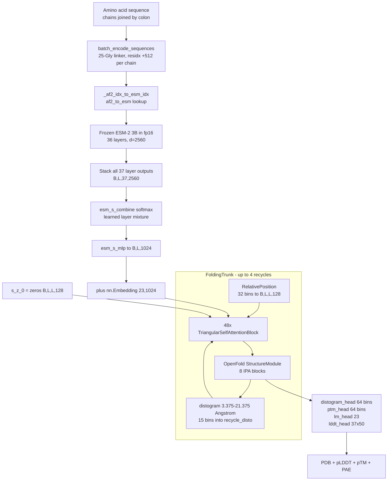
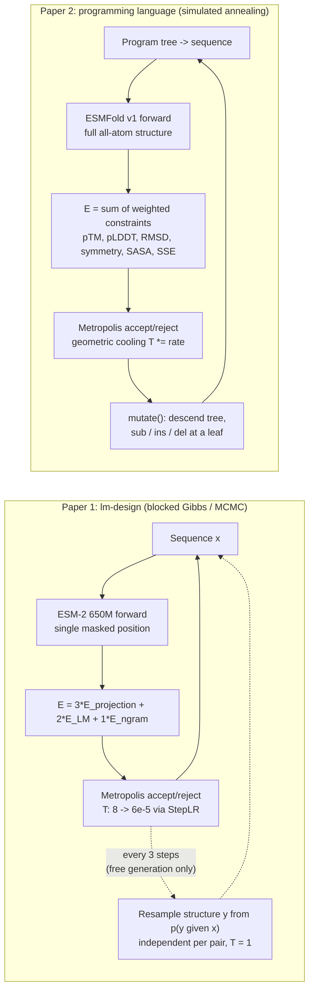

# ESM (Evolutionary Scale Modeling) — Technical Report

Source: [facebookresearch/esm](https://github.com/facebookresearch/esm) (branch `main`, PyPI package `fair-esm` 2.0.1, repository archived 2024-08-01), cross-referenced with two December 2022 bioRxiv preprints:

- **Paper 1** — [Language models generalize beyond natural proteins](https://www.biorxiv.org/content/10.1101/2022.12.21.521521v1.full.pdf) (Verkuil, Kabeli et al.), code under `examples/lm-design/`.
- **Paper 2** — [A high-level programming language for generative protein design](https://www.biorxiv.org/content/10.1101/2022.12.21.521526v1.full.pdf) (Hie, Candido et al.), code under `examples/protein-programming-language/`.

## 1. Overview

ESM is Meta FAIR's protein language modeling stack. The central claim across the whole line of work is that **training a transformer on raw amino acid sequences with a masked language modeling objective causes structural information to emerge in the internal representations**, with no explicit supervision on structure and no multiple sequence alignment at inference time. Every downstream system in the repo is a way of reading that emergent information back out:

- Attention maps → inter-residue contacts (a logistic regression on 660 attention channels).
- Frozen per-layer representations → full atomic-resolution structure (ESMFold).
- Masked-token marginals → mutation effect prediction (ESM-1v).
- The same representations, used generatively → de novo protein design (both December 2022 papers).

This is the key architectural contrast with AlphaFold (see [papers/alphafold/TECHNICAL_REPORT.md](../alphafold/TECHNICAL_REPORT.md)): AlphaFold spends most of its inference wall-clock running `jackhmmer`/`hhblits` against multi-terabyte genetic databases to build an MSA. ESMFold deletes that entire stage and replaces it with a forward pass through a frozen 3B-parameter language model, which has internalized the evolutionary statistics during pretraining. The MSA becomes weights instead of a runtime input.

### 1.1 Model lineage

| Date | Model | Paper | Contribution |
|---|---|---|---|
| 2019 (upd. Aug 2020) | **ESM-1** | Rives et al. 2019 / PNAS 2021 | First evolutionary-scale transformer protein LM; 250M sequences |
| Dec 2020 | **ESM-1b** | Rives et al. Appendix B | Architecture cleanup (learned positions, tied LM head, pre/post LN) |
| Dec 2020 | Self-attention contacts | Rao et al. 2020 (ICLR'21) | Unsupervised contact prediction from attention maps |
| Feb / Jun 2021 | **ESM-MSA-1 / 1b** | Rao et al. 2021 (ICML'21) | Axial attention over an MSA; tied row attention |
| Jul 2021 | **ESM-1v** | Meier et al. 2021 | Zero-shot variant effect prediction; UniRef90; 5-model ensemble |
| Apr 2022 | **ESM-IF1** | Hsu et al. 2022 (ICML) | Inverse folding: GVP-GNN + seq2seq transformer, 12M AF2 structures |
| Aug 2022 | **ESM-2** | Lin et al. 2022 / Science 2023 | Rotary embeddings, scaling to 15B params |
| Nov 2022 | **ESMFold** | Lin et al. 2022 | End-to-end single-sequence structure prediction |
| Nov 2022 / Mar 2023 | **ESM Metagenomic Atlas** | — | 617M → 772M predicted metagenomic structures |
| Dec 2022 | **lm-design** | Paper 1 | Generative design via MCMC over an LM-defined energy |
| Dec 2022 | **protein-programming-language** | Paper 2 | Compiling declarative programs into ESMFold-guided energies |

### 1.2 Installation surface

```bash
pip install fair-esm                       # core models
pip install "fair-esm[esmfold]"            # + OpenFold dependency chain
pip install 'dllogger @ git+https://github.com/NVIDIA/dllogger.git'
pip install 'openfold @ git+https://github.com/aqlaboratory/openfold.git@4b41059694619831a7db195b7e0988fc4ff3a307'
```

ESMFold requires Python ≤ 3.9 and a working `nvcc` (OpenFold compiles CUDA kernels). `setup.py` declares no `install_requires` at all — PyTorch is assumed present — and ships two console entry points, `esm-extract` → `esm.scripts.extract:main` and `esm-fold` → `esm.scripts.fold:main`. Models are also reachable without installing the package via `torch.hub.load("facebookresearch/esm:main", "esm2_t33_650M_UR50D")`.

## 2. Repository layout

| Path | Contents |
|---|---|
| `esm/model/esm1.py` | `ProteinBertModel` — ESM-1, ESM-1b, ESM-1v |
| `esm/model/esm2.py` | `ESM2` |
| `esm/model/msa_transformer.py` | `MSATransformer` |
| `esm/modules.py` | `TransformerLayer`, `AxialTransformerLayer`, heads, layer norms, `apc`/`symmetrize` |
| `esm/multihead_attention.py` | `MultiheadAttention` (fairseq-derived) |
| `esm/axial_attention.py` | `RowSelfAttention`, `ColumnSelfAttention` |
| `esm/rotary_embedding.py` | `RotaryEmbedding` |
| `esm/data.py` | `Alphabet`, `BatchConverter`, `FastaBatchedDataset`, `ESMStructuralSplitDataset` |
| `esm/pretrained.py` | Checkpoint download, state-dict migration, all model entry points |
| `esm/esmfold/v1/` | `ESMFold`, `FoldingTrunk`, `TriangularSelfAttentionBlock`, misc modules |
| `esm/inverse_folding/` | ESM-IF1: GVP modules, GVP-Transformer encoder/decoder, structure I/O |
| `scripts/extract.py`, `scripts/fold.py` | The two CLIs |
| `scripts/atlas/` | Bulk download manifests for the Metagenomic Atlas |
| `examples/lm-design/` | Paper 1 implementation |
| `examples/protein-programming-language/` | Paper 2 implementation |
| `examples/variant-prediction/` | ESM-1v zero-shot scoring |
| `examples/inverse_folding/` | ESM-IF1 sampling and scoring scripts |

## 3. Tokenization and data pipeline

### 3.1 Alphabet

`esm/constants.py` defines 28 base tokens covering the 20 standard amino acids plus ambiguity and gap codes:

```
L A G V S E R T I D P K Q N F Y M H W C X B U Z O . -
```

`Alphabet.from_architecture(name)` wraps these with architecture-specific special tokens. The differences matter because they change index arithmetic everywhere downstream (BOS offsets in variant scoring, EOS stripping in the contact head, `<cath>` as the decoder start symbol in ESM-IF1):

| Architecture | Prepend tokens | Append tokens | `prepend_bos` | `append_eos` | `use_msa` |
|---|---|---|---|---|---|
| `ESM-1`, `protein_bert_base` | `<null_0> <pad> <eos> <unk>` | `<cls> <mask> <sep>` | True | False | False |
| `ESM-1b`, `roberta_large` | `<cls> <pad> <eos> <unk>` | `<mask>` | True | True | False |
| `MSA Transformer`, `msa_transformer` | `<cls> <pad> <eos> <unk>` | `<mask>` | True | False | True |
| `invariant_gvp` (ESM-IF1) | `<null_0> <pad> <eos> <unk>` | `<mask> <cath> <af2>` | True | False | False |

The vocabulary is padded with `<null_i>` filler tokens until `len(all_toks) % 8 == 0`, which keeps the embedding and output projection matrices tensor-core friendly.

### 3.2 Batch converters

`BatchConverter` produces `(B, max_len + prepend_bos + append_eos)` token tensors filled with `padding_idx`, optionally truncating at `truncation_seq_length`. `MSABatchConverter` extends this to `(B, max_alignments, max_seqlen + bos + eos)` and asserts that all sequences within a single MSA have equal length (an MSA is by definition already aligned; ragged input is a caller bug).

### 3.3 Length-aware batching

`FastaBatchedDataset.get_batch_indices(toks_per_batch, extra_toks_per_seq=0)` performs greedy bin packing on length-sorted sequences. The cost model is the padded rectangle, not the sum of lengths:

```python
if max(sz, max_len) * (len(buf) + 1) > toks_per_batch:
    # flush current batch
```

This is what makes `esm-extract` and `esm-fold` efficient on FASTA files with a wide length distribution — short sequences get grouped densely, and a single long sequence forms its own batch rather than forcing everything else to pad up to its length.

### 3.4 ESM Structural Split Dataset

`ESMStructuralSplitDataset` provides five-fold cross validation with structural holdouts at the SCOPe **family**, **superfamily**, and **fold** levels, so representation quality can be measured against increasing structural dissimilarity. Each domain pickle contains `seq`, `ssp` (secondary structure labels), `dist` (an L×L distance map), and `coords` (L×3). Splits and pickles auto-download to `~/.cache/torch/data/esm/structural-data`.

## 4. Shared transformer stack

### 4.1 `TransformerLayer`

Pre-layer-norm, which is what makes the deeper models (48 layers at 15B) trainable without warmup gymnastics:

```python
residual = x
x = self.self_attn_layer_norm(x)
x, attn = self.self_attn(...)
x = residual + x

residual = x
x = self.final_layer_norm(x)
x = gelu(self.fc1(x))
x = self.fc2(x)
x = residual + x
```

Two flags select the model generation: `use_esm1b_layer_norm` (which layer norm class) and `use_rotary_embeddings` (whether `MultiheadAttention` applies RoPE to Q and K).

Internally the layer stack operates on `(T, B, C)`, not `(B, T, C)` — a fairseq inheritance. Every model transposes on entry to the layer loop and back before the LM head, and the `repr_layers` dictionary transposes each captured hidden state back to `(B, T, C)` for the caller.

### 4.2 `MultiheadAttention`

Standard scaled dot-product attention with `scaling = head_dim ** -0.5`, separate `q_proj`/`k_proj`/`v_proj`/`out_proj`, and softmax computed in float32 regardless of the activation dtype. Three details are worth noting:

- **`add_bias_kv`** appends a learned key/value pair of shape `(1, 1, embed_dim)`. ESM-1 uses this (a "null attention" slot); ESM-1b and ESM-2 do not. ESM-1's contact head has to strip the resulting extra column with `attentions[..., :-1]`.
- **Fast path**: when there is no rotary embedding, no incremental state, and head weights are not requested, it delegates to `F.multi_head_attention_forward`.
- **Incremental state** via a `FairseqIncrementalState` mixin caches `prev_key`/`prev_value` under UUID-prefixed keys. Only ESM-IF1's autoregressive decoder uses this.

### 4.3 `RotaryEmbedding`

ESM-2's only source of positional information. Standard RoPE with `inv_freq = 1 / (10000 ** (arange(0, dim, 2) / dim))`, cached `cos`/`sin` tables rebuilt on sequence-length or device change, applied to Q and K only:

```python
def apply_rotary_pos_emb(x, cos, sin):
    return (x * cos) + (rotate_half(x) * sin)
```

Because rotary encodes *relative* position in the attention dot product rather than adding an absolute embedding to the residual stream, ESM-2 has no `max_positions` ceiling baked into a lookup table — this is the change that let ESM-2 drop the 1024-token limit that constrained ESM-1b.

### 4.4 Layer normalization

`ESM1LayerNorm` is a TensorFlow-style implementation with `eps=1e-12` placed inside the sqrt. `ESM1bLayerNorm` prefers `apex.normalization.FusedLayerNorm` and silently falls back to `torch.nn.LayerNorm` when apex is unavailable. The two are not numerically identical, which is why the class choice is checkpoint-dependent rather than a free implementation detail.

### 4.5 `RobertaLMHead`

```python
x = dense(features)      # Linear(embed_dim, embed_dim)
x = gelu(x)
x = layer_norm(x)        # ESM1bLayerNorm
x = F.linear(x, weight) + bias   # weight tied to embed_tokens.weight
```

Weight tying to the input embedding is used by ESM-1b, ESM-1v, MSA Transformer, and ESM-2. ESM-1 alone uses an untied `embed_out` matrix of shape `(vocab, embed_dim)` with an optional bias.

## 5. ESM-1, ESM-1b, ESM-1v

All three share the class `ProteinBertModel` in `esm/model/esm1.py`, which branches on the checkpoint's `arch` field:

```python
if self.args.arch == "roberta_large":
    self.model_version = "ESM-1b"
    self._init_submodules_esm1b()
else:
    self.model_version = "ESM-1"
    self._init_submodules_esm1()
```

ESM-1v is architecturally identical to ESM-1b (`arch == "roberta_large"`); it differs only in training data (UniRef90 rather than UniRef50) and in being released as an ensemble of five independently seeded models.

| Feature | ESM-1 (`protein_bert_base`) | ESM-1b / ESM-1v (`roberta_large`) |
|---|---|---|
| `embed_scale` | `sqrt(embed_dim)` | `1` |
| Positional embeddings | `SinusoidalPositionalEmbedding` | `LearnedPositionalEmbedding` |
| Pre-encoder LN | none | optional `emb_layer_norm_before` |
| Post-encoder LN | none | `emb_layer_norm_after` |
| LM head | untied `F.linear(x, embed_out, embed_out_bias)` | tied `RobertaLMHead` |
| `add_bias_kv` | True (null attention token) | False |
| Layer norm class | `ESM1LayerNorm` | `ESM1bLayerNorm` |
| Contact head input | `attentions[..., :-1]` (strip null column) | full `(B, L, H, T, T)` |

Default architecture arguments are `num_layers=36`, `embed_dim=1280`, `ffn_embed_dim=5120`, `attention_heads=20`. Note that `__init__` reads `self.args.layers`, not `num_layers` — the `add_args` names exist for training-time CLI integration, while inference reconstructs the model from the checkpoint's own config.

`LearnedPositionalEmbedding` computes positions as a cumulative sum over non-padding tokens offset by `padding_idx`, and allocates `num_embeddings + padding_idx + 1` rows. This is the mechanism behind ESM-1b's hard 1024-residue limit.

## 6. MSA Transformer

`MSATransformer` (`esm_msa1_t12_100M_UR50S`, `esm_msa1b_t12_100M_UR50S`) takes an entire MSA as input rather than a single sequence: tokens have shape `(B, R, C)` for R aligned sequences of C columns. Defaults: 12 layers, `embed_dim=768`, `ffn_embed_dim=3072`, 12 heads, dropout 0.1 throughout, `max_tokens_per_msa = 2**14`.

### 6.1 Axial attention

Full attention over an `R × C` grid is `O((RC)²)` and immediately intractable. `AxialTransformerLayer` factorizes it into two passes per layer, operating on a `(R, C, B, D)` layout:

1. **`RowSelfAttention`** — attention along the sequence axis within each aligned row. This is the analogue of ordinary within-sequence attention.
2. **`ColumnSelfAttention`** — attention along the MSA depth axis at each fixed column. This is what lets the model reason about conservation and coevolution at a given position across homologs.
3. **`FeedForwardNetwork`** — GELU FFN.

Each sublayer is wrapped in a `NormalizedResidualBlock` (pre-LN, dropout, residual).

### 6.2 Tied row attention

The single most important design choice in the model. Because every row of an MSA is the *same* protein, the contact map they imply must be the same — so the row attention weights are tied across rows by summing pre-softmax logits and taking a single softmax:

```python
max_rows = max(1, self.max_tokens_per_msa // num_cols)
attns = 0
for start in range(0, num_rows, max_rows):
    attn_weights = self.compute_attention_weights(x[start : start + max_rows], ...)
    attns += attn_weights          # accumulate BEFORE softmax
attn_probs = attns.softmax(-1)     # one softmax over the tied logits
```

The query scaling is correspondingly divided by the number of rows: `align_scaling(q) = (head_dim ** -0.5) / sqrt(num_rows)`, so the summed logits do not blow up as the MSA deepens. The chunked loop above also serves as a memory fallback, activated when `num_rows * num_cols > max_tokens_per_msa` and gradients are disabled.

Contacts are predicted from **row attentions only** — column attentions describe evolutionary relationships between sequences, not spatial relationships between residues.

### 6.3 Positional embeddings

Two of them. Sequence position uses the standard `LearnedPositionalEmbedding` applied to the flattened `(B*R, C)` tokens. MSA depth uses a separate learned parameter:

```python
msa_position_embedding = nn.Parameter(0.01 * torch.randn(1, 1024, 1, emb_dim))
x += msa_position_embedding[:, :num_alignments]
```

capping usable MSA depth at 1024 sequences.

## 7. ESM-2

`ESM2` in `esm/model/esm2.py` is a deliberately minimal architecture — the paper's thesis is that scale, not architectural cleverness, drives the emergence of structural information.

```python
class ESM2(nn.Module):
    def __init__(
        self,
        num_layers: int = 33,
        embed_dim: int = 1280,
        attention_heads: int = 20,
        alphabet: Union[esm.data.Alphabet, str] = "ESM-1b",
        token_dropout: bool = True,
    ):
```

Differences from ESM-1b:

- **No positional embedding module at all.** Position enters only through rotary embeddings inside attention.
- `embed_scale = 1`.
- FFN width is hardcoded to `4 * embed_dim` rather than read from config.
- `emb_layer_norm_after` + tied `RobertaLMHead`, as in ESM-1b.

### 7.1 Token dropout rescaling

The one non-obvious piece of the forward pass. During pretraining, BERT-style masking corrupts 15% of tokens and 80% of those become `<mask>`, so the expected fraction of zeroed embeddings is 0.12. At inference the observed mask fraction is usually 0 (or, in the design loops of Paper 1, exactly `1/L`). The model rescales to keep the residual stream's expected magnitude consistent with training:

```python
x.masked_fill_((tokens == self.mask_idx).unsqueeze(-1), 0.0)
mask_ratio_train = 0.15 * 0.8                                   # 0.12
src_lengths = (~padding_mask).sum(-1)
mask_ratio_observed = (tokens == self.mask_idx).sum(-1).to(x.dtype) / src_lengths
x = x * (1 - mask_ratio_train) / (1 - mask_ratio_observed)[:, None, None]
```

### 7.2 Forward flow

`tokens (B, T)` → embed and rescale → zero out padding → transpose to `(T, B, C)` → 33 (or 6/12/30/36/48) `TransformerLayer`s, collecting `repr_layers` and optionally per-layer attention → `emb_layer_norm_after` → transpose back → `lm_head` → logits `(B, T, vocab)`.

Requested hidden states are captured **before** the final layer norm, except for the last layer, which is overwritten with the post-LN value. Attention maps are stacked to `(B, L, H, T, T)` and pair positions involving padding are zeroed before being handed to the contact head.

### 7.3 Scaling ladder

| Model | Layers | Params | Embed dim | Heads (implied) |
|---|---|---|---|---|
| `esm2_t6_8M_UR50D` | 6 | 8M | 320 | 20 |
| `esm2_t12_35M_UR50D` | 12 | 35M | 480 | 20 |
| `esm2_t30_150M_UR50D` | 30 | 150M | 640 | 20 |
| `esm2_t33_650M_UR50D` | 33 | 650M | 1280 | 20 |
| `esm2_t36_3B_UR50D` | 36 | 3B | 2560 | 40 |
| `esm2_t48_15B_UR50D` | 48 | 15B | 5120 | 40 |

All trained on UniRef50/D release 2021_04, sampled from UniRef90 cluster members.

## 8. Unsupervised contact prediction

`ContactPredictionHead` reads contacts directly out of attention maps, using a logistic regression with one weight per (layer, head) channel — fitted on only 20 structures. The fact that this works at all is the empirical core of Rao et al. 2020.

```python
def forward(self, tokens, attentions):
    # remove EOS column/row if append_eos, then remove BOS
    batch_size, layers, heads, seqlen, _ = attentions.size()
    attentions = attentions.view(batch_size, layers * heads, seqlen, seqlen)
    attentions = apc(symmetrize(attentions))
    attentions = attentions.permute(0, 2, 3, 1)   # B x T x T x (L*H)
    return self.activation(self.regression(attentions).squeeze(3))   # sigmoid
```

Two classical contact-prediction corrections are applied before the regression:

```python
def symmetrize(x):
    return x + x.transpose(-1, -2)

def apc(x):                      # average product correction
    a1  = x.sum(-1, keepdims=True)
    a2  = x.sum(-2, keepdims=True)
    a12 = x.sum((-1, -2), keepdims=True)
    avg = a1 * a2
    avg.div_(a12)
    return x - avg
```

APC subtracts the outer-product background expected from per-position "stickiness" (highly conserved or highly exposed residues attract attention indiscriminately), isolating the genuinely pairwise signal. It is the same correction used by direct coupling analysis methods like GREMLIN.

The regression weights are **not** part of the main checkpoint. They live in a separate `{model_name}-contact-regression.pt` file downloaded alongside the model. `_has_regression_weights()` returns False for any model name containing `esm1v`, `esm_if`, `270K`, or `500K` — for those, contact prediction is unavailable and the loader emits a warning rather than failing.

## 9. ESMFold

ESMFold is the system that makes the "language model as MSA replacement" claim concrete. It stacks a frozen ESM-2 3B language model, a 48-block AlphaFold-style Evoformer-like trunk, and an unmodified OpenFold structure module.



### 9.1 Language model front end

```python
self.esm, self.esm_dict = esm_registry.get(cfg.esm_type)()   # esm2_t36_3B_UR50D
self.esm.requires_grad_(False)
self.esm.half()
```

The ESM-2 weights are frozen and run in fp16. Crucially they are **not stored in the ESMFold checkpoint** — `esmfold_3B_v1.pt` contains 3,923 keys, none prefixed `esm.`. The loader therefore explicitly tolerates missing `esm.*` keys and re-instantiates the language model from the hub:

```python
for missing_key in expected_keys - found_keys:
    if not missing_key.startswith("esm."):
        missing_essential_keys.append(missing_key)
if missing_essential_keys:
    raise RuntimeError(...)
model.load_state_dict(model_state, strict=False)
```

**Vocabulary remapping.** ESMFold speaks two token vocabularies: OpenFold's AF2 residue indices internally, and the ESM `Alphabet` for the language model. A registered buffer bridges them:

```python
@staticmethod
def _af2_to_esm(d: Alphabet):
    esm_reorder = [d.padding_idx] + [d.get_idx(v) for v in residue_constants.restypes_with_x]
    return torch.tensor(esm_reorder)

def _af2_idx_to_esm_idx(self, aa, mask):
    aa = (aa + 1).masked_fill(mask != 1, 0)
    return self.af2_to_esm[aa]
```

The `+1` shift reserves lookup index 0 for padding.

**BOS/EOS handling** is done manually because the sequence is wrapped before the ESM forward and unwrapped after:

```python
bos = esmaa.new_full((B, 1), self.esm_dict.cls_idx)
eos = esmaa.new_full((B, 1), self.esm_dict.padding_idx)
esmaa = torch.cat([bos, esmaa, eos], dim=1)
esmaa[range(B), (esmaa != 1).sum(1)] = self.esm_dict.eos_idx   # EOS after last real residue
```

**Layer mixture.** Rather than picking one layer's representation, ESMFold learns a softmax-weighted combination over all 37 outputs (embedding + 36 transformer layers):

```python
self.esm_s_combine = nn.Parameter(torch.zeros(self.esm.num_layers + 1))   # (37,)
...
esm_s = (self.esm_s_combine.softmax(0).unsqueeze(0) @ esm_s).squeeze(2)   # (B, L, 2560)
s_s_0 = self.esm_s_mlp(esm_s)                                             # (B, L, 1024)
s_s_0 = s_s_0 + self.embedding(aa)
```

`esm_s_mlp` is `LayerNorm(2560) → Linear(2560, 1024) → ReLU → Linear(1024, 1024)`.

The pair representation `s_z_0` starts as **zeros** in the production `esmfold_v1` config, because `use_esm_attn_map=False`. When that flag is enabled, the 1440 attention channels (36 layers × 40 heads) are projected through `esm_z_mlp` into the 128-dim pair track instead. The released model does not use it — all pairwise structure is built up inside the trunk.

### 9.2 `FoldingTrunkConfig`

| Field | Default | Role |
|---|---|---|
| `num_blocks` | 48 | `TriangularSelfAttentionBlock` count |
| `sequence_state_dim` (`c_s`) | 1024 | Single/sequence track width |
| `pairwise_state_dim` (`c_z`) | 128 | Pair track width |
| `sequence_head_width` | 32 | → 32 sequence attention heads |
| `pairwise_head_width` | 32 | → 4 pair attention heads |
| `position_bins` | 32 | `RelativePosition` clamp range |
| `dropout` | 0 | |
| `layer_drop` | 0 | **declared but never read** |
| `cpu_grad_checkpoint` | False | **declared but never read** |
| `max_recycles` | 4 | Default recycle count |
| `chunk_size` | None | Axial attention chunking |
| `structure_module` | `StructureModuleConfig()` | OpenFold SM |

`RelativePosition` embeds clamped residue-index differences into a `(2 * 32 + 2, 128)` table, with index 0 reserved for masked pairs — the same relative positional encoding scheme AlphaFold uses (`max_relative_feature=32`).

### 9.3 `TriangularSelfAttentionBlock`

Each of the 48 blocks updates a sequence track and a pair track, exactly the two-track pattern of AlphaFold's Evoformer — except the "MSA track" has collapsed to a single sequence, since the language model has already absorbed the alignment. The triangle operations are imported verbatim from OpenFold:

| Sub-module | Source | Purpose |
|---|---|---|
| `TriangleMultiplicationOutgoing` / `Incoming` | OpenFold | Pair update via triangle products |
| `TriangleAttentionStartingNode` / `EndingNode` | OpenFold | Pair attention respecting triangle inequality |
| `SequenceToPair(1024, 64, 128)` | local (`misc.py`) | Broadcast sequence state into pair features |
| `PairToSequence(128, 32)` | local | Pair state → per-head attention bias |
| `Attention(1024, 32, 32, gated=True)` | local | Sequence self-attention |
| `ResidueMLP` | local | 4× FFN on both tracks |

Forward order:

```python
bias = self.pair_to_sequence(pairwise_state)
y = self.layernorm_1(sequence_state)
y, _ = self.seq_attention(y, mask=mask, bias=bias)
sequence_state = sequence_state + self.drop(y)
sequence_state = self.mlp_seq(sequence_state)

pairwise_state = pairwise_state + self.sequence_to_pair(sequence_state)
tri_mask = mask.unsqueeze(2) * mask.unsqueeze(1)
pairwise_state = pairwise_state + self.row_drop(self.tri_mul_out(pairwise_state, mask=tri_mask))
pairwise_state = pairwise_state + self.col_drop(self.tri_mul_in(pairwise_state, mask=tri_mask))
pairwise_state = pairwise_state + self.row_drop(self.tri_att_start(..., chunk_size=chunk_size))
pairwise_state = pairwise_state + self.col_drop(self.tri_att_end(..., chunk_size=chunk_size))
pairwise_state = self.mlp_pair(pairwise_state)
```

`SequenceToPair` builds pair features as `[q_i ⊙ k_j, q_i - k_j]` — an outer-product-like coupling analogous to AlphaFold's `OuterProductMean`, but from a single sequence rather than an MSA. `PairToSequence` closes the loop by turning the pair state into a per-head additive attention bias, the counterpart of `MSARowAttentionWithPairBias`.

Every residual branch (both triangle multiplications, both triangle attentions, `sequence_to_pair`, `pair_to_sequence`, the attention output projection, and the penultimate linear of each `ResidueMLP`) is **zero-initialized**, so a freshly constructed block is the identity and the 48-block stack trains stably from the start.

`row_drop` and `col_drop` share the dropout mask along the row or column axis respectively — the same structured-dropout trick AlphaFold uses to avoid breaking the geometric consistency of the pair representation.

### 9.4 Recycling

```python
if no_recycles is None:
    no_recycles = self.cfg.max_recycles      # 4
else:
    no_recycles += 1

for recycle_idx in range(no_recycles):
    with ExitStack() if recycle_idx == no_recycles - 1 else torch.no_grad():
        recycle_s = self.recycle_s_norm(recycle_s.detach())
        recycle_z = self.recycle_z_norm(recycle_z.detach())
        recycle_z += self.recycle_disto(recycle_bins.detach())

        s_s, s_z = trunk_iter(s_s_0 + recycle_s, s_z_0 + recycle_z, residx, mask)

        structure = self.structure_module(
            {"single": self.trunk2sm_s(s_s), "pair": self.trunk2sm_z(s_z)},
            true_aa, mask.float(),
        )

        recycle_s, recycle_z = s_s, s_z
        recycle_bins = FoldingTrunk.distogram(
            structure["positions"][-1][:, :, :3], 3.375, 21.375, self.recycle_bins
        )
```

Only the final iteration runs with gradients; earlier passes are wrapped in `torch.no_grad()`. The feedback signal is a **discretized distogram** of the previous iteration's predicted structure, embedded through `nn.Embedding(15, 128)` (row 0 zeroed at init) and added into the pair track:

```python
boundaries = torch.linspace(min_bin, max_bin, num_bins - 1) ** 2
CB = -0.58273431 * a + 0.56802827 * b - 0.54067466 * c + CA   # virtual CB from N, CA, C
dists = (CB[..., None, :, :] - CB[..., :, None, :]).pow(2).sum(dim=-1, keepdims=True)
bins = torch.sum(dists > boundaries, dim=-1)
```

15 bins spanning 3.375–21.375 Å on virtual Cβ distances, computed with fixed linear-combination coefficients from the N, CA, C backbone atoms.

Two semantics worth flagging: the default when the caller passes nothing is `max_recycles = 4`, and when the caller passes `num_recycles=k` the trunk runs `k + 1` iterations.

### 9.5 Structure module

The trunk projects into the OpenFold `StructureModule` via `trunk2sm_s: Linear(1024 → 384)` and `trunk2sm_z: Linear(128 → 128)`. This module is AlphaFold's, unmodified — 8 blocks of Invariant Point Attention over rigid backbone frames, with a sidechain torsion resnet. See §3.4 of [papers/alphafold/TECHNICAL_REPORT.md](../alphafold/TECHNICAL_REPORT.md) for how IPA works; ESMFold changes nothing about it.

| Field | Default |
|---|---|
| `c_s` / `c_z` | 384 / 128 |
| `c_ipa` / `c_resnet` | 16 / 128 |
| `no_heads_ipa` | 12 |
| `no_qk_points` / `no_v_points` | 4 / 8 |
| `no_blocks` | 8 |
| `no_angles` | 7 |
| `trans_scale_factor` | 10 |
| `dropout_rate` | 0.1 |

### 9.6 Output heads and confidence

| Head | Input | Output | Notes |
|---|---|---|---|
| `distogram_head` | `c_z=128` | 64 bins | Symmetrized logits |
| `ptm_head` | `c_z=128` | 64 bins | Feeds both pTM and PAE |
| `lm_head` | `c_s=1024` | 23 tokens | Auxiliary sequence head |
| `lddt_head` | SM `c_s=384` | 37 × 50 | MLP `384→128→128→1850` |

**pLDDT** comes from `CategoricalMixture`, which takes the expectation over binned logits:

```python
def categorical_lddt(logits, bins=50):
    return CategoricalMixture(logits, bins=bins).mean()
```

Bin centers are the midpoints of `linspace(0, 1, 51)`; the expectation is scaled by 100. Only the **last** structure-module block's state is used.

**pTM** uses OpenFold's `compute_tm(ptm_logits, max_bins=31, no_bins=64)` with the standard TM kernel `1 / (1 + bin_center² / d0²)` and `d0 = 1.24 * (max(n, 19) - 15)^(1/3) - 1.8`, cropped to the valid sequence length.

**PAE** comes from `compute_predicted_aligned_error(ptm_logits, max_bin=31, no_bins=64)` over the same 64-bin parameterization.

### 9.7 Multimers via a glycine linker

ESMFold has no multi-chain architecture. Chains separated by `:` in the input string are physically concatenated with a 25-glycine linker, and the discontinuity is signalled purely through the residue index:

```python
chains = seq.split(":")
seq = chain_linker.join(chains)                       # chain_linker = "G" * 25
residx[...] += i * residue_index_offset               # residue_index_offset = 512
linker_mask[offset : offset + len(chain_linker)] = 0
```

The 512-residue index jump makes `RelativePosition` clamp to its extreme bin for cross-chain pairs, which the model reads as "unrelated in sequence." After the forward pass, `linker_mask` zeroes `atom37_atom_exists` on the linker residues so they never appear in the output PDB. `chain_index` is carried through to the PDB writer so chains are labelled correctly.

`set_chunk_size(n)` propagates a chunk size into the triangle attention modules, trading speed for memory by reducing axial attention from O(L²) to O(L). Recommended values in the CLI help are 128, 64, and 32.

## 10. ESM-IF1 — inverse folding

ESM-IF1 (`esm_if1_gvp4_t16_142M_UR50`) solves the inverse problem: given backbone coordinates, generate a sequence that folds into them. It is trained on CATH 4.3 plus **12M AlphaFold2-predicted structures** for UniRef50 — a data-augmentation strategy that is the paper's main contribution. Reported performance is 51% native sequence recovery on structurally held-out backbones, 72% for buried residues.

Architecturally it is a three-stage pipeline: a rotation-equivariant GNN reads the geometry, a transformer encoder fuses geometric and confidence features, and an autoregressive transformer decoder emits amino acids.

```
PDB/mmCIF -> load_coords -> (L, 3, 3) N/CA/C
          -> CoordBatchConverter
          -> GVPGraphEmbedding (top-30 kNN graph) -> GVPEncoder (4 layers)
          -> GVPTransformerEncoder (8 layers, d=512)
          -> TransformerDecoder (8 layers, autoregressive)
          -> sequence
```

### 10.1 Geometric vector perceptrons

The GVP maintains features as `(s, V)` tuples, where `s` has shape `(..., n_scalar)` and `V` has shape `(..., n_vector, 3)`. Rotation equivariance is achieved structurally rather than by data augmentation:

```python
s, v = x
v = torch.transpose(v, -1, -2)
vh = self.wh(v)                                     # learned linear map on vector channels
vn = _norm_no_nan(vh, axis=-2, eps=self.eps)        # rotation-INVARIANT norms
s = self.scalar_act(self.ws(torch.cat([s, vn], -1)))
v = torch.transpose(self.wv(vh), -1, -2)
g = self.wg(s).unsqueeze(-1)                        # vector_gate=True
v = v * self.vector_act(g)
```

The scalar path only ever sees rotation-invariant quantities (norms of vectors), so scalars are invariant. The vector path applies linear maps along the channel axis while leaving the spatial axis untouched, and is gated by a scalar — scalar × vector still rotates with the vector. Composition of invariant scalars and equivariant vectors is what keeps the whole network equivariant.

`GVPConv` builds messages by concatenating `(s_j, v_j)`, edge attributes, and `(s_i, v_i)` through a 3-GVP stack with `aggr="mean"`. `GVPConvLayer` adds a residual update plus a 2-layer GVP feedforward, with `LayerNorm` and dropout that drops whole vector channels (`_VDropout`) rather than individual components.

### 10.2 Graph construction and features

`GVPGraphEmbedding` builds a **top-30 k-nearest-neighbour graph** on Cα coordinates, with a masking hierarchy that prefers real coordinates over missing coordinates over padding, and ties broken by sequence distance.

| Feature set | Dimensions | Contents |
|---|---|---|
| Node scalars | 7 | cos/sin of φ, ψ, ω (6) + coordinate-mask flag |
| Node vectors | 3 | 2 chain-orientation unit vectors + 1 pseudo-sidechain direction |
| Edge scalars | 34 | 16 RBF on distance (0–20 Å) + 16 sinusoidal sequence-offset + 2 missing-coord flags |
| Edge vectors | 1 | Unit displacement |

### 10.3 Transformer encoder

`GVPTransformerEncoder.forward_embedding` sums five components into a 512-dim representation:

1. `<mask>` token embeddings scaled by `sqrt(512)` — the encoder never sees the true amino acids.
2. GVP-GNN output, with vectors rotated into each residue's **local frame** via `get_rotation_frames(coords)` (an orthonormal basis from C→CA and N→CA), then flattened: `Linear(1024 + 3*256 = 1792, 512)`.
3. Direct geometric input features in the local frame: `Linear(15, 512)`.
4. Dihedral features: `Linear(6, 512)` + `Normalize`.
5. Per-residue confidence, RBF-expanded into 16 bins on [0, 1]: `Linear(16, 512)`.

The local-frame rotation is what converts equivariant vectors into invariant inputs for the transformer, which has no notion of 3D geometry.

### 10.4 Checkpoint hyperparameters

| Parameter | Value |
|---|---|
| `arch` | `vt_medium_with_invariant_gvp` |
| `gvp_num_encoder_layers` | 4 |
| `gvp_top_k_neighbors` | 30 |
| `gvp_node_hidden_dim_scalar` / `_vector` | 1024 / 256 |
| `gvp_edge_hidden_dim_scalar` / `_vector` | 32 / 1 |
| `encoder_layers` / `decoder_layers` | 8 / 8 |
| `encoder_embed_dim` / `decoder_embed_dim` | 512 / 512 |
| `encoder_ffn_embed_dim` / `decoder_ffn_embed_dim` | 2048 / 2048 |
| `encoder_attention_heads` / `decoder_attention_heads` | 8 / 8 |
| `dropout` / `attention_dropout` | 0.1 / 0.1 |
| `activation_fn` | `relu` |
| `max_positions` | 1024 |
| `share_decoder_input_output_embed` | True |

### 10.5 Sampling

The decoder runs the encoder once and then decodes left to right with incremental state:

```python
sampled_tokens = torch.full((1, 1 + L), mask_idx, dtype=int)
sampled_tokens[0, 0] = self.decoder.dictionary.get_idx('<cath>')     # BOS
encoder_out = self.encoder(batch_coords, padding_mask, confidence)
for i in range(1, L + 1):
    logits, _ = self.decoder(sampled_tokens[:, :i], encoder_out, incremental_state=incremental_state)
    logits = logits[0].transpose(0, 1) / temperature
    if sampled_tokens[0, i] == mask_idx:
        sampled_tokens[:, i] = torch.multinomial(F.softmax(logits, dim=-1), 1).squeeze(-1)
```

Positions pre-filled by `partial_seq` are skipped, which is how both fixed-motif design and multichain design are implemented. Default temperature is 1.0; the README recommends 1e-6 to maximize native sequence recovery, and higher values for diversity.

### 10.6 Coordinate handling and multichain

`CoordBatchConverter` uses a two-stage sentinel scheme: pad with `inf`, then collate with `nan`, then derive masks from finiteness.

```python
coords = [F.pad(torch.tensor(cd), (0,0,0,0,1,1), value=np.inf) for cd, _ in batch]
confidence = [F.pad(torch.tensor(cf), (1,1), value=-1.) for _, cf in batch]
coords = collate_dense_tensors(coords, pad_v=np.nan)
padding_mask = torch.isnan(coords[:, :, 0, 0])
coord_mask = torch.isfinite(coords.sum(-2).sum(-1))
confidence = confidence * coord_mask + (-1.) * padding_mask
```

Setting a residue's coordinates to `inf` is how callers mask out spans of a backbone — the model was trained with span masking specifically so it tolerates partial structures.

Multichain complexes (`multichain_util.py`) are handled by concatenating chains with a **10-residue NaN gap** between them. The encoder sees the full complex geometry; the decoder designs only the target chain, with all other positions pinned to `<pad>` in `partial_seq`.

Scoring (`score_sequence`) returns two numbers: `ll_fullseq`, the mean log-likelihood over all positions, and `ll_withcoord`, restricted to positions with finite coordinates.

## 11. Model zoo and weight loading

### 11.1 Download

```
Model:      https://dl.fbaipublicfiles.com/fair-esm/models/{model_name}.pt
Regression: https://dl.fbaipublicfiles.com/fair-esm/regression/{model_name}-contact-regression.pt
```

Both go through `torch.hub.load_state_dict_from_url` with a fallback to `~/.cache/torch/hub/checkpoints/`. Regression weights are merged into the model state dict before construction.

### 11.2 State-dict migration

The checkpoints originate from fairseq training runs, so `pretrained.py` rewrites keys per architecture:

| `arch` | Model class | Transformation |
|---|---|---|
| `roberta_large` | `ProteinBertModel` | Strip `encoder.` and `sentence_encoder.` prefixes; zero the mask embedding; infer `emb_layer_norm_before` from key presence |
| `protein_bert_base` | `ProteinBertModel` | Strip `decoder.` prefix |
| `msa_transformer` | `MSATransformer` | Strip encoder prefixes **and swap `row` ↔ `column`** in key names |
| `invariant_gvp` | `GVPTransformerModel` | Remap inverse-folding module names |
| `esm2*` | `ESM2` | `upgrade_state_dict` prefix stripping; rebuild from `cfg.encoder_layers`/`encoder_embed_dim`/`encoder_attention_heads`/`token_dropout` |

The MSA row/column swap is a genuine historical wart — an earlier version of the code had the two attention axes named the opposite way round, and rather than re-export checkpoints the loader renames on the fly.

### 11.3 Full model table

| Shorthand | Entry point | Layers | Params | Dataset | Embed dim |
|---|---|---|---|---|---|
| ESM-2 | `esm2_t48_15B_UR50D` | 48 | 15B | UR50/D 2021_04 | 5120 |
| | `esm2_t36_3B_UR50D` | 36 | 3B | UR50/D 2021_04 | 2560 |
| | `esm2_t33_650M_UR50D` | 33 | 650M | UR50/D 2021_04 | 1280 |
| | `esm2_t30_150M_UR50D` | 30 | 150M | UR50/D 2021_04 | 640 |
| | `esm2_t12_35M_UR50D` | 12 | 35M | UR50/D 2021_04 | 480 |
| | `esm2_t6_8M_UR50D` | 6 | 8M | UR50/D 2021_04 | 320 |
| ESMFold | `esmfold_v1` | 48 (+36) | 690M (+3B) | PDB + UR50 | — |
| | `esmfold_v0` | 48 (+36) | 690M (+3B) | PDB ≤ 2020-05 | — |
| | `esmfold_structure_module_only_*` | 0 (+various) | various | — | — |
| ESM-IF1 | `esm_if1_gvp4_t16_142M_UR50` | 20 | 142M | CATH 4.3 + 12M AF2 | 512 |
| ESM-1v | `esm1v_t33_650M_UR90S_[1-5]` | 33 | 650M | UR90/S 2020_03 | 1280 |
| ESM-MSA-1b | `esm_msa1b_t12_100M_UR50S` | 12 | 100M | UR50/S + MSA 2018_03 | 768 |
| ESM-MSA-1 | `esm_msa1_t12_100M_UR50S` | 12 | 100M | UR50/S + MSA 2018_03 | 768 |
| ESM-1b | `esm1b_t33_650M_UR50S` | 33 | 650M | UR50/S 2018_03 | 1280 |
| ESM-1 | `esm1_t34_670M_UR50S` / `UR50D` / `UR100` | 34 | 670M | 2018_03 | 1280 |
| | `esm1_t12_85M_UR50S` | 12 | 85M | UR50/S 2018_03 | 768 |
| | `esm1_t6_43M_UR50S` | 6 | 43M | UR50/S 2018_03 | 768 |

The `esmfold_structure_module_only_*` family (8M through 15B, plus `_270K` training-checkpoint variants) are the ablations behind Table S1 of the ESMFold paper — a structure module trained directly on frozen LM embeddings with `num_blocks=0`, i.e. no trunk at all. The README explicitly advises against using them for real structure prediction.

## 12. Inference engineering

### 12.1 `esm-extract`

| Flag | Default | Purpose |
|---|---|---|
| `model_location` | required | Hub name or local `.pt` |
| `--toks_per_batch` | 4096 | Batching budget |
| `--repr_layers` | `[-1]` | Which layers to save (0..num_layers inclusive) |
| `--include` | required | Any of `mean`, `per_tok`, `bos`, `contacts` |
| `--truncation_seq_length` | 1022 | Hard truncation |
| `--nogpu` | off | |

Writes one `.pt` per sequence containing `label`, and whichever of `representations[layer]` (`(L, dim)`), `mean_representations[layer]`, `bos_representations[layer]`, and `contacts` were requested. Per-token slices are `[1 : truncate_len + 1]`, excluding BOS. The README warns against `bos` for pretrained models, since they were trained without BOS-token supervision. `MSATransformer` is explicitly rejected — it needs an MSA, not a FASTA.

### 12.2 `esm-fold`

| Flag | Default | Purpose |
|---|---|---|
| `-i/--fasta`, `-o/--pdb` | required | I/O |
| `--num-recycles` | None (→ 4) | Trunk recycles |
| `--max-tokens-per-batch` | 1024 | Set to 0 to disable batching |
| `--chunk-size` | None | Axial attention chunking |
| `--cpu-only` | off | Casts ESM back to fp32 |
| `--cpu-offload` | off | FSDP parameter offload |

Sequences are sorted shortest-first and packed greedily. Out-of-memory is handled by skipping rather than crashing:

```python
except RuntimeError as e:
    if e.args[0].startswith("CUDA out of memory"):
        # log the offending batch size or sequence length, then continue
```

which matters when folding a large FASTA overnight — one pathological sequence should not lose the whole run.

### 12.3 CPU offloading

Two different FSDP implementations appear in the repo, which is worth knowing when debugging.

`scripts/fold.py` uses **PyTorch FSDP**, wrapping only `model.esm` (the frozen 3B language model) and leaving the trunk on GPU:

```python
torch.distributed.init_process_group(backend="nccl", init_method="tcp://localhost:9999",
                                     world_size=1, rank=0)
with enable_wrap(wrapper_cls=FullyShardedDataParallel,
                 cpu_offload=CPUOffload(offload_params=True)):
    for layer_name, layer in model.esm.layers.named_children():
        setattr(model.layers, layer_name, wrap(layer))
    model = wrap(model)
```

`examples/esm2_infer_fairscale_fsdp_cpu_offloading.py` uses **FairScale FSDP** for standalone ESM-2 15B inference, with `mixed_precision=True`, `flatten_parameters=True`, `state_dict_device=cpu`, `cpu_offload=True`, wrapping each `TransformerLayer` individually before wrapping the root. This is what makes 15B inference feasible on a single GPU.

## 13. Zero-shot variant effect prediction

ESM-1v scores mutations with no supervised training and no MSA. `examples/variant-prediction/predict.py` implements three strategies, all reducing to a log-odds ratio between mutant and wild-type at the mutated position:

```python
wt, idx, mt = row[0], int(row[1:-1]) - offset_idx, row[-1]
score = token_probs[0, 1 + idx, mt_encoded] - token_probs[0, 1 + idx, wt_encoded]
```

where `token_probs` are log-softmax logits and the `1 +` accounts for the BOS token.

| Mode | Forward passes | Description |
|---|---|---|
| `wt-marginals` | 1 | Single pass over the wild-type sequence; read off all positions at once |
| `masked-marginals` | L | Mask each position independently, score from that pass — the mode the paper recommends |
| `pseudo-ppl` | L per mutation | Build the mutant sequence, then sum log P over all positions with each masked in turn |

`masked-marginals` is more accurate because it removes the model's ability to trivially copy the wild-type residue from the input, at the cost of L forward passes.

The MSA Transformer path requires `--msa-path` (a3m) and `--msa-samples` (default 400), supports only `masked-marginals`, and masks position `i` on the **first** MSA row (the query), reading `token_probs[:, 0, i]`.

The released ensemble is five models, `esm1v_t33_650M_UR90S_1` through `_5`, trained with different seeds on UniRef90; scores are averaged. The benchmark covers 41 deep mutational scanning datasets with Spearman correlation as the metric. The README notes ESM-2 can be substituted with similar performance.

## 14. ESM Metagenomic Atlas

The Atlas is ESMFold's flagship application: `v0` (Nov 2022) contains 617M predicted metagenomic protein structures, and `v2023_02` (Mar 2023, with EBI) adds 150M more plus precomputed ESM-2 embeddings. Producing it at all is the practical argument for removing the MSA step — the same corpus with AlphaFold's genetic search would be computationally out of reach.

Bulk download manifests under `scripts/atlas/{v0,v2023_02}/` are sharded on a two-dimensional grid of **TM-score bins × pLDDT bins** (`tm_.70_.80_plddt_.80_.90.txt` and so on), in three parallel trees:

- `tarballs/` — PDB structures
- `esm2_embeddings/` — precomputed representations
- `foldseekdb/` — Foldseek structure-search databases

plus a `highquality_clust30/` subset. Structures can also be fetched or folded through `api.esmatlas.com`:

```bash
curl -X POST --data "KVFGRCELAAAMKRHGLDNYRGYSLGNWVCAAKFESNFNTQATNRNTDGSTDYGILQINSRWWCNDGRTPGSRNLCNIPCSALLSSDITASVNCAKKIVSDGNGMNAWVAWRNRCKGTDVQAWIRGCRL" \
  https://api.esmatlas.com/foldSequence/v1/pdb/
```

Atlas data is CC BY 4.0; the source code is MIT.

## 15. Paper 1 — Language models generalize beyond natural proteins

**Question.** Language models trained on natural sequences might only memorize natural protein families. Can they instead generate *de novo* proteins — designs distant in both sequence and structure from anything in nature?

**Answer.** Yes. Of 228 experimentally evaluated designs, 152 (67%) produced a soluble monomeric species by size exclusion chromatography. Of those 152, 35 had no significant sequence match to any known natural protein; the remaining 117 had median 27% identity to their nearest match.

Implementation: `examples/lm-design/`.

### 15.1 The generative model

The design method is not sampling from an autoregressive decoder. It is MCMC over an energy function assembled from two things the frozen language model provides:

```
p(sequence, structure) = p(structure | sequence) · p(sequence)
```

- `p(sequence)` is the LM pseudo-likelihood: mask position `i`, read the marginal, multiply over `i`.
- `p(structure | sequence)` comes from a **learned linear projection of attention maps into a distogram**.

### 15.2 The structure projection

This is the load-bearing trick. The paper fits a single affine map from ESM-2's attention states to inter-residue distance bins:

```
z_ij = W_projection · attention_maps_ij + b_projection
```

660 input channels (20 heads × 33 layers) → 18 distance bins, for **11,898 total parameters** (660 × 18 + 18). The paper's argument for why this is a legitimate readout rather than a second structure predictor is precisely the parameter count: 11,898 parameters cannot encode the space of protein structures, so whatever structural signal comes out must already be present in the language model's internal states.

Bins span 2.5–20 Å at roughly 1 Å resolution, with the first bin absorbing < 2.5 Å and the last > 20 Å. Logits are symmetrized because distograms are symmetric by construction. ESM-2 weights are frozen; the projection is trained for 10 epochs, batch size 4, learning rate 1e-2, categorical cross-entropy, on 80% of the 15,051-protein non-redundant PDB set from Yang et al. 2020 (releases before 2018-05-01), disjoint from the de novo target set.

The code (`utils/linear_projection.py`) generalizes slightly beyond the paper: two 1×1 convolutions produce distance and omega (symmetrized) plus theta and phi (asymmetric), of which only the distance branch is used in the design energy. `CUTOFF_BIN = 5` corresponds to roughly 7.9 Å, the conservative contact threshold.

### 15.3 The energy function

```
E(x) = λ_p · E_projection(y = Y | x)  +  λ_LM · E_LM(x)  +  λ_n · E_ngram(x)

E_projection = -( Σ_{ij where d_ij < 10Å}  log p(y_ij = Y_ij | x) ) / L²
E_LM         = -( Σ_i  log p(x'_i | x_i) · 1(x'_i = x_i) ) / L
```

Only pairs in contact in the target (`d_ij < 10 Å`) contribute to the structure term — the model is told where residues should be close, not where they should be far apart.

Defaults in `conf/config.yaml` match the paper's stated weights:

| Config key | Value | Paper symbol |
|---|---|---|
| `struct_w` | 3 | λ_p |
| `LM_w` | 2 | λ_LM |
| `ngram_w` | 1 | λ_n |
| `ngram_orders` | `[1, 2, 3]` | mono/bi/trigram |
| `num_iter` | 170,000 | MCMC steps |
| temperature schedule | `StepLR(initial=8, step_size=10000, gamma=0.5)` | T: 8 → ~6e-5 |
| `suppress_AA` | `'C'` | cysteine disallowed |
| `free_generation_length` | 100 | L for unconstrained sampling |

### 15.4 MCMC

The energy defines a Boltzmann distribution `p(x) ∝ exp(-E(x)/T)`, sampled by Metropolis with simulated annealing. One uniformly random single-residue substitution is proposed per step:

```python
log_P_x  = self.calc_total_loss(x,  mask, **a_cfg.energy_cfg)[0]
log_P_xp = self.calc_total_loss(xp, mask, **a_cfg.energy_cfg)[0]
log_A_xp_x = (-log_P_xp - -log_P_x) / a_cfg.temperature
A_xp_x = (log_A_xp_x).exp().clamp(0, 1)
A_bools = Bernoulli(A_xp_x).sample().bool()
self.x_seqs = torch.where(A_bools[:, None, None], xp, x)
```

**The efficiency trick.** Computing the true pseudo-likelihood requires L forward passes (one per masked position). Because Metropolis only needs the *ratio* between `E(x')` and `E(x)`, and the two sequences differ at exactly one position, the implementation masks only that position and runs a single forward pass per candidate. The `mask` tensor carries exactly one `True`, and both `x` and `x'` are evaluated under the same mask index. This is what makes 170,000 steps feasible — roughly 10 hours on one 32 GB V100 for L ≈ 100.

Mutations to cysteine are disallowed throughout, since free cysteines would form disulfides and confound the experimental assay.

### 15.5 Free generation via blocked Gibbs

For unconstrained generation, both sequence and structure vary. The sampler alternates:

```python
while curr_step < num_iter:
    resample_y()                                        # y ~ p(y|x), independent per pair, T = 1
    stage_fixedbb_args['num_iter'] = resample_y_every   # 3
    stage_fixedbb(designer, stage_fixedbb_args)         # x ~ p(x|y), 3 Metropolis steps
    designer.resuming_stage = True
    curr_step += resample_y_every
```

Structure is sampled independently at every pair position from the projected distogram at a **fixed** temperature of 1, while the sequence temperature anneals from 8 downward. The paper is explicit about why: annealing both temperatures collapsed the sampler onto low-diversity alpha-bundle solutions that score very well under both `p(y|x)` and `p(x|y)`. Holding the structure temperature fixed keeps the joint chain exploring.

Total: 170,000 sequence steps in blocks of 3, so roughly 56,700 structure resamples.

### 15.6 The n-gram prior

Background uni-, bi-, and trigram amino acid frequencies are taken from UniRef50 release 2018_03 and stored as pickles in `utils/ngram_stats/`. The energy is a sum of KL divergences:

```
E_ngram = Σ_{i in {1,2,3}}  D_KL( ngram_i(x)  ||  ngram_i,background )
```

```python
tup_dict = Counter(ngrams(seq, n=order))
p = np.array(list(tup_dict.values()))                              # observed, normalized
q = np.array([order_dict.get(k, 1e-5) for k in tup_dict.keys()])   # background, floored
return np.sum(p * np.log(p / q))
```

Conceptually this is a weak second language model, and it exists mainly so the no-LM baseline can be given a matched sequence prior.

### 15.7 Evaluation pipeline

- **Oracle**: AlphaFold in single-sequence mode with no MSA and no templates, all 5 models, best selected by pLDDT, then Amber-relaxed. AlphaFold is a genuinely orthogonal check — different architecture, objective, and training data from ESM-2.
- **Solubility/aggregation filters**: hydrophobic SASA < 1.7× the ideal-sphere surface, sequence net charge ≥ 2 or ≤ −2, average SAP score ≤ 0.4 (relaxed to 0.5 when ≥ 25% beta strand).
- **Packing filters**: Rosetta `PackStat` > 0.55 (averaged over 100 stochastic repeats), `SSShapeComplementarity` > 0.6. Computed both on the Amber-relaxed structure and after additional Rosetta minimization, combined with logical OR.
- **Globularity filters**: relative radius of gyration < 1.5 and relative SASA < 3, against the idealized radius `2.24 * num_residues**0.392`.
- **Novelty**: `jackhmmer 3.3.2` with non-default `-n 1 --seed 0`. One iteration only, because additional iterations accumulated spurious hits when querying de novo sequences; and ranking by **best-domain** E-value rather than full-sequence E-value, because single-domain designs otherwise matched long repetitive proteins through many weak per-domain hits.

### 15.8 Results

| Setting | Outcome |
|---|---|
| Fixed backbone, in silico | Median RMSD < 2.5 Å for 33/39 targets; min RMSD < 2 Å for 35/39; mean sequence identity to target 22% |
| Fixed backbone, experimental | 79 designs across 6 targets: 97% soluble, 78% successful, 39% monodisperse |
| LM vs no-LM controlled | **19/20 (95%)** with the LM vs **1/20 (5%)** without; adding an n-gram prior to the no-LM baseline gave 0/20 |
| Free generation | 129 evaluated: 96% soluble, 55% successful, 30% monodisperse |
| Distant free generations | 31/49 (63%) successful among designs with seq-id < 0.2 and TM-score < 0.5 to their nearest natural match |
| Overall | 152/228 (67%) |

The LM-vs-no-LM comparison is the sharpest result. Both methods produce designs AlphaFold predicts confidently; the difference is that AlphaFold-only designs are improbable sequences (LM perplexity 10.6–13.1 versus 6.7 for the natural de novo targets) and fail experimentally through insolubility. Rosetta energy, packing metrics, and shape complementarity all fail to separate the two sets — **language model perplexity is the metric that predicts experimental success**. ProteinMPNN and ESM-IF1 designs score 5.76 and 5.79 pseudo-perplexity, consistent with their known high success rates.

The designs also exhibit real design motifs applied in novel contexts: proline bending helices, periodic glycines enabling beta-barrel curvature, helix dipole capping, and buried hydrogen-bond networks including a salt bridge, a pi-cation interaction, and a T-shaped pi-pi stack — in backbones whose original designs had purely hydrophobic cores.

## 16. Paper 2 — A high-level programming language for generative protein design

**Question.** Protein design lacks the modularity of other engineering disciplines because local structure is entangled with global context. Can a generative model absorb that entanglement, so a designer only has to compose high-level directives?

**Answer.** A program is a syntax tree plus constraints; it compiles to an energy function; simulated annealing with ESMFold in the loop realizes it. The paper demonstrates programs up to three levels of hierarchy — asymmetric complexes of dimers whose constituent chains each have internal two-fold symmetry.

Implementation: `examples/protein-programming-language/`.

### 16.1 The language

A program is:

1. A **syntax tree** of nonterminals `x_i` and terminals (`A`, `B`, …), where each terminal denotes a unique protein subsequence. `x_1` is the start symbol. A nonterminal may produce any permutation of higher-numbered nonterminals, terminals, or a mix (`x_1 -> x_2 x_3` and `x_1 -> x_2 B` are legal; `x_2 -> x_1 x_3` and `x_2 -> x_2 x_3` are not).
2. A **set of constraints**, each attached to a node and applied to that node's entire subtree. A constraint is any function of the subtree, its subsequence, and its substructure returning a real number — arbitrary and non-differentiable is fine, because optimization is black-box.

Compilation is a weighted linear combination:

```
E(x) = Σ_i Σ_j  a_j · f_j(x_i)
```

where `f_j(x_i)` is constraint `j` evaluated on the subtree rooted at node `x_i`, `a_j` is its weight, and terms are zero where a constraint is not applied.

In code, `ProgramNode` carries `children`, `sequence_segment` (leaves only), `energy_function_terms`, `energy_function_weights`, and `children_are_different_chains`. `get_energy_term_functions()` walks depth-first and returns `(name, weight, partial(term.compute, node))` triples, so each term is bound to the subtree it constrains.

Repetition is expressed by reusing the same terminal symbol — a K-fold symmetric protein is literally K children sharing one `FixedLengthSequenceSegment`, so their sequences are tied by construction rather than by a penalty term.

### 16.2 Constraint catalogue

| Class | Value returned | Implementation |
|---|---|---|
| `MaximizePTM` | `1 - ptm` | ESMFold pTM |
| `MaximizePLDDT` | `1 - plddt` | Mean Cα pLDDT scaled to [0,1] |
| `SymmetryRing` | `std(adjacent_distances(centroids))` | Rotational symmetry; adjacent centroid distances with circular wraparound |
| `SymmetryRing(all_to_all=True)` | `std(pairwise_distances(centroids))` | Globular/polyhedral symmetry |
| `MinimizeSurfaceHydrophobics` | exposed hydrophobic atoms / all hydrophobic atoms | Shrake–Rupley rolling probe via biotite; V, I, L, F, M, W |
| `MinimizeSurfaceExposure` | fraction of subtree atoms with SASA > 0 | biotite |
| `MaximizeSurfaceExposure` | `1 - ` the above | Used to keep binding sites solvent-facing |
| `MaximizeGlobularity` | `std(distances_to_centroid)` | Low variance ⇒ compact |
| `MatchSecondaryStructure` | fraction of residues not matching the target | P-SEA via `biotite.structure.annotate_sse`; `a`/`b`/`c` |
| `MinimizeCRmsd` | Kabsch-superimposed RMSD | `biotite.structure.superimpose` |
| `MinimizeDRmsd` | RMSD of pairwise distance matrices | Invariant to superposition |

Both cRMSD and dRMSD exist because cRMSD alone produces an insufficiently smooth energy landscape for MCMC — small sequence changes can flip the optimal superposition discontinuously. dRMSD, being superposition-free, is well behaved, and in practice cRMSD is sometimes zero-weighted entirely.

`MinimizeCRmsd` with `backbone_only=True` gives fixed backbone design; the all-atom form (side chains included) gives functional site scaffolding. This distinction is only possible because ESMFold emits an all-atom structure at every optimization step.

### 16.3 Folding callback

```python
@dataclass
class FoldingResult:
    atoms: AtomArray   # biotite, parsed from the ESMFold PDB output
    ptm: float
    plddt: float       # mean CA pLDDT, scaled to [0, 1]
```

`EsmFoldv1` loads `esm.pretrained.esmfold_v1()` and calls `model.infer(sequence, residx=...)` **once per MCMC candidate**. This is the computational premise of the whole paper: ESMFold is fast enough that a full atomic-resolution structure prediction can sit inside the inner loop of a 30,000-step annealing run.

### 16.4 Optimization

```python
temperature = temperature * annealing_rate
candidate = deepcopy(program); candidate.mutate()
folding_result = folding_callback.fold(candidate_sequence, residue_indices)
candidate_energy = sum(w * fn(folding_result) for _, w, fn in candidate.get_energy_term_functions())

energy_differential = -candidate_energy + state.current_energy
accept_probability = np.clip(np.exp(energy_differential / temperature), a_max=1.0)
accept_candidate = np.random.uniform() < accept_probability
```

Geometric cooling: `T_i = (T_min / T_max) ** (i / M)`, with paper defaults `T_max = 1`, `T_min = 0.0001`, `M = 30,000` iterations. The shipped tutorial uses a lighter `annealing_rate=0.97` over 10,000 steps.

Mutation proposal descends the tree by picking a child with probability proportional to its mutation-candidate count (roughly its length), then delegates to the leaf. `FixedLengthSequenceSegment` does substitution only; `VariableLengthSequenceSegment` weights substitution : deletion : insertion 3 : 1 : 1 (the paper states 60% / 20% / 20%). Cysteine is excluded by default via `RESIDUE_TYPES_WITHOUT_CYSTEINE`.

### 16.5 Chains

Multimers are handled the same way ESMFold handles them everywhere — through the residue index. Setting `children_are_different_chains=True` inserts a **+1000 residue-index skip** (`MULTIMER_RESIDUE_INDEX_SKIP_LENGTH`) between children, which ESMFold's relative positional encoding reads as a chain break. The paper's "single chain constraint" is the inverse: applied to a node, it forces all terminals in that subtree into one contiguous chain in left-to-right order.

### 16.6 Programs and their paper sections

| File | Paper section | Tree and weights |
|---|---|---|
| `free_hallucination.py` | A.3.1, Fig 2A | Single leaf; `[MaximizePTM, MaximizePLDDT, MinimizeSurfaceHydrophobics]`, all weight 1 |
| `fixed_backbone.py` | A.3.2, Fig 2D | Single leaf; adds `MinimizeCRmsd` + `MinimizeDRmsd` with `backbone_only=True`. Paper weights: dRMSD 2, cRMSD/pTM/pLDDT 1, hydrophobics 0.5 |
| `secondary_structure.py` | A.3.3, Fig 2G | Two children with independent `MatchSecondaryStructure` (default `'a'` and `'b'`); paper weight 10 on the SSE term |
| `functional_site_scaffolding.py` | A.3.4, Fig 2H | Variable-length leader + constant binding site + variable-length follower; site gets `[MaximizeSurfaceExposure, MinimizeCRmsd, MinimizeDRmsd]` weighted `[1, 10, 10]` |
| `symmetric_monomer.py` | A.3.5, Fig 3A | K children sharing one 50-residue protomer segment; `SymmetryRing` at root |
| `symmetric_two_level_multimer.py` | A.3.6, Fig 4A | Root `SymmetryRing` over chains (`children_are_different_chains=True`); each chain node has its own `SymmetryRing` + `MaximizeGlobularity` (weight 0.05) over shared protomers |
| `symmetric_binding.py` | A.3.9, Fig 5A | Three binder protomers, each a leader/binding-site/follower triple, with `SymmetryRing` at root |

The scaffolded functional sites in the paper are IL10 (1Y6K chain L, residues 31–40), ACE2 (6M0J chain A, 5–23), C3d (1GHQ chain A, 104–126 and 170–184), HA2 (5JW3 chain B, three discontiguous segments), and the SARS-CoV-2 RBD epitope of bebtelovimab (7MMO chain C, 439–450 and 498–506).

### 16.7 Results and validation

- **Free hallucination**: 200/200 seeds reached ESMFold pLDDT > 0.7; 44 (22%) also cleared pLDDT > 0.7 under single-sequence AlphaFold2, which was not used during optimization.
- **Fixed backbone**: RMSD < 1.6 Å across six de novo backbones (1QYS, 5L33, 6D0T, 6MRS, 6W3W, 6WVS), reproducibly across ≥ 50 seeds each.
- **Functional site scaffolding**: sub-angstrom all-atom RMSD in 3 of 5 attempted sites, on scaffolds structurally distinct from the native protein.
- **Symmetry**: 3- through 8-fold designs including analogues of natural folds (coiled coils, beta propellers, TIM barrels) and shapes with no natural analogue — a pentagonal star (TM-score 0.48 to nearest PDB structure 3S38) and a cube (0.51 to 7DEG). Median nearest-PDB TM-score 0.64 for single-chain symmetric designs, 0.48 for two-level symmetric oligomers.
- **Designability check**: because these designs were not yet experimentally validated at preprint time, the paper substitutes an inverse-folding **roundtrip**. Sample 10 sequences from the designed backbone with ESM-IF1 at temperature 0.1, refold each with ESMFold, and measure cRMSD back to the starting backbone. Higher starting pLDDT and lower ESM-IF1 perplexity both correlate with roundtrip success. ProteinMPNN was used as a second, independent inverse folding model. Roundtrips were sampled from *intermediate* structures across the trajectory, not only the best-pLDDT endpoint, specifically to avoid biasing the analysis toward high-confidence structures.

### 16.8 The two design loops compared



| Aspect | Paper 1 (lm-design) | Paper 2 (programming language) |
|---|---|---|
| Structure oracle in loop | Learned 11,898-param distogram projection | Full ESMFold v1 all-atom prediction |
| Backbone model | ESM-2 650M | ESM-2 3B (inside ESMFold) |
| Energy source | LM likelihood + projected distogram + n-gram | Declarative constraints on the predicted structure |
| Constraints expressible | Fixed target distogram, or none | Arbitrary non-differentiable functions on any subtree |
| Iterations | 170,000 | 30,000 (paper) / 10,000 (tutorial) |
| Temperature schedule | `StepLR`, halve every 10,000 steps | Geometric per step |
| Multimers | Not supported | Residue-index skip of +1000 |
| Sequence representation | One-hot tensor over the ESM vocabulary | ASCII string segments in a syntax tree |
| Validation | Wet-lab: 228 designs, 67% success | In silico: inverse-folding roundtrip |

The two papers are complementary halves of the same claim. Paper 1 establishes that a sequence-only language model contains enough design knowledge to produce experimentally viable de novo proteins. Paper 2 takes the same underlying model, wraps it in a structure predictor fast enough to sit in an optimization loop, and shows the resulting system is *controllable* — that a designer can specify what they want declaratively and get it.

## 17. Benchmarks

From the repository README. Contact numbers are top-L long-range precision (sequence separation ≥ 24). Direct coupling methods and ESM-MSA-1 use trRosetta MSAs; everything else predicts from a single sequence. Structure prediction numbers come from training an AlphaFold2 structure module on frozen language model embeddings.

| Model | Unsup. contacts (Large valid) | Contacts CASP14 | Contacts CAMEO | Structure CASP14 | Structure CAMEO |
|---|---|---|---|---|---|
| Gremlin (Potts) | 39.3 | | | | |
| TAPE | 11.2 | | | | |
| ProtBert-BFD | 34.1 | | | | |
| Prot-T5-XL-BFD | 35.6 | 46.1 | 62.6 | | |
| Prot-T5-XL-Ur50 (3B) | 47.9 | 49.8 | 69.4 | | |
| ESM-1 | 33.7 | | | | |
| ESM-1b | 41.1 | 24.4 | 39.0 | 41.6 | 64.5 |
| ESM-1v | 35.3 | | | | |
| ESM-MSA-1b | **57.4** | | | | |
| ESM-2 (8M) | 15.9 | 9.8 | 15.7 | 36.7 | 48.1 |
| ESM-2 (35M) | 28.8 | 16.4 | 28.4 | 41.4 | 56.4 |
| ESM-2 (150M) | 42.2 | 26.8 | 40.1 | 49.0 | 64.9 |
| ESM-2 (700M) | 50.1 | 32.5 | 47.6 | 51.3 | 70.1 |
| ESM-2 (3B) | 52.7 | 34.0 | 49.9 | 52.5 | 71.8 |
| ESM-2 (15B) | 54.5 | 37.0 | 51.7 | 55.4 | **72.1** |

Two things stand out. First, structural information improves monotonically with scale across nearly three orders of magnitude of parameters — this is the scaling-law argument for why ESM-2 was built. Second, ESM-MSA-1b at 100M parameters still beats ESM-2 15B on unsupervised contact precision (57.4 vs 54.5), because an explicit MSA supplies coevolutionary signal that a single-sequence model must reconstruct from memory. The trade is inference cost: the MSA model needs a genetic database search, ESM-2 needs one forward pass.

## 18. Compute and dependency footprint

### 18.1 The `esmfold` conda environment

| Package | Pin |
|---|---|
| python | 3.7 |
| pytorch | 1.12.* |
| cudatoolkit | 11.3.* |
| openmm | 7.5.1 |
| setuptools | 59.5.0 |
| biopython | 1.79 |
| deepspeed | 0.5.9 |
| dm-tree | 0.1.6 |
| ml-collections | 0.1.0 |
| numpy | 1.21.2 |
| scipy | 1.7.1 |
| pytorch_lightning | 1.5.10 |
| PyYAML | 5.4.1 |
| hmmer / hhsuite / kalign2 | 3.3.2 / 3.3.0 / 2.04 |
| fairscale, einops, omegaconf, hydra-core | unpinned |
| openfold | git `4b41059694619831a7db195b7e0988fc4ff3a307` |
| dllogger | git (NVIDIA) |

The `pip install "fair-esm[esmfold]"` extras are a lighter subset: `biopython`, `deepspeed==0.5.9`, `dm-tree`, `pytorch-lightning`, `omegaconf`, `ml-collections`, `einops`, `scipy`.

The hmmer/hhsuite/kalign pins are inherited from OpenFold's own environment; ESMFold inference does not use them.

### 18.2 Runtime characteristics

| System | Notes |
|---|---|
| ESM-2 650M inference | Comfortable on a single consumer GPU; CPU workable for short sequences |
| ESM-2 15B inference | Requires FSDP with CPU offload on a single GPU |
| ESMFold v1 | 3B frozen LM in fp16 + 690M trainable trunk. Long sequences need `--chunk-size` (128 / 64 / 32) and/or `--cpu-offload` |
| ESM-IF1 | 142M params; needs pytorch-geometric, torch-scatter, torch-sparse, biotite |
| lm-design fixed backbone | ~10 hours for L ≈ 100 on one 32 GB V100 (170,000 MCMC steps) |
| protein-programming-language | 30,000 ESMFold forward passes per design trajectory |

The design workloads are the expensive ones, and their cost is dominated by the number of oracle calls, not by model size — which is exactly why Paper 1 uses an 11,898-parameter distogram projection instead of a full structure predictor in its inner loop, and why Paper 2 was only possible once ESMFold made all-atom prediction cheap.

## 19. Discrepancies between code, papers, and documentation

Points where the code disagrees with the papers, the documentation, or itself. Worth knowing before relying on any of these numbers.

**ESMFold recycling.** `forward()`'s docstring says the default number of recycles is 3, `infer()`'s says 4, and the actual default when `num_recycles=None` is `FoldingTrunkConfig.max_recycles = 4`. Separately, passing `num_recycles=k` executes `k + 1` trunk iterations, not `k`.

**Dead config fields.** `FoldingTrunkConfig.layer_drop` and `cpu_grad_checkpoint` are declared with defaults but never read anywhere in `trunk.py` on `main`.

**Trunk block composition.** `TriangularSelfAttentionBlock` uses a local `ResidueMLP`, not OpenFold's `PairTransition`, and a local `misc.Dropout` rather than OpenFold's. The triangle multiplication and triangle attention modules are the only OpenFold imports.

**ESM-IF1 parameter count.** The README model table lists 124M; the model name and the `pretrained.py` docstring say 142M. The checkpoint is `esm_if1_gvp4_t16_142M_UR50`.

**Pseudo-likelihood in lm-design.** Paper 1's Appendix A.2.1 defines `p(sequence)` as the full pseudo-likelihood `Π_i p(x_i | x_{\i})`, which is L forward passes. The implementation masks exactly one position per energy evaluation. This is stated in the paper as an efficiency approximation valid for the Metropolis *ratio* (Appendix A.3.1), but the two definitions are not interchangeable if you want an absolute pseudo-likelihood.

**Variable naming in `fixedbb.py`.** Locals named `log_P_x` / `log_P_xp` hold energies (positive weighted losses), not log-probabilities. The sign works out in the acceptance ratio, but the names invert the semantics.

**`mutant-marginals`.** Documented in the ESM-1v paper as a scoring strategy, but `examples/variant-prediction/predict.py` implements only `wt-marginals`, `masked-marginals`, and `pseudo-ppl`.

**Paper 2 constraint naming.** The paper's Methods describe a "structure prediction confidence" constraint; the code splits it into `MaximizePTM` and `MaximizePLDDT`, each returning `1 - score`. There is no function literally named `maximize_confidence`.

**`ngram_orders`.** A quadgram background table (`quadgram_seg.p`) ships in `utils/ngram_stats/` but the default `ngram_orders` is `[1, 2, 3]`, matching the paper.

**Undeclared ESMFold config fields.** Released ESMFold checkpoints carry training-time config keys (`fp16_esm`, `embed_aa`, `bypass_lm`, `esm_input_dropout`) that are not declared on the `ESMFoldConfig` dataclass, so they are only visible by inspecting the checkpoint.

## Verification

- Code details were read from `raw.githubusercontent.com/facebookresearch/esm/main/...` and the GitHub API (branch `main`) — no local clone exists in this environment. The repository was archived read-only on 2024-08-01, so `main` is frozen and these references will not drift.
- Both December 2022 preprints were read in full, including their Methods appendices (`2022.12.21.521521` Verkuil et al.; `2022.12.21.521526` Hie et al.).
- Benchmark numbers in §17 are reproduced from the repository README, not independently rerun.
- Suggested follow-up verification for a reader: clone the repo and run `esm-fold --help` and `esm-extract --help` to confirm current CLI flags, and open `esm/esmfold/v1/trunk.py` (`FoldingTrunkConfig`), `esm/model/esm2.py`, and `examples/lm-design/conf/config.yaml` directly to confirm exact hyperparameter values.
- The AlphaFold machinery ESMFold reuses (triangle attention/multiplication, the IPA structure module, FAPE) is documented in [papers/alphafold/TECHNICAL_REPORT.md](../alphafold/TECHNICAL_REPORT.md); this report does not re-derive it.
