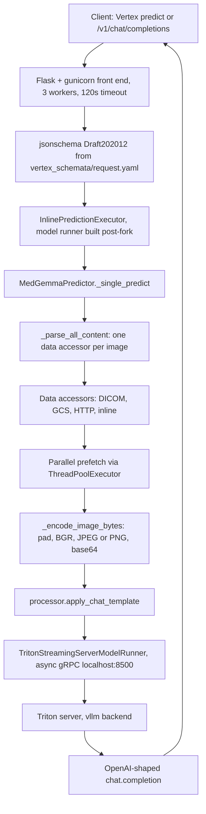

# MedGemma 1.5 — Technical Report

Sources: [MedGemma 1.5 Technical Report (arXiv:2604.05081v2)](https://arxiv.org/pdf/2604.05081) and [google-health/medgemma](https://github.com/google-health/medgemma) (branch `main`). Prior model: [MedGemma Technical Report (arXiv:2507.05201)](https://arxiv.org/abs/2507.05201).

## 1. Overview

MedGemma is a collection of Gemma 3 variants trained for medical text and image comprehension. MedGemma 1.5 4B is the current multimodal model; MedGemma 1 27B (text-only) and MedSigLIP (the image encoder, usable standalone for classification/retrieval) remain available from the earlier release.

What 1.5 adds on top of MedGemma 1, all inside a **single unchanged 4B architecture**:

- **3D radiology** — CT and MRI volumes, handled as long sequences of 2D axial slices.
- **Whole slide imaging (WSI)** — histopathology slides, handled as long sequences of tissue patches.
- **Anatomical localization** — bounding boxes on chest X-rays.
- **Multi-timepoint (longitudinal) CXR** — prior vs current study comparison.
- **Medical document understanding** — lab reports and EHR PDFs to structured JSON.

The crucial engineering point: none of these are new architectural components. Every capability is delivered by **input representation engineering** (how a volume or a slide is turned into a token sequence that fits a 32K context) plus **new training data and teachers**. This report focuses on those mechanics and on the serving stack that implements them.

**What the repository actually contains.** No model code and no weights. The repo ships (a) `notebooks/` — client-side recipes for inference, preprocessing, LoRA SFT, and GRPO; and (b) `python/` — a production Vertex AI serving container that performs DICOM/WSI retrieval and preprocessing *server-side*, so that a client can pass a DICOMweb URI instead of 85 pre-rendered PNGs. Weights live on [Hugging Face](https://huggingface.co/models?other=medgemma) and Vertex Model Garden.

## 2. Model architecture

Per the paper (§2), MedGemma 1.5 4B is Gemma 3 with the same architecture as MedGemma 1:

| Component | Detail |
|---|---|
| Language decoder | Gemma 3 4B, continued-pretrained on medical data |
| Vision encoder | MedSigLIP, 400M SigLIP encoder, **frozen** during 1.5 training |
| Encoder input | 896 x 896 RGB, 8-bit per channel |
| Tokens per image | 256 (derived below) |
| Context budget | 32K tokens, the binding constraint on volume/slide length |
| System prompt | None — MedGemma models are not trained with a system instruction |

The "256 tokens per image" figure is not stated directly but falls out of the paper's own arithmetic: 85 CT slices = 21,760 vision tokens, and 126 WSI patches = 32,256 vision tokens. Both give 21760/85 = 32256/126 = **256 tokens per image**. This single number explains every input-length cap in the system: the caps are chosen so that vision tokens plus the accompanying text (indication/history for CT, specimen label for WSI) stay under 32K. CT gets fewer images (85) than WSI (126) precisely because CT prompts carry longer text.

Because the vision tower is frozen and only accepts 8-bit RGB, all of the interesting preprocessing work is about **packing 12-16 bit medical pixel data into three 8-bit channels without losing diagnostic signal** (§4).

## 3. Training pipeline

Three stages, reusing the Gemma 3 recipes with medical data substituted in (paper §2.1-2.2):

1. **Continued pretraining (PT)** — supervised finetuning of the LLM only, with the MedSigLIP encoder frozen. Mixture = original Gemma text and interleaved image-text data + new medical image-text pairs.
2. **Distillation** — 256 teacher logits are sampled per token, weighted by teacher probabilities; the student learns the teacher's distribution over that sample via cross-entropy. 1.5 adds **domain-specific teachers** trained on CT Dataset 1, MRI Dataset 1, and the internal histopathology corpus, alongside an improved large instruction-tuned teacher.
3. **Reinforcement learning** — same Gemma 3 RL recipe with medical data. For WSI report generation the reward is token-level ROUGE-L against the report's final-diagnosis section.

### 3.1 New training data (paper Table 1)

| Modality | Dataset | Train examples | Stages |
|---|---|---|---|
| Radiology | CXR-IND1 (India hospital system, CXR + free-text reports) | 605,732 | PT, Distill, RL |
| Radiology | CT Dataset 1 (axial CT: head, chest, abdomen; US outpatient network) | 282,963 | PT, Distill, RL |
| Radiology | MRI Dataset 1 (axial multi-parametric MRI: head, abdomen, knee) | 167,674 | PT, Distill, RL |
| Radiology | Chest ImaGenome (sequential images + bounding boxes) | 39,968 | RL |
| Pathology | Internal WSI histopathology + paired diagnosis reports | 335,825 | PT, RL |
| Dermatology | Dataset 4 (Japan, longitudinal visits) | 25,560 | PT, Distill |
| Dermatology | Dataset 5 (unlabeled) | 87,879 | PT, Distill, RL |
| Dermatology | ISIC 2017/2018 (CC-0 dermoscopic) | 40,269 | PT, Distill |
| EHR | EHRQA (synthetic FHIR via Synthea) | 9,809 QA pairs | Distill |
| EHR | Lab report sets 2/3/4 (real + synthetic PDFs) | 8,250 docs / 22,159 pages | Distill |
| EHR | Dataset 5 (synthetic health queries) | 33,882 queries | Distill |

Note the stage assignment is itself a design decision: bounding-box supervision (Chest ImaGenome) is **RL-only**, and all document-understanding data is **distillation-only**.

One deliberate data intervention matters for interpreting results: during pretraining, *mentions of temporal relationships in CXR reports were removed* (paper Table 4, footnote 1). MS-CXR-T temporal performance is therefore closer to a generalization result than an in-distribution one.

## 4. Input engineering for high-dimensional modalities

This is the core of MedGemma 1.5 and the part the repository implements in code.

### 4.1 CT and MRI volumes: slicing

Since the encoder only takes 2D RGB, volumes are decomposed into axial slices, each rescaled to 896 x 896.

- **Cap of 85 slices per query** (21,760 vision tokens), chosen to stay under 32K once the report indication (prompt) and findings (target) are included, and to keep training memory manageable.
- Slices may come from **multiple z-stacked volumes** per study — for CT, different reconstruction kernels from the same scan; for MRI, different sequences and contrasts (T1w, T2w, GRE, SWI).
- Volume inclusion criteria: at most 512 x 512 px per slice, axial orientation, uniform slice thickness, and at least five slices.
- If the stacked volume exceeds 85 slices, slices are **sampled equidistantly along z**.

The client-side implementation of that sampling is in `notebooks/high_dimensional_ct_hugging_face.ipynb`:

```python
MAX_SLICE = 85
if len(dicom_instances) > MAX_SLICE:
  dicom_instances = [
      dicom_instances[int(round(i / MAX_SLICE * (len(dicom_instances) - 1)))]
      for i in range(1, MAX_SLICE + 1)
  ]
```

### 4.2 CT: multi-channel Hounsfield windowing

CT voxels are calibrated signed values in Hounsfield Units, typically spanning roughly -1024 to +3000. The encoder accepts 256 levels per channel. Rather than pick one diagnostic window and throw away the rest, MedGemma packs **three different windows into the R, G, B channels** of a single image. Prompt images therefore look colorized, and each channel is a different physical view of the same slice.

| Channel | Range (paper §2.3.1) | Rationale |
|---|---|---|
| Red | -1024 to 1024 HU | Wide window; keeps morphology visible from air-filled lung to cortical bone across brain/chest/abdomen |
| Green | -135 to 215 HU | Soft tissue; green dominates luminance, so texture in viscera and mediastinum lands where the encoder is most sensitive |
| Blue | 0 to 80 HU | Narrow, high contrast; grey/white matter differentiation, acute hemorrhage, vascular calcification |

The notebook reproduces this exactly:

```python
window_clips = [(-1024, 1024), (-135, 215), (0, 80)]
return np.stack([norm(ct_vol, lo, hi) for lo, hi in window_clips], axis=-1)
```

Server-side, the same idea is implemented with a windowing class hierarchy in `python/data_accessors/local_file_handlers/generic_dicom_handler.py`:

- `TraditionalWindow(center, width)` — clip to `center ± width // 2`, interpolate onto the full dtype range, **round** before casting.
- `RGBWindow(red, green, blue)` — applies three `TraditionalWindow`s to the same slice and concatenates along the channel axis.
- `NopImageTransform` — identity, used for MRI.
- `rescale_ct_imaging()` — applies `RescaleSlope`/`RescaleIntercept` to get true HU (deliberately *not* using `ModalityLUTSequence` for CT), raising if only one of the two tags is present.

Note the center/width parameterization: the repo's default constant is

```python
_MEDGEMMA_1_CT_DEFAULT_WINDOW = RGBWindow(
    TraditionalWindow(0, 2048),    # -> [-1024, 1024]
    TraditionalWindow(175, 80),    # -> [ 135,  215]
    TraditionalWindow(40, 80),     # -> [   0,   80]
)
```

Red and blue match the paper. **Green does not**: `center=175, width=80` yields `[135, 215]`, whereas the paper and both notebooks specify `[-135, 215]` (which is `center=40, width=350`, the conventional soft-tissue window). The class docstring in the same file repeats the code's version and describes 135 HU as "fat" — but fat is around -100 HU, so the intended lower bound is almost certainly -135. The constant name (`_MEDGEMMA_1_...`) suggests it may also be a carryover from the single-slice CT handling in MedGemma 1. Treat the notebook values as authoritative for 1.5 and see §11.

There is a second, separately documented windowing quirk. The legacy implementation in `python/data_processing/image_utils.py:window()` computes the range as `[center - width//2, center - 1 + width//2]` and floors instead of rounding. The comments state both are bugs, kept unchanged to avoid regressing legacy CXR embeddings; `TraditionalWindow` in the DICOM handler is the corrected version.

### 4.3 MRI: per-volume normalization instead of windowing

MR voxel values are relative — there is no physiological equivalent of Hounsfield Units — so no windowing is applied. Instead the volume is min-max normalized and the same value is written to R, G, and B (paper §2.3.1).

`_process_buffered_mri_volume()` in the DICOM handler makes an important implementation choice explicit: the min and max are taken **over the entire buffered acquisition**, not per slice.

```python
min_val = np.min(images)
max_delta = np.max(images) - min_val
for image in images:
    image = image.astype(np.float64)
    if max_delta == 0:
        image[...] = 255
    else:
        image = np.round(((image - min_val) / max_delta) * 255)
    yield image.astype(np.uint8)
```

Normalizing per volume preserves relative intensity across slices, which is what makes cross-slice comparison meaningful. This is why the handler buffers a whole acquisition before emitting anything, and why `_same_acquisition()` compares a tuple of DICOM tags (`SOPClassUID`, `StudyInstanceUID`, `SeriesInstanceUID`, `ImageType`, `AcquisitionUID`, `AcquisitionNumber`, acquisition date/time, `PyramidUID`, `Modality`) to decide where one acquisition ends and the next begins.

### 4.4 Slice indexing in the prompt

Volumes are not passed as an unlabeled image bag. During evaluation, prompts consist of the selected slices **interleaved with slice indices** (`SLICE {index}`), followed by the question (paper §3.2.1). The serving container injects these automatically for CT and MRI volume sources, so clients don't have to. From `python/serving/predictor.py`:

```python
for slice_index, img in enumerate(data_source.acquision_data_source_iterator, 1):
    if slice_index == 2:
        revised_content.append(_dicom_ct_or_mri_volume_slice_index_text_entry(1))
    images.append(img)
    revised_content.append(entry)
    if slice_index == 1:
        continue
    revised_content.append(_dicom_ct_or_mri_volume_slice_index_text_entry(slice_index))
```

The resulting content stream is `[img1, "SLICE 1", img2, "SLICE 2", ...]` — each label *follows* its image, and the label for slice 1 is emitted only when the acquisition has at least two slices (a single image gets no index). Non-volume sources (CXR, microscopy, external camera, GCS/HTTP/inline images) are appended without indices.

### 4.5 Whole slide images: tissue-aware patch sampling

WSIs are gigapixel; the pipeline reduces one to a bounded, ordered sequence of patches (paper §2.3.2):

1. **Tissue mask** at 5x magnification, using a multi-stage segmentation in HSV color space (from PolyPath, Ahmed et al. 2025). Patch extraction is restricted to tissue-containing regions.
2. **Stochastic magnification** per slide, approximately uniform over standard diagnostic levels: `P(5x) = 0.34`, `P(10x) = 0.33`, `P(20x) = 0.33`.
3. **Non-overlapping 896 x 896 patches** on a regular grid defined by the tissue mask, stride equal to patch size.
4. **Cap of 126 patches** per slide (32,256 vision tokens) via random subsampling without replacement.
5. **Original spatial ordering preserved** so the model retains relative positional context.
6. Patches encoded as PNG and stored alongside the slide caption.

The repo's client-side equivalent (`notebooks/high_dimensional_pathology_model_garden.ipynb`) uses EZ-WSI rather than reimplementing the tissue segmentation:

```python
level = slide.get_level_by_pixel_spacing(
    pixel_spacing.PixelSpacing.FromMagnificationString("10X"))
gen = patch_generator.DicomPatchGenerator(
    slide, level, patch_size=896, stride_size=896)
patches = [p for p in gen]
sampled_patches = random.sample(patches, k=min(125, len(patches)))
```

and then sends only *coordinates* to the endpoint, letting the server fetch pixels:

```python
"image_dicom": {
    "dicom_source": dicom_source,
    "access_credential": token,
    "patch_coordinates_list": [
        {"x_origin": p.x, "y_origin": p.y, "width": p.width, "height": p.height}
        for p in sampled_patches
    ],
}
```

Note the notebook caps at 125 patches and warns that the deployed endpoint must be configured with an image limit of at least 125 (85 for the CT notebook) via the Model Garden serving spec.

### 4.6 Anatomical localization

The model emits bounding boxes as JSON. Two representations appear in the sources and they differ:

- **Paper (§3.2.4)**: a JSON list of objects with a `label` and `[y0, x0, y1, x1]`, coordinates normalized to **[0, 1]**, `(y0, x0)` top-left and `(y1, x1)` bottom-right. Metric is IoU against Chest ImaGenome.
- **Notebook (`cxr_anatomy_localization_with_hugging_face.ipynb`)**: same ordering and corner convention, but normalized to **[0, 1000]**, keys `box_2d` and `label`, wrapped in a fenced `json` code block that the client has to strip before parsing.

The notebook also shows two practical details worth copying: the prompt disambiguates laterality ("left refers to the patient's left side where the heart is"), and the response may contain a thinking trace between the special tokens `<unused94>` and `<unused95>` that must be stripped even when thinking was not requested.

Client-side preprocessing for localization mirrors what the server does for every image — convert to ubyte, grayscale/RGBA to RGB, then **zero-pad to square** (§7).

### 4.7 Longitudinal CXR and document understanding

- **Longitudinal**: prior and current radiographs are passed as an image pair with a structured prompt; the model returns one of Improved / Stable / Worsened for consolidation, edema, pleural effusion, pneumonia, or pneumothorax. Scored by macro accuracy on MS-CXR-T.
- **Documents**: PDFs are rendered to images with [pypdfium2](https://github.com/pypdfium2-team/pypdfium2) and the model emits structured JSON with `name`, `result`, `unit`, `specimen`, `method`, and sample collection time. Scoring uses a multi-phase label matcher to pair predicted with ground-truth labels before computing per-parameter precision/recall/F1. The paper frames this as a prerequisite for LOINC mapping and FHIR resource generation.

## 5. Serving architecture

`python/serving/` builds a Vertex AI serving container that combines an NVIDIA Triton model server (vLLM backend) with a Python API server that performs the medical-imaging retrieval and preprocessing described above.



### 5.1 Container image (`python/serving/Dockerfile`)

Multi-stage build:

1. `python:3.12-slim` prep stage creates a venv at `/payload/server-env` and installs hash-pinned requirements (`--require-hashes`), copies `data_accessors`, `data_processing`, and `serving` into `/payload`, and moves `serving/model_configuration` to `/payload/model_repository`.
2. The prep stage also **git-clones upstream source for LGPL/GPL-adjacent dependencies** into `/source-mirror` (openslide-bin, openslide-python, pygobject, certifi, tqdm, launchpadlib and friends) — a license-compliance source-mirroring step, not a build input.
3. `google/cloud-sdk:stable` contributes a minimal gcloud install.
4. Final stage is `nvcr.io/nvidia/tritonserver:25.06-vllm-python-py3`, with `libnccl-dev`/`libnccl2` held via `apt-mark hold` to prevent compatibility-breaking NCCL upgrades.

Entrypoint is `/serving/entrypoint.sh`.

### 5.2 Startup (`entrypoint.sh`)

```bash
export MODEL_REST_PORT=8600
export VLLM_USE_V1=0   # vLLM v1 engine not yet compatible with Gemma
```

- If `MODEL_SOURCE` is set it overrides `AIP_STORAGE_URI`. Weights are copied with `gcloud storage cp` into either `/model_files` (`MODEL_TO_DISK=true`) or **`dev/shm/model_files`** (default) — shared memory, so large models fit within Vertex endpoint disk limits. The README recommends `sharedMemorySizeMb` of 16 GB for 4B and 80 GB for 27B.
- `serving.config_init` translates vLLM-style CLI flags into `/model_repository/default/1/model.json`.
- Triton launches with gRPC on `127.0.0.1:8500`, HTTP on `127.0.0.1:8600`, `--allow-vertex-ai=false` (Vertex traffic is handled by the Python front end, not Triton), `--strict-readiness=true`.
- The front end launches as `serving.server_gunicorn`.
- `wait -n` then `exit $?`: if either process dies, the container exits, so the orchestrator restarts the whole thing rather than serving from a half-dead container.

The Triton model config (`model_configuration/default/config.pbtxt`) is minimal — `backend: "vllm"`, one instance, `KIND_MODEL` (device placement deferred to vLLM).

### 5.3 Configuration surface

`config_init.py` maps flags to a vLLM engine config; only non-`None` values are emitted, so unset flags inherit vLLM defaults.

| Flag | Purpose |
|---|---|
| `--tensor-parallel-size` | Set equal to GPU count |
| `--gpu-memory-utilization` | Suggested 0.95 |
| `--max-num-seqs` | vLLM smart-batching width |
| `--max-model-len` | Context length (integer only, no `32k` suffix parsing) |
| `--swap-space` | GiB of CPU swap for GPU overflow |
| `--enable-chunked-prefill` | Lowers GPU memory for long `max-model-len` |
| `--limit-mm-per-prompt` | Comma-separated `type=count`; this is the "image limit" the notebooks tell you to raise to 85/125 |
| `--mm-processor-kwargs` | JSON kwargs for the MM preprocessor; none recommended |
| `--model-name` | Currently ignored; reserved for future HF loading |

Environment variables cover the API surface: `AIP_HTTP_PORT`, `AIP_HEALTH_ROUTE`, `AIP_PREDICT_ROUTE` (required, set automatically by Vertex), `AIP_STORAGE_URI` / `MODEL_SOURCE`, `MODEL_TO_DISK`, and Cloud Logging settings (`ENABLE_CLOUD_LOGGING`, `CLOUD_OPS_LOG_PROJECT`, `CLOUD_OPS_LOG_NAME`).

Application-level tuning lives in `python/serving/flags.py`, each flag backed by an env var:

| Flag / env | Default | Meaning |
|---|---|---|
| `worker_download_parallelism` | `PROCESS` | Thread vs process pool for instance data download |
| `max_parallel_download_workers` | 3 | Download concurrency per accessor |
| `thread_pool_max_workers` | 4 | Parallel data-loading workers per request |
| `thread_pool_timeout` | 1800 s | Data-loading timeout |
| `model_input_width` / `model_input_height` | 224 | Default patch dimensions and the shrink-optimization target (see §11) |
| `image_input_compression_format` | `jpeg` | `jpeg` or `png` |
| `image_input_compression_quality` | 95 | JPEG quality |
| `image_size_optimization` | false | Downscale oversized images before the encoder |
| `approved_gcs_source_list` | unset (all allowed) | GCS bucket allowlist |
| `approved_dicom_store_source_list` | unset (all allowed) | DICOM store allowlist |
| `icc_profile_cache_*` | — | GCS bucket / Redis host, port, and whether to cache profile bytes in Redis |

### 5.4 Front end (`serving/server_gunicorn.py` + `serving_framework/server_gunicorn.py`)

- Gunicorn options: `bind 0.0.0.0:$AIP_HTTP_PORT`, `workers: 3`, `timeout: 120`, and `preload_app` forced to `False` so each worker sets up its own state after fork.
- Routes: the Vertex `AIP_PREDICT_ROUTE` (POST) plus an additional `/v1/chat/completions` route. Both are served with `instance_input=False`, meaning the whole request body is treated as the payload rather than requiring an `instances` list. `AIP_HEALTH_ROUTE` proxies `TritonServerHealthCheck`, which GETs `http://localhost:8600/v2/health/ready` and maps failure to 503.
- Request validation uses `jsonschema.Draft202012Validator` built from `vertex_schemata/request.yaml`.
- `InlinePredictionExecutor.start()` constructs the `TritonStreamingServerModelRunner` **post-fork** — the comment notes it is safer to instantiate the RPC stub after forking.
- The framework also ships a `SubprocessPredictionExecutor` (newline-delimited JSON over pipes to a persistent worker, with restart-on-broken-pipe) which MedGemma does not use.

The prompt converter is a closure over a Hugging Face processor loaded from either `--local_model_path` or `--hf_model` (exactly one must be set):

```python
processor = transformers.AutoProcessor.from_pretrained(pathlib.Path(LOCAL_MODEL_PATH_FLAG.value))

def to_prompt(conversation, params):
    return processor.apply_chat_template(conversation, tokenize=False, **params)
```

So the container renders the chat template itself and hands Triton a **flat string plus a list of base64 images**, rather than relying on vLLM's own chat templating.

### 5.5 Model runner

`serving_framework/model_runner.py` defines an abstract `ModelRunner` with `run_model_multiple_output` plus `run_model` / `batch_model` conveniences, keeping the predictor independent of the inference backend. Two Triton implementations exist:

- `TritonServerModelRunner` — synchronous gRPC unary `infer`.
- `TritonStreamingServerModelRunner` — the one actually wired up. It uses the asyncio gRPC client and `stream_infer`. There is a non-obvious workaround: a request queue is held open after the single request is enqueued because letting the input stream close immediately caused server-side cancellation (`asyncio.CancelledError`). A `None` sentinel closes the stream in both success and error paths. `InferenceServerException` is translated to `model_runner.ModelError`.

The input tensor map built by `_MedGemmaPredictionRequest.model_input()`:

| Tensor | dtype | Contents |
|---|---|---|
| `text_input` | object | UTF-8 encoded rendered prompt |
| `image` | object | Array of base64-encoded image bytes (omitted if no images) |
| `exclude_input_in_output` | bool | 1 |
| `return_num_input_tokens` | bool | 1 |
| `return_num_output_tokens` | bool | 1 |

### 5.6 Request and response format

The request schema (`vertex_schemata/request.yaml`, `MedGemmaChatCompletionRequest`) is intentionally aligned with the OpenAI Chat Completions API: `messages` (required), `max_tokens` / `max_completion_tokens`, `temperature`, `top_p`, `top_k`, `min_p`, `n`, `best_of`, `seed`, `stop`, frequency/presence/repetition penalties, and a legacy `"@requestFormat": "chatCompletions"` field kept for older Model Garden vLLM clients. `additionalProperties: false`.

`_MedGemmaPredictionParameters.from_json()` whitelists and renames these into vLLM sampling parameters, with a single default: **`max_tokens = 500`**.

The response is an OpenAI-shaped object assembled in `_instance_response()` — `id` (uuid4), `object: "chat.completion"`, `created`, `choices[].message.{role, content}`, and a `usage` block computed from the `num_input_tokens` / `num_output_tokens` tensors. `model` is hardcoded to `"placeholder"`.

`predict()` accepts three shapes: a bare chat-completion body, `{"instances": [one]}`, and `{"instances": [many]}`. Multiple instances are processed **sequentially**, not batched.

## 6. Data accessor subsystem

`python/data_accessors/` is the layer that turns a URI in a request into decoded pixel arrays. It is the largest part of the repo and the reason the container exists at all.

### 6.1 Contract

`abstract_data_accessor.py` defines:

- `AbstractDataAccessor[InstanceDataClass, InstanceDataType]` with `load_data(stack: contextlib.ExitStack)` (prefetch; the ExitStack must outlive the iterator), `is_accessor_data_embedded_in_request()`, `__len__`, and a `data_acquisition_iterator()`.
- `DataAcquisition` — an `AccessorDataSource` tag plus an iterator of images. The tag is what lets the predictor decide whether to inject `SLICE n` labels.
- `AccessorDataSource` — `TEXT`, `DICOM_CXR_IMAGES`, `DICOM_CT_VOLUME`, `DICOM_MRI_VOLUME`, `DICOM_WSI_MICROSCOPY_PYRAMID_LEVEL`, `DICOM_MICROSCOPY_IMAGES`, `DICOM_EXTERNAL_CAMERA_IMAGES`, `TRADITIONAL_IMAGES`, `OPEN_SLIDE_IMAGE_PYRAMID_LEVEL`.
- `DataAccessorConfig` — worker count plus `THREAD` vs `PROCESS` parallelism, returning the matching executor.

### 6.2 Input types

`_parse_image_content()` in `predictor.py` dispatches on the content entry's `type`:

| `type` | Accessor | Notes |
|---|---|---|
| `image_dicom` | DICOM generic or DICOM WSI | Routed by SOP Class UID (§6.3) |
| `image_gcs` | `GcsGenericData` | 2 download threads (`_GCS_DOWNLOAD_THREAD_COUNT`) |
| `image_bytes` | `InlineBytesData` | Inline payload |
| `image_url` | `HttpImageData` | Arbitrary HTTP source |
| `image` | `HttpImageData` | MedGemma internal chat syntax |
| `text` | `InlineText` | No accessor work needed |

All image types are remapped to plain `"image"` before the chat template is applied (`_MESSAGE_CONTENT_ENTRY_TYPE_REMAP`), so the model sees an ordinary Gemma 3 conversation. Each entry may carry its own `access_credential` bearer token.

Decoding of fetched bytes is delegated to a list of local file handlers, tried in order: `GenericDicomHandler`, `TraditionalImageHandler`, `OpenSlideHandler` (configured with the endpoint input dimensions), `WsiDicomHandler`. A handler that cannot parse returns an empty iterator rather than raising.

### 6.3 DICOM source routing

`utils/dicom_source_utils.py` decides how to treat a DICOMweb URI, querying the store for series metadata when needed:

- Modality is read from the `Modality` tag, or inferred from SOP Class UID (`infer_modality_from_sop_class_uid`) against tables for CT, MR, SM, DX/CR.
- Supported modalities: `CR`, `DX` (CXR), `CT`, `MR`, `SM`, `GM` (microscopy), `XC` (external camera). Anything else raises.
- A series containing **more than one modality** is rejected.
- If the SOP Class UID is `1.2.840.10008.5.1.4.1.1.77.1.6` (VL Whole Slide Microscopy Image), the request routes to the WSI accessor; VL instances implied by a shared `ConcatenationUID` are pulled in automatically. Mixing that IOD with other IODs is rejected.
- Everything else routes to the generic DICOM accessor.

**Selecting one volume out of a series** is a real problem — a CT series can contain several reconstructions. `_identify_dicom_series_instances_for_single_ct_or_mri_volume()` applies a deterministic cascade:

1. Prefer non-DERIVED `ImageType` instances; fall back to DERIVED; fall back to instances with no `ImageType`.
2. Keep the `AcquisitionNumber` group with the most instances.
3. Split out instances lacking `ImagePositionPatient`, preferring those that have it.
4. Sort by acquisition date/time and drop duplicate `InstanceNumber`s.
5. Sort by the z component of `ImagePositionPatient`.

This runs only when the request targets a *series* (not explicit instances) and the modality is CT or MR.

### 6.4 DICOM decoding

`generic_dicom_handler.py` handles both encapsulated (compressed) and unencapsulated pixel data:

- Transfer syntax must be one of implicit/explicit VR little endian or deflated, or decodable by `ez_wsi_dicomweb.dicom_frame_decoder`.
- `SamplesPerPixel` must be 1 or 3; photometric interpretation must be MONOCHROME1/MONOCHROME2/RGB for unencapsulated data, and must be consistent with `SamplesPerPixel`.
- Concatenated DICOM (`ConcatenationUID` present) is rejected in the generic path.
- MONOCHROME1 is inverted (`max - pixel`) after normalization.
- CXR normalization applies the modality LUT via pydicom, then rescales dynamic range across the full bit depth so 12-bit acquisitions use the whole uint16 range.
- Per-modality default transforms are registered in `_DEFAULT_MODALITY_IMAGE_TRANSFORMS`: CR/DX use the DICOM's own `WindowCenter`/`WindowWidth` when present, CT uses the RGB window, MR uses the no-op transform. Only CT is in `_WINDOWED_MODALITIES`.
- ICC profile transforms are applied to 8-bit 3-channel data when a target profile is requested, reading the profile from the DICOM or from the compressed frame bytes.

### 6.5 WSI accessor

`dicom_wsi/data_accessor.py` builds on EZ-WSI's `DicomSlide`:

- **Frame cache strategy.** The slide frame cache is initialized with `MINIMIZE_DICOM_STORE_QPM` (block until the batch is cached, minimizing queries per minute against the DICOM store) and switched to `MINIMIZE_LATENCY` when an ICC profile transform is needed and non-blocking prefetch is preferable.
- **Whole-level vs per-patch prefetch.** `_pre_load_slide_patches()` compares `level.number_of_frames / len(patches)` against `load_whole_slide_frame_ratio` (default 10, overridable per request). Below the threshold it loads the entire pyramid level; above it, only the frames the requested patches touch. This is the difference between one bulk read and hundreds of small ones.
- **Downsample ceiling.** If a requested resize implies more than `_MAX_DICOM_LEVEL_DOWNSAMPLE = 8.0` x downsampling from the source level, the request is rejected (`DicomImageDownsamplingTooLargeError`) rather than silently degrading image quality.
- **No patch coordinates** means the whole level is treated as one patch.
- **Channel normalization**: monochrome is broadcast to 3 channels, RGBA drops alpha, anything else raises.
- **ICC profiles** are cached in GCS and/or Redis (`icc_profile_cache.py`) since profile bytes are large and shared across a slide.
- Credential errors (`HttpForbiddenError` / `HttpUnauthorizedError`) are mapped to a distinct `InvalidCredentialsError` so clients can tell auth failures from data errors.

Patch geometry helpers live in `utils/patch_coordinate.py` and `utils/image_dimension_utils.py`:

- `PatchCoordinate.validate_patch_in_dim()` enforces containment when `require_patches_fully_in_source_image` is true (the default); when false, `get_patch_from_memory()` **zero-pads** the out-of-bounds region instead of failing.
- `get_projected_patch()` / `resize_projected_patch()` project a patch defined in one resolution onto a different source level, computing the source read region, rescale dimensions, and clip offsets, using floor/ceil on downsample and rounding on upsample so the sampled region fully spans the request.
- `resize_image_dimensions()` picks `INTER_AREA` for decimation and `INTER_CUBIC` for magnification.

### 6.6 Parallel prefetch

`_ModelPredictor._prefetch_instance_data_async()` loads all content in parallel before a single model call:

```python
if len(med_gemma_content) == 1:
    result = _get_inst_data_map_func(stack, med_gemma_content[0])
    return [] if result is None else [result]
with concurrent.futures.ThreadPoolExecutor(max_workers=self._threadpool_max_workers) as pool:
    results = pool.map(functools.partial(_get_inst_data_map_func, stack),
                       med_gemma_content, timeout=self._thread_pool_timeout)
```

Errors are collected rather than raised, and if any accessor failed the request short-circuits to an error response before touching the GPU. A shared `contextlib.ExitStack` owns every resource for the lifetime of the request.

## 7. Image encoding path

`_encode_image_bytes()` in `predictor.py` is the last thing that touches pixels before they reach the model, and it encodes several training-time assumptions:

1. **Downcast to uint8** by scaling with the source dtype's max (windowing has already normalized to the full range).
2. **Channel normalization** — single-channel monochrome is replicated to 3 channels; RGBA drops alpha; 2-D arrays are stacked to 3 channels.
3. **Optional shrink** (`image_size_optimization`) — if the image exceeds the configured model input size, resize down with `INTER_AREA` (fast, robust to high-frequency noise) to cut encoder memory and compute.
4. **Zero-pad to square** via `_zero_pad_image_to_square()`, splitting the padding evenly on both sides. The comment states this is the "method performed in training", and the localization notebook does the same thing client-side — so aspect-ratio handling is a trained-in convention, not an aesthetic choice.
5. **RGB to BGR** because OpenCV's encoders assume BGR.
6. **Compress** to JPEG (quality clamped to 1-100, default 95) or PNG.
7. **Base64 encode**.

Compression is parallelized selectively:

```python
_PNG_PROCESS_POOL_THRESHOLD = 20
```

Above 20 images, with `PROCESS` parallelism and PNG output, encoding moves to a 5-worker `ProcessPoolExecutor`. The comment records the measurements behind the threshold: for PNG at ~100 images a process pool saves about 1 second, while for JPEG a process pool is usually *slower* and at best saves ~40 ms. Since an 85-slice CT or 126-patch WSI always crosses the threshold, this path matters for exactly the workloads MedGemma 1.5 added.

## 8. Security and operational controls

- **Source allowlists** — `approved_gcs_source_list` and `approved_dicom_store_source_list` (JSON list or single string, from flag or env). `_validate_dicom_image_accessor()` does a case-insensitive prefix match and raises `UnapprovedDicomStoreError` on miss, logging the attempted connection. When unset, all sources are allowed, so this must be configured explicitly for a locked-down deployment.
- **Per-instance credentials** — each image entry carries its own `access_credential` bearer token (`InstanceJsonKeys.BEARER_TOKEN`), converted by `authentication_utils.create_auth_from_instance()`. The container acts on the caller's behalf rather than holding blanket data access.
- **Credential hygiene in logs** — `_generate_instance_metadata_error_string()` replaces a present bearer token with the literal `'PRESENT'` and strips the potentially huge `ez_wsi_state` blob before logging validation errors.
- **Error truncation** — `_MAX_ERROR_DESCRIPTION_LENGTH = 1024` caps outbound error text; accessor errors expose a curated `api_description` rather than the raw exception.
- **Schema hardening** — `additionalProperties: false` on the request schema; validation failures return 400 with the jsonschema message; response-validation failures return a generic 500.
- **Structured logging** — `serving/logging_lib/` wraps Google Cloud Logging, toggled by `ENABLE_CLOUD_LOGGING` and scoped by `CLOUD_OPS_LOG_PROJECT` / `CLOUD_OPS_LOG_NAME`; secret-bearing flags go through `secret_flag_utils`.
- **Health** — Vertex health route delegates to Triton `/v2/health/ready`; Triton runs with `--strict-readiness=true` and binds gRPC/HTTP to `127.0.0.1` only, so the model server is not reachable from outside the container.

## 9. Client-side and tuning recipes

### 9.1 Inference

Local (Hugging Face) inference is a standard `image-text-to-text` pipeline or `AutoModelForImageTextToText` with `dtype=torch.bfloat16` and `device_map="auto"`; the 85-slice CT notebook adds `offload_buffers=True`. Prompts are built as interleaved content lists and rendered with `processor.apply_chat_template(..., add_generation_prompt=True)`. Deterministic decoding (`do_sample=False`) is used throughout, matching the paper's temperature 0.0.

Vertex inference goes through `endpoint.raw_predict()` against a **dedicated endpoint** with an OpenAI-shaped body. The server-side accessors are the payoff: the CT notebook sends a list of DICOMweb instance URIs plus a token, and the pathology notebook sends one instance URI plus 125 patch coordinates — no pixels cross the wire from the client.

### 9.2 QLoRA supervised fine-tuning (`fine_tune_with_hugging_face.ipynb`)

Task: 9-class colorectal tissue classification on NCT-CRC-HE-100K, evaluated on CRC-VAL-HE-7K.

| Setting | Value |
|---|---|
| Quantization | 4-bit NF4, double quant, bf16 compute/storage |
| LoRA | `r=16`, `lora_alpha=16`, `lora_dropout=0.05`, `target_modules="all-linear"` |
| Also trained | `modules_to_save=["lm_head", "embed_tokens"]` |
| Attention | `eager` (recommended for Gemma 3) |
| Optimizer | `adamw_torch_fused`, lr 2e-4, linear schedule, warmup 0.03, max grad norm 0.3 |
| Batch | 4 per device x 4 accumulation steps, gradient checkpointing (non-reentrant) |

The collator masks padding, the `boi_token` id, and token id `262144` to `-100` so image placeholders don't contribute to the loss, and sets `padding_side="right"` for training (switched to `"left"` for inference).

### 9.3 GRPO reinforcement learning (`reinforcement_learning_with_hugging_face.ipynb`)

Task: MedQA with a correctness reward, using TRL's `GRPOTrainer` on `google/medgemma-1.5-4b-it`.

| Setting | Value |
|---|---|
| LoRA | `r=64`, `lora_alpha=64`, `target_modules="all-linear"` |
| Learning rate | 5e-6 |
| Generations per prompt | 4 |
| Batch | 3 per device x 4 accumulation steps |
| Max completion length | 1024 tokens, 1700 steps |
| Generation backend | vLLM, `vllm_mode="colocate"`, 30% of GPU memory |
| Precision | bf16, gradient checkpointing, `attn_implementation="eager"` |

The reward function is a regex battery over the completion that extracts a single answer letter from any of eight "Final Answer" phrasings and returns 1.0 on exact match. The prompt uses the same thinking toggle as the paper's text evaluations: a system message of `"SYSTEM INSTRUCTION: think silently if needed."`. Pinned environment: `transformers==4.57.3`, `trl[vllm]==0.23.1`, `torch==2.8.0`, Python 3.12, tested on a single A100 40GB.

### 9.4 Other notebooks

`quick_start_with_hugging_face`, `quick_start_with_model_garden`, `quick_start_with_dicom`, `evaluate_on_medqa`, and `ehr_navigator_agent` (an agent that navigates FHIR-format EHR data), plus the four 1.5-specific notebooks covered above.

## 10. Evaluation

### 10.1 Protocol

- Single inference run per example; **temperature 0.0** for MedGemma 1.5 (and for MedGemma 1 on new datasets, for consistency); default temperature/top-k for other baselines.
- MedGemma has no system prompt. Baseline general models get `"You are a helpful radiology assistant."` for radiology tasks and `"You are a helpful medical assistant."` otherwise.
- Thinking is enabled for MedQA, MedMCQA, EHRNoteQA, PubMedQA, MMLU Med, MedXpertQA (text), and AfriMed-QA by appending `"SYSTEM INSTRUCTION: think silently if needed."`.
- Prompts were re-standardized versus MedGemma 1 and manually optimized on train/validation splits; the paper notes prompt changes sometimes had large effects and that further optimization is likely possible.
- Generative outputs are parsed for `Final Answer: yes/no` or a choice letter — the models produce text, not class probabilities.

### 10.2 New capabilities (paper Table 4)

| Task | Metric | MedGemma 1 4B | **MedGemma 1.5 4B** | MedGemma 1 27B | Qwen3 VL 4B | Gemini 3 Pro | External SOTA |
|---|---|---|---|---|---|---|---|
| Chest ImaGenome (localization) | Mean IoU | 3.1 | **38.0** | 16.0 | 8.7 | 39.1 | 30.7-34.4 (CoCa-CXR) |
| MS-CXR-T (temporal) | Macro acc. | 61.1 | **65.7** | 50.1 | 53.5 | 62.9 | 68.5 (BioViL-T) |
| CT Dataset 1 (3D CT) | Accuracy | 58.2 | **61.1** | 57.8 | 52.8 | 61.0 | — |
| MRI Dataset 1 (3D MRI) | Accuracy | 51.3 | **64.7** | 57.4 | 49.6 | 55.5 | — |
| WSI Histopath | ROUGE-L | 2.2 | **49.4** | 4.1 | — | 12.2 | 49.8 (PolyPath) |
| EHR Dataset 2 / 3 / 4 | Macro F1 | 78 / 50 / 25 | **91 / 71 / 64** | 76 / 66 / 5 | — | 93 / 90 / 81 | — |
| Mendeley Lab Reports | Macro F1 | 85 | 85 | 69 | — | 90 | — |
| EHRNoteQA | Accuracy | 79.4 | 80.4 | 90.7 | 90.6 | 95.0 | 95.15-97.16 (GPT-4) |

The WSI and localization jumps are the headline: both go from essentially non-functional (2.2 ROUGE-L, 3.1 IoU) to competitive with task-specific SOTA. A 4B model matching PolyPath on slide-level report generation and beating CoCa-CXR on localization is the strongest evidence that the input-packing strategy works.

### 10.3 Carryover benchmarks (paper Table 3, selected)

| Task | Metric | MedGemma 1 4B | MedGemma 1.5 4B | MedGemma 1 27B |
|---|---|---|---|---|
| MedQA (4-op) | Accuracy | 64.4 | **69.1** | 85.3 |
| MedMCQA | Accuracy | 55.7 | **59.8** | 70.2 |
| EHRQA | Accuracy | 67.6 | **89.6** | 90.5 |
| MedXpertQA (text + MM) | Accuracy | 18.8 | **26.4** | 26.8 |
| EyePACS | Accuracy | 64.9 | **76.8** | 75.3 |
| MIMIC-CXR report gen. | RadGraph F1 | 21.9 | **27.2** | 27.0 |
| PubMedQA | Accuracy | 73.4 | 67.6 | 77.2 |
| SlakeVQA | Tokenized F1 | 72.3 | 59.8 | 70.3 |
| VQA-RAD | Tokenized F1 | 49.9 | 48.1 | 46.7 |
| MMLU Pro (general, Table 6) | Accuracy | 39.1 | 33.8 | 60.2 |

Two things worth internalizing. First, the improved distillation and RL let 1.5 *gain* on text benchmarks while adding modalities — this is not the usual multimodal tax. Second, the losses are real and localized: SLAKE and VQA-RAD regress (the paper argues these rely on token overlap against non-standardized ground truth), PubMedQA regresses, and general-knowledge MMLU-Pro drops from 39.1 to 33.8 — below the base Gemma 3 4B at 43.6. Specializing a 4B model has a measurable out-of-domain cost.

### 10.4 CT-RATE (paper Appendix A)

On the out-of-distribution CT-RATE chest CT set (18 conditions, volumes resampled to 480 x 480 x 240 by the dataset authors), MedGemma 1.5 4B scores 26.9 macro F1 versus 23.5 for MedGemma 1 4B and 8.5 for Gemini 3.0 Flash. The methodological caveat is significant for anyone planning to deploy this: because a generative VLM emits text rather than multi-label probabilities, the framework had to **query the model 18 times per volume**, once per condition. Against a dedicated CT classifier's single forward pass, that is an 18x inference cost, and it is why the paper limited this evaluation to a subset of models.

## 11. Gaps, caveats, and discrepancies

**Not in the repository:** training code, distillation infrastructure, RL harness, the internal datasets, the HSV tissue-segmentation algorithm (cited to PolyPath), the evaluation framework, and the weights themselves. Nothing here permits reproducing training.

**Paper vs code discrepancies** found while cross-checking:

| Item | Paper / notebook | Repository code |
|---|---|---|
| CT green window | `-135` to `215` HU (soft tissue) | `TraditionalWindow(175, 80)` = `135` to `215` HU in `generic_dicom_handler.py`; docstring calls 135 HU "fat", but fat is near -100 HU |
| Bounding box range | Normalized to `[0, 1]` (paper §3.2.4) | Normalized to `[0, 1000]` in the localization notebook prompt |
| Patch cap | 126 patches (paper §2.3.2) | 125 in the pathology notebook |

The green-window mismatch is the one to verify before trusting a custom CT pipeline: the constant is named `_MEDGEMMA_1_CT_DEFAULT_WINDOW` and may be a MedGemma 1 carryover, but as written it is not the window the 1.5 paper describes. The notebook values are the safer reference.

**Configuration traps:**

- `model_input_width` / `model_input_height` default to **224**, not 896. These are used as the default patch dimensions when a request omits width/height and as the target of the optional `image_size_optimization` shrink — enabling that optimization with the defaults would downscale images to 224 px before a 896 px encoder. Set them explicitly.
- `--limit-mm-per-prompt` must be raised to at least 85 (CT/MRI) or 125-126 (WSI) or long-context requests are rejected; the notebooks call this out as a Model Garden deployment setting.
- Shared memory must be sized for the weights when `MODEL_TO_DISK` is left at the default (16 GB / 80 GB suggested).
- Source allowlists default to "allow everything".
- `VLLM_USE_V1=0` is pinned because the v1 engine was not yet Gemma-compatible; this will need revisiting.
- Multiple `instances` in one request are processed sequentially, so batching gains must come from vLLM's `max-num-seqs`, not from the API.

**Model-level caveats from the paper:** out-of-the-box performance is promising but the model "is not meant to be deployed without the necessary clinical fine-tuning"; the document-understanding features are framed as data-processing tools, explicitly distinct from clinical decision-making.

## 12. Verification

- The paper was read from the arXiv PDF (v2, 2026-05-01), including Appendix A (CT-RATE, MMLU-Pro) and Appendix B (all prompt templates).
- Repository contents were fetched directly from GitHub with `gh api repos/google-health/medgemma/contents/...` against branch `main` — there is no local clone in this environment. Notebook code was extracted from the `.ipynb` JSON (code cells only).
- Every code claim above names the file and symbol so it can be re-checked. The highest-value things for a reader to verify independently, because they can change between releases:
  - `_MEDGEMMA_1_CT_DEFAULT_WINDOW` in `python/data_accessors/local_file_handlers/generic_dicom_handler.py` (the green-window question).
  - Flag defaults in `python/serving/flags.py`, especially `MODEL_INPUT_WIDTH` / `MODEL_INPUT_HEIGHT`.
  - The Triton base image tag and `VLLM_USE_V1` in `python/serving/Dockerfile` and `entrypoint.sh`.
  - `python/serving/vertex_schemata/request.yaml` for the current API contract.
- The 256-tokens-per-image figure is derived from the paper's own token counts (21,760 / 85 and 32,256 / 126), not stated directly in either source.
