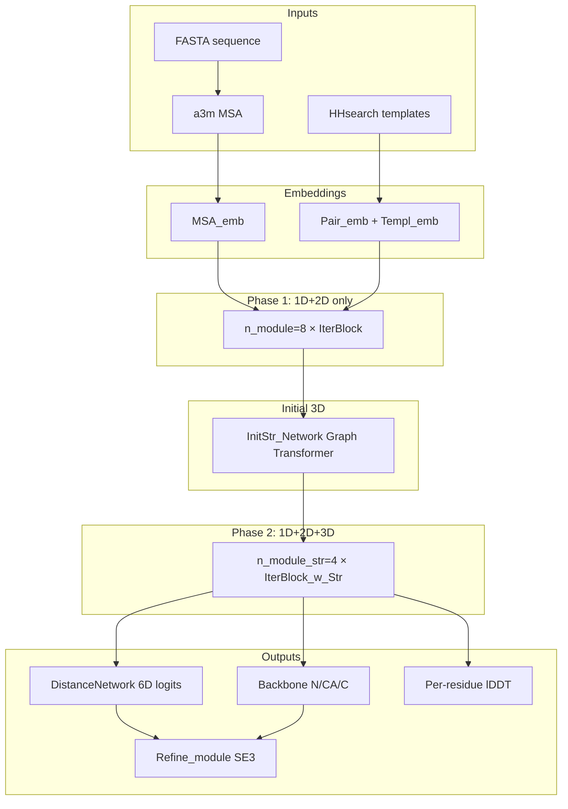

# RoseTTAFold — Technical Report

Sources: [RosettaCommons/RoseTTAFold](https://github.com/RosettaCommons/RoseTTAFold) (`main`, cloned 2026-07-31), cross-referenced with Baek et al., *Science* 373:871–876 (2021) ([doi:10.1126/science.abj8754](https://doi.org/10.1126/science.abj8754)) and the Alchemy Bio article [*A Complete Guide to Protein Folding Prediction with RoseTTAFold: Part I*](https://alchemybio.substack.com/p/a-complete-guide-to-protein-folding).

> **Note on the paper link:** The arXiv URL `arxiv.org/pdf/2604.05081` supplied in the original request is the **MedGemma 1.5 Technical Report**, not RoseTTAFold. This report is grounded in the GitHub repo and the Substack article; the Science paper is cited as the paper of record for biological claims.

---

## 1. Overview

RoseTTAFold is the University of Washington / Baker-lab protein structure prediction system released in 2021. Given an amino acid sequence (and optionally structural templates from homologs), it predicts 3D backbone coordinates and a **6D coordinate representation** (distance + three backbone dihedral/angle channels) per residue pair.

The repo ships **four related systems**:

| Subsystem | Path | Role |
|---|---|---|
| **3-track network (e2e)** | `network/` + `predict_e2e.py` | Full structure prediction in one forward pass + SE(3) refinement + TRFold |
| **3-track network (PyRosetta)** | `network/` + `predict_pyRosetta.py` | Predicts 6D distributions only; Rosetta folding follows |
| **2-track PPI screen** | `network_2track/` + `predict_msa.py` | Fast inter-chain contact prediction (`RF2t.pt`) |
| **Accuracy predictor + folding** | `DAN-msa/`, `folding/` | DeepAccNet-msa scores decoys; `RosettaTR.py` folds from npz restraints |

### 1.1 The three-track idea

Unlike AlphaFold2's Evoformer (which iterates MSA and pair representations with triangle attention, then folds in a separate structure module with **recycling**), RoseTTAFold maintains **three coupled representations** that exchange information inside every block:

1. **1D track (MSA)** — `(B, N, L, d_msa)` contextual embeddings per aligned sequence and position.
2. **2D track (pair)** — `(B, L, L, d_pair)` residue-pair features encoding co-evolution and geometry priors.
3. **3D track (structure)** — `(B, L, 3, 3)` N/CA/C backbone coordinates on a kNN geometric graph, updated by SE(3)-equivariant layers.

The central engineering bet: bidirectional cross-track updates in a **single forward pass** can match AlphaFold2 accuracy without recycling. The Alchemy Bio article highlights that RF achieves comparable predictions with one iteration because the 3D coordinate track provides explicit geometric feedback to the MSA and pair tracks during inference.



### 1.2 Entry points

| Script | Pipeline stages | Final structure |
|---|---|---|
| `run_e2e_ver.sh` | MSA → PSIPRED → hhsearch → `predict_e2e.py` | Single `t000_.e2e.pdb` |
| `run_pyrosetta_ver.sh` | MSA → PSIPRED → hhsearch → `predict_pyRosetta.py` → `RosettaTR.py` × 15 → DAN-msa → pick | Five `model/model_[1-5].crderr.pdb` |
| `network/predict_complex.py` | Same as e2e on paired MSA | Multi-chain PDB |
| `network_2track/predict_msa.py` | Paired MSA only | `(L1, L2)` contact npz |

---

## 2. Input pipeline

Entry points: `run_e2e_ver.sh`, `run_pyrosetta_ver.sh`. Default resources: `CPU=8`, `MEM=64` GB (`run_e2e_ver.sh:18–19`).

### 2.1 MSA generation (`input_prep/make_msa.sh`)

**Databases** (searched in order, `make_msa.sh:15–17`):

1. `UniRef30_2020_06/UniRef30_2020_06`
2. `bfd/bfd_metaclust_clu_complete_id30_c90_final_seq.sorted_opt`

**Base HHblits command** (`make_msa.sh:20`):

```bash
hhblits -o /dev/null -mact 0.35 -maxfilt 100000000 -neffmax 20 -cov 25 \
  -cpu $CPU -nodiff -realign_max 100000000 -maxseq 1000000 -maxmem $MEM -n 4
```

**E-value ladder** per database (`make_msa.sh:31`): `1e-30`, `1e-10`, `1e-6`, `1e-3`.

After each HHblits run, redundancy filtering and early stopping:

| Step | Command | Threshold | Stop if count > |
|---|---|---|---|
| cov75 | `hhfilter -id 90 -cov 75` | 90% identity, 75% coverage | **2000** sequences |
| cov50 | `hhfilter -id 90 -cov 50` | 90% identity, 50% coverage | **4000** sequences |

On success, copy filtered a3m → `t000_.msa0.a3m` and `break 2`. Fallback: copy last `prev_a3m` if no output (`make_msa.sh:57–59`).

**Known bug** (`make_msa.sh:37`): after the cov75 filter, `prev_a3m` is assigned to the cov50 filename before cov50 is created. The intended next HHblits input is likely the cov75 or raw a3m.

**Output:** `t000_.msa0.a3m` — a3m format; parsed by `parse_a3m()` in `network/parsers.py` (lowercase insertions stripped, 21-class indices including gap token 20).

### 2.2 Secondary structure (`input_prep/make_ss.sh`)

1. **csbuild** (CS-BLAST 2.2.3): profile checkpoint from the a3m.
2. **PSIPRED 4.01** (conda): `makemat` → `psipred` → `psipass2`.

**Output** `t000_.ss2` — two pseudo-FASTA records:

```
>ss_pred
CCCC...   # one char per residue: C/E/H
>ss_conf
989899... # per-residue confidence digits
```

Merged into hhsearch input (`run_e2e_ver.sh:59`):

```bash
cat $WDIR/t000_.ss2 $WDIR/t000_.msa0.a3m > $WDIR/t000_.msa0.ss2.a3m
```

### 2.3 Template search (hhsearch)

**Command** (`run_e2e_ver.sh:58–60`):

```bash
hhsearch -b 50 -B 500 -z 50 -Z 500 -mact 0.05 -cpu 8 -maxmem 64 \
  -aliw 100000 -e 100 -p 5.0 \
  -d $PIPEDIR/pdb100_2021Mar03/pdb100_2021Mar03 \
  -i t000_.msa0.ss2.a3m -o t000_.hhr -atab t000_.atab -v 0
```

**Database:** `pdb100_2021Mar03` (>100 GB download; includes `*_pdb.ffindex` / `*_pdb.ffdata` for mmap template coordinate access via `network/ffindex.py`).

**Template parsing** (`network/parsers.py`):

- Skip hits with < 10 aligned columns or sequence identity > 105%.
- `read_templates(L, ffdb, hhr, atab, n_templ=10)` for e2e; `n_templ=25` for PyRosetta.
- Produces `xyz_t` (N, CA, C per template residue), `t1d` (score, SS, probability from `.atab`), `t0d` (template-level metadata), converted to `t2d` (10-channel 2D template features) via `xyz_to_t2d()`.

**Outputs:** `t000_.hhr` (hit list), `t000_.atab` (per-residue alignment scores).

### 2.4 Pipeline guard inconsistency

`run_e2e_ver.sh:67` skips stage 4 if `t000_.3track.npz` exists, but `predict_e2e.py` writes `t000_.e2e.npz` / `t000_.e2e.pdb`. The example run produces e2e outputs without a `3track.npz` file.

---

## 3. Featurization and embeddings (`network/Embeddings.py`)

### 3.1 MSA embedding — `MSA_emb`

```python
# network/Embeddings.py:69-79
self.emb = nn.Embedding(d_msa=21, d_model)   # 20 AAs + gap
self.pos = PositionalEncoding(d_model, max_len=5000)
self.pos_q = QueryEncoding(d_model)
```

| Component | Implementation | Tensor shape |
|---|---|---|
| Amino-acid lookup | `nn.Embedding(21, d_msa)` | `(B, N, L)` → `(B, N, L, d_msa)` |
| Positional encoding | Sinusoidal PE indexed by `idx` (real residue numbers, not 0…L−1) | added to `(B, N, L, d_msa)` |
| Query encoding | `nn.Embedding(2, d_msa)` — index 0 for row 0 (query), 1 for templates | added to `(B, N, L, d_msa)` |

`PositionalEncoding` uses `div_term = exp(arange(0, d, 2) * -(log(10000) / d))` (`Embeddings.py:19–20`), matching the standard Transformer scheme with `max_len=5000`.

At inference, `d_msa=384` (`predict_e2e.py:24`).

### 3.2 Pair embedding — `Pair_emb_w_templ` / `Pair_emb_wo_templ`

Initial pair features (`Embeddings.py:123–150`):

- Left/right residue embeddings at `d_model // 2` each (tiled to `L × L`).
- `seqsep = log(|idx_i − idx_j| + 1)` — one channel.
- Template map from `Templ_emb` (when `use_templ=True`).
- Linear projection → `d_pair`, then `PositionalEncoding2D`.

`PositionalEncoding2D` encodes row and column indices separately into the first and second halves of the pair channel dimension (`Embeddings.py:33–55`).

At inference, `d_pair=288`.

### 3.3 Template embedding — `Templ_emb`

Per-template features (`Embeddings.py:82–121`):

- **t1d** `(B, T, L, 3)`: alignment score, predicted SS, probability.
- **t2d** `(B, T, L, L, 10)`: inter-residue geometry from template coordinates.
- Concatenate `[t2d, t1d_left, t1d_right, log(seqsep)]` → project to `d_templ=64`.
- Axial encoder (`AxialEncoderLayer` × 1) over the `L` dimension for each template.
- Learned attention pooling over `T` templates → single `(B, L, L, d_templ)` map.

---

## 4. The trunk (`network/Attention_module_w_str.py`, `network/RoseTTAFoldModel.py`)

Top-level modules:

- `RoseTTAFoldModule` — trunk + `DistanceNetwork`; returns `(logits, xyz, lddt)` (`RoseTTAFoldModel.py:8–58`).
- `RoseTTAFoldModule_e2e` — adds `Refine_module` for post-hoc SE(3) coordinate refinement (`RoseTTAFoldModel.py:61–131`).

Core stack: `IterativeFeatureExtractor` (`Attention_module_w_str.py:410–480`).

### 4.1 Forward schedule

| Stage | Module | Count | Notes |
|---|---|---|---|
| 0 | `Pair2Pair` (`initial`) | 1 | Pre-process pair embeddings before MSA coupling |
| 1 | `IterBlock` | `n_module=8` | 1D + 2D only (no coordinates) |
| 2 | `InitStr_Network` | 1 | Graph transformer → initial N/CA/C |
| 3 | `IterBlock_w_Str` | `n_module_str=4` | Full three-track; `top_k ∈ {128, 128, 64, 64}` |
| 4 | `FinalBlock` | 1 | Last SE(3) update + `pred_lddt`; `top_k=32` |

Returns: `msa[:,0]` (query-row MSA embedding), `pair`, `xyz`, `lddt`.

Production inference hyperparameters (`predict_e2e.py:19–65`):

| Key | Value |
|---|---|
| `n_module` | 8 |
| `n_module_str` | 4 |
| `n_module_ref` | 4 (e2e only) |
| `n_layer` | 1 (per sub-encoder) |
| `d_msa` | 384 |
| `d_pair` | 288 |
| `d_templ` | 64 |
| `n_head_msa` | 12 |
| `n_head_pair` | 8 |
| `n_head_templ` | 4 |
| `d_hidden` | 64 |
| `r_ff` | 4 |
| `p_drop` | 0.0 (e2e) / 0.1 (pyRosetta) |
| `performer_N_opts` | `{"nb_features": 64}` |
| `performer_L_opts` | `{"nb_features": 64}` |

### 4.2 IterBlock — the two-track micro-loop

Each `IterBlock` (`Attention_module_w_str.py:288–323`) executes four steps in order:

```
MSA2MSA → MSA2Pair → Pair2Pair → Pair2MSA
```

`IterBlock_w_Str` adds (`Attention_module_w_str.py:325–366`):

```
MSA2MSA → MSA2Pair → Pair2Pair → Pair2MSA → Str2Str → Str2MSA
```

---

### 4.3 1D track — `MSA2MSA`

**Attention along L (residue dimension):** `EncoderLayer(use_tied=True)` → `SoftTiedMultiheadAttention` (`Attention_module_w_str.py:154–158`, `Transformer.py:276–277`).

**Soft-tied attention** (`Transformer.py:157–209`):

1. `SequenceWeight` compares query-row embeddings to all rows at each column: softmax over `N` → weights `(B, L, h, 1, N)` (`Transformer.py:130–154`).
2. Scale `q` by sequence weights: `q = q * seq_weight`.
3. Collapse the sequence axis into one shared attention map per head:

```python
attention = torch.einsum('bnhik,bnhkj->bhij', q, k)  # (B, h, L, L)
```

4. Apply shared attention to all sequences: `torch.einsum('bhij,bnhjk->bnhik', attention, v)`.

**Contrast with `TiedMultiheadAttention`** (`Transformer.py:84–128`): uniform `scale = 1/√(N·d_k)` over all sequences instead of learned weights. RF uses soft-tied for the L-axis in production; the Alchemy Bio article notes that soft-tied maps resemble true contact maps on CASP14 target T1049.

**Attention along N (sequence dimension):** `EncoderLayer` with Performer `SelfAttention(nb_features=64, generalized_attention=True)` (`Attention_module_w_str.py:161–164`, `performer_pytorch.py`). Reshape `(B, N, L, d)` → `(B·L, N, d)` so attention runs over homologs at fixed positions. Complexity drops from O(N²) to O(N·r) with random feature count `r=64` (FAVOR+ / Performer).

Returns updated MSA `(B, N, L, d_msa)` and symmetrized attention maps `(B, L, L, n_head_msa)` passed to `MSA2Pair`.

---

### 4.4 1D → 2D — `MSA2Pair`

Inspired by CopulaNet (`Attention_module_w_str.py:11–14` comment).

1. Project MSA `d_msa → n_feat_proj=32`.
2. `SequenceWeight` → weighted sequences `feat_1d = w_seq * x_down`.
3. **`CoevolExtractor`** — outer product with sequence weighting (`Attention_module_w_str.py:82–96`):

```python
pair = torch.einsum('abij,ablm->ailjm', x_down, x_down_w)  # (B, L, L, 32²)
pair = proj_2(pair)  # → (B, L, L, d_pair)
```

4. Concatenate `[pair_orig, pair_new, left_1d, right_1d, att]` and update via `ResidualNetwork(n_resblock=1)`.

The outer-product step is RF's co-evolution readout — analogous to AlphaFold's `OuterProductMean` but implemented as a weighted bilinear map with a ResNet fusion step.

---

### 4.5 2D track — `Pair2Pair`

`AxialEncoderLayer` with Performer on both row and column axes (`Attention_module_w_str.py:191–201`):

- Reshape `(B, L, L, d_pair)` → attention along rows, then along columns.
- This is RF's substitute for AlphaFold2's **triangle attention** and **triangle multiplication** — cheaper axial attention with Performer linearization instead of O(L³) geometric consistency layers. Geometric consistency is enforced instead by the explicit **3D coordinate track**.

---

### 4.6 2D → 1D — `Pair2MSA`

`DirectEncoderLayer` / `DirectMultiheadAttention` (`Transformer.py:211–231`, `Attention_module_w_str.py:178–189`):

- Pair features are **projected directly into attention logits**: `nn.Linear(d_in, heads)` + softmax over `L`, not dot-product Q·K.
- Symmetrize pair input: `0.5 * (src + src.permute(0,2,1,3))` before attention (`Transformer.py:455–456`).
- Cross-attention: pair `(B, L, L, C)` updates MSA `(B, N, L, d_msa)`.

---

### 4.7 Initial 3D coordinates — `InitStr_Network`

`network/InitStrGenerator.py:70–116`:

- **Graph:** fully connected (all `i ≠ j` edges) via `torch_geometric`.
- **Nodes:** sequence-weighted MSA sum + `seq1hot` → `Linear(d_msa+21, 64)` + ELU.
- **Edges:** pair features + signed `log(|i−j|+1)` seqsep → `Linear(d_pair+1, 64)` + ELU.
- **Backbone:** 3 × `UniMPBlock` (`TransformerConv`, 4 heads, edge_dim=64) — UniMP graph transformer (arXiv:2009.03509).
- **Output:** `Linear(64, 9)` → reshape to `(B, L, 3, 3)` N/CA/C.

This graph-transformer initialization is a distinctive RF feature; RoseTTAFold2 removes it in favor of template-integrated three-track blocks with recycling.

---

### 4.8 3D track — `Str2Str`

**Graph construction** — `make_graph()` (`Attention_module_w_str.py:19–55`):

- CA–CA distance map; keep top-`k` neighbors per residue (`top_k` ∈ {128, 128, 64, 64, 32}).
- Always connect sequentially adjacent residues: `|i − j| < kmin=9`.
- DGL graph; `edata['d']` = displacement vectors (detached — no grad through basis); `edata['w']` = pair edge features.

**Node features:** sequence-weighted MSA + `seq1hot` → 32-dim (`Attention_module_w_str.py:208–232`).

**SE(3) update** (`SE3_network.py:54–108`):

- Input fibers: type-0 (scalar, 32 ch) + type-1 (vector, 3 ch per backbone atom).
- Stack: `GSE3Res` + `GNormBias` × `num_layers`, then final `GSE3Res`.
- Production `SE3_param` (`predict_e2e.py:39–50`): `num_layers=2, num_channels=16, num_degrees=2, n_heads=4, div=2`.
- `@torch.cuda.amp.autocast(enabled=False)` — SE(3) runs in fp32 while trunk uses fp16.

**Coordinate update** (`Attention_module_w_str.py:241–249`):

```python
offset = shift['1'].reshape(B, L, -1, 3)   # type-1 equivariant output
CA_new = xyz[:,:,1] + offset[:,:,1]
N_new  = CA_new + offset[:,:,0]
C_new  = CA_new + offset[:,:,2]
```

Type-0 output `shift['0']` becomes per-residue **state features** fed to `Str2MSA` and `pred_lddt`.

---

### 4.9 3D → 1D — `Str2MSA`

`MaskedDirectMultiheadAttention` (`Attention_module_w_str.py:253–286`, `Transformer.py:233–264`):

- Compute CA–CA distances from current `xyz`.
- Four distance shells: `mask = 1 - sigmoid(d − b)` for `distbin = [8.0, 12.0, 16.0, 20.0]` Å — one head per shell.
- Queries/keys from SE(3) state features; values from MSA; masked softmax over `L × L`.
- Residual + FFN.

This lets the 3D geometry directly refine MSA embeddings in distance-dependent shells — the third cross-track edge in the three-track design.

---

## 5. Output heads and geometry

### 5.1 `DistanceNetwork` (`network/DistancePredictor.py`)

Four independent `ResidualNetwork` heads on symmetrized (dist, omega) or raw (theta, phi) pair features:

| Head | Output bins | Symmetrized |
|---|---|---|
| `dist` | 37 | yes (`0.5*(x + x^T)`) |
| `omega` | 37 | yes |
| `theta` | 37 | no |
| `phi` | 19 | no |

### 5.2 Bin definitions (`network/kinematics.py`)

```python
PARAMS = {"DMIN": 2.0, "DMAX": 20.0, "DBINS": 36, "ABINS": 36}
```

- Distance bins: 36 bins from 2.0–20.0 Å plus one **no-contact** bin → **37** total.
- Angular bins: 36 bins over [−π, π] plus no-contact → **37** (omega, theta); phi uses **19** bins over [0, π].

Saved npz keys (`predict_e2e.py:222–225`): `dist`, `omega`, `theta`, `phi` — each `(L, L, n_bins)` float16.

### 5.3 TRFold gradient-descent folding (`network/trFold.py`)

After SE(3) refinement, e2e path runs TRFold on CA coordinates (`predict_e2e.py:229–238`):

```python
TRF = TRFold(prob_trF, fold_params)
xyz = TRF.fold(xyz, batch=15, lr=0.1, nsteps=200)
```

`fold_params` (`predict_e2e.py:68–85`): `DCUT=19.5`, `ALPHA=1.57`, `DSTEP=0.5`, `ASTEP=10°`, `SG9` smoothing kernel. TRFold uses 32 distance bins at `4.25 + 0.5·i` Å (`trFold.py:92`). O atom reconstructed by `extend()` from N, CA, C geometry.

---

## 6. End-to-end refinement (`network/Refine_module.py`)

`RoseTTAFoldModule_e2e` calls `Refine_module` after the trunk (`RoseTTAFoldModel.py:95–131`).

### 6.1 `Regen_Network`

Rebuilds coordinates from final query-row MSA embedding + projected pair/distogram features via another 3-block UniMP graph transformer (`Refine_module.py:14–60`).

### 6.2 Mirror-image ensemble

```python
# Refine_module.py:137-143
xyz   = torch.cat([xyz, xyz * torch.tensor([1, 1, -1])])
state = torch.cat([state, state])
```

Both native and mirrored structures are refined in parallel to resolve handedness ambiguity.

### 6.3 Iterative SE(3) refinement loop

- `n_module_ref=4` `Refine_Network` clones per outer iteration.
- Each `Refine_Network` uses a **deeper** SE(3) stack: `REF_param` with `num_layers=3, num_channels=32, num_degrees=3, div=4` (`predict_e2e.py:52–63`).
- Up to **200** outer iterations; early stop when `no_impr > 10` or `no_impr_best > 20` (`Refine_module.py:150–169`).
- Keep structure with highest mean predicted lDDT; pick best of native/mirror at end.

Example log (`example/end-to-end/log/network.stdout`): 42 SE(3) iterations on GPU `cuda:0` float16, mean lDDT ≈ 0.71–0.72.

### 6.4 Outputs (e2e)

| File | Content |
|---|---|
| `{prefix}.npz` | 6D distributions (float16) |
| `{prefix}_init.pdb` | Pre-TRFold backbone; B-factor = predicted lDDT ∈ [0, 1] |
| `{prefix}.pdb` | Post-TRFold N/CA/C/O; B-factor = lDDT |

---

## 7. Inference configuration

### 7.1 Model weights

| File | Used by | `strict` load |
|---|---|---|
| `RoseTTAFold_e2e.pt` | `predict_e2e.py`, `predict_complex.py` | `True` |
| `RoseTTAFold_pyrosetta.pt` | `predict_pyRosetta.py` | `False` |
| `RF2t.pt` | `network_2track/predict_msa.py` | `True` |

Download (`README.md`):

```bash
wget https://files.ipd.uw.edu/pub/RoseTTAFold/weights.tar.gz
tar xfz weights.tar.gz
```

Weights are under the **Rosetta-DL Software license** (non-commercial); code is MIT.

### 7.2 MSA subsampling at inference

- Cap at **1000** sequences: `msa[:, :1000]` (`predict_e2e.py:168, 209`).
- Remove sequences with > 50% gaps in the selected crop (`predict_e2e.py:166–167`).

### 7.3 Sliding-window cropping (long proteins)

Triggered when `L > window * 2`:

| Script | `window` | `shift` | Merge strategy |
|---|---|---|---|
| `predict_e2e.py` | 150 | 75 | Mean over overlapping 2D windows; mean for node features |
| `predict_pyRosetta.py` | 150 | 50 | lDDT-weighted mean for distograms |
| `predict_complex.py` | 200 | 100 | Same as e2e |

Crop selection: union of two sequence windows `[start_1, end_1)` and `[start_2, end_2)` on a grid. For cropped e2e, trunk runs with `return_raw=True`, then `refine_only=True` on the merged distogram.

### 7.4 SE3 vs REF parameters

| Param | Trunk `SE3_param` | Refine `REF_param` |
|---|---|---|
| `num_layers` | 2 | 3 |
| `num_channels` | 16 | 32 |
| `num_degrees` | 2 | 3 |
| `div` | 2 | 4 |
| `l0_out_features` | 8 | 8 |

---

## 8. Complex prediction (`network/predict_complex.py`)

### 8.1 Paired MSA input

Multi-chain complexes use a single a3m with concatenated sequences per row. Bacterial pairing script `example/complex_modeling/make_joint_MSA_bacterial.py` matches rows by UniProt accession hash proximity (`|hash1 − hash2| < 10`).

Post-filter: `hhfilter -id 90 -cov 75` (or 50) on `paired.a3m`.

### 8.2 Chain index offset

```python
# predict_complex.py:136-141
for L_i in Ls[:-1]:
    idx_pdb[:, L_prev + L_i:] += 500   # comment: "it was 200 originally"
    L_prev += L_i
```

`idx_pdb` (offset) is fed to the model; `idx_pdb_orig` (contiguous 0…L−1) is used for crop indexing and PDB residue numbering. The +500 jump makes monomer-trained positional encodings treat chains as spatially separated — critical for multi-chain prediction without retraining.

The 2-track PPI model uses **+200** instead (`network_2track/predict_msa.py:73`).

### 8.3 Multi-chain PDB output

Chain IDs cycle `A, B, C, …`; residue numbers restart per chain from `Ls`. CA-only or N/CA/C output; B-factor = lDDT.

Optional `--templ_npz` with keys `xyz_t`, `t1d`, `t0d` for complex template structures.

---

## 9. The 2-track PPI screen (`network_2track/`)

Fast variant for yeast protein–protein interaction screening (`README.md`; Humphreys et al., *Science* 2021 on core eukaryotic complexes).

### 9.1 Architecture differences

| | 3-track (`RoseTTAFoldModule`) | 2-track (`TrunkModule`) |
|---|---|---|
| Tracks | MSA + pair + structure | MSA + pair only |
| Blocks | 8 `IterBlock` + 4 `IterBlock_w_Str` | 12 `IterBlock` |
| `d_msa` / `d_pair` | 384 / 288 | 64 / 128 |
| `r_ff` | 4 | 2 |
| Performer | yes (`nb_features=64`) | no (empty opts) |
| Structure output | SE(3) + graph transformer | `InitStr_Network` (unused in PPI script) |
| MSA cap | 1000 | 10,000 |

`MSA2Pair` in 2-track uses a simpler outer-product average (`network_2track/Attention_module.py`) without `CoevolExtractor` / `SequenceWeight` weighting.

### 9.2 PPI inference (`network_2track/predict_msa.py`)

```bash
python network_2track/predict_msa.py -msa paired.a3m -npz complex.npz -L1 218
```

Output: single key `dist` — `(L1, L2)` float16 inter-chain contact probability = sum of first **20** distance bins (≤ ~12 Å) of the inter-chain distogram (`predict_msa.py:82–85`).

---

## 10. PyRosetta folding path (`folding/`)

`run_pyrosetta_ver.sh` stages 4–6 after `predict_pyRosetta.py`.

### 10.1 Restraint generation — `gen_rst()` (`folding/utils.py`)

Input npz: `dist`, `omega`, `theta`, `phi` probability arrays.

**Distance restraints (CB–CB splines):**

- 32 bins: `4.25 + 0.5·i` Å for `i = 0…31`.
- Repulsion points prepended: `DREP = [0.0, 2.0, 3.5]` → 35 spline control points.
- Potential: `-log((p + MEFF) / (p_last · bkgr)) + EBASE` with `MEFF=1e-4`, `EBASE=−0.5`, `ALPHA=1.57` (`folding/data/params.json`).
- Pairs selected where `prob > PCUT=0.05` (hardcoded in `gen_rst`, independent of CLI `-pd`).

**Orientation restraints:**

| Type | Atoms | Selection threshold |
|---|---|---|
| omega | CAᵢ–CBᵢ–CBⱼ–CAⱼ (dihedral) | `PCUT + 0.5 = 0.55` |
| theta | Nᵢ–CAᵢ–CBᵢ–CBⱼ (dihedral) | `PCUT + 0.5 = 0.55` |
| phi | CAᵢ–CBᵢ–CBⱼ (angle) | `PCUT + 0.6 = 0.65` |

### 10.2 RosettaTR minimization (`folding/RosettaTR.py`)

**Job grid** (`run_pyrosetta_ver.sh:94`): 15 jobs = 3 modes `m ∈ {0,1,2}` × 5 probability cutoffs `pd ∈ {0.05, 0.15, 0.25, 0.35, 0.45}`, each with `-r 3` noisy restarts, `-sg 7,3` smoothing.

**Restraint stages by mode `-m`:**

| Mode | Stages | Sequence separation |
|---|---|---|
| 0 | short → medium → long | (3,12), (12,24), (24,L) |
| 1 | short+medium → long | (3,24), (24,L) |
| 2 (default) | combined | (3, L) |

Per stage: `RepeatMover(min_mover, 3)` → clash removal → cartesian minimization.

**Adaptive weights** (`RosettaTR.py:10–12`):

```python
vdw_weight        = {0: 3.0, 1: 5.0, 2: 10.0}
rsr_dist_weight   = {0: 3.0, 1: 2.0, 3: 1.0}
rsr_orient_weight = {0: 1.0, 1: 1.0, 3: 0.5}
```

**FastRelax** (default `--fastrelax`):

| Round | Space | `PCUT` | Notes |
|---|---|---|---|
| 1 | torsion | 0.15 | distance + orientation restraints |
| 2 | cartesian | 0.30 | distance only; CA coordinate restraints (`std=1.0, tol=2.0`) |

Score functions: `scorefxn.wts` (centroid), `scorefxn_cart.wts` (full atom); constraint weights in `folding/data/`.

---

## 11. DeepAccNet-msa and model selection (`DAN-msa/`)

### 11.1 What it predicts (`pyErrorPred/model.py`)

| Output | Shape | Meaning |
|---|---|---|
| `estogram` | `(L, L, 15)` | 15-bin distance-error histogram |
| `mask` | `(L, L)` | Contact confidence (sigmoid) |
| `lddt` | `(L,)` | Per-residue predicted lDDT (derived from estogram) |

**Architecture:**

1. **3D conv branch** on 24³ voxel grid (20 atom types, 14 Å neighbor cutoff): Conv3d 20→20→30→20, AvgPool3d(4).
2. Concat with 1D features → Conv1d → 60 channels.
3. Tile to 2D, concat with 2D features → Conv2d → 32 channels.
4. **ResNet trunk:** 5 shared chunks × 4 blocks (dilations 1,2,4,8, 128 ch) + 4-block error head + 4-block mask head = **28** bottleneck blocks total.
5. Inference: `obt_size=70`, `tbt_size=58` (includes network distogram as 37 extra channels); ensemble of 1 model (`smTr_rep1`).

**Loss** (`model.py:230`): `estogram + 10·lddt + 0.33·mask`.

### 11.2 Model picking (`pick_final_models.div.py`)

1. Score each decoy by `mean(lddt)` from DAN-msa npz; keep top **50%**.
2. Pairwise structural distance: `1 − global_lddt` via external `lddt` binary (bidirectional).
3. `AgglomerativeClustering(n_clusters=5, affinity='precomputed', linkage='average')`.
4. Per cluster: pick highest mean lDDT structure.
5. Write `model/model_{1-5}.pdb` symlinks and `model/model_{1-5}.crderr.pdb` with B-factor = estimated CA error:

```python
CAdev = 1.5 * exp(4 * (0.7 - lddt_res))   # pick_final_models.div.py:56
```

---

## 12. Infrastructure and reproducibility

### 12.1 Conda environments

**`RoseTTAFold-linux.yml`** (CUDA 11.1):

| Package | Version |
|---|---|
| Python | 3.8.10 |
| PyTorch | 1.9.0 + cudatoolkit 11.1.74 |
| dgl-cu110 | 0.6.1 |
| pytorch-geometric | 1.7.2 |
| hhsuite | (conda) |
| psipred | 4.01 |
| blast-legacy | 2.2.26 |

**`folding-linux.yml`:** env name `folding`; `tensorflow-gpu=1.14`, `parallel` (GNU parallel for RosettaTR).

**`install_dependencies.sh`:** downloads `lddt` binary (openstructure.org) and csblast 2.2.3.

### 12.2 Genetic databases (`README.md`)

| Database | Size | Download |
|---|---|---|
| UniRef30 (2020_06) | 46 GB | `http://wwwuser.gwdg.de/~compbiol/uniclust/2020_06/UniRef30_2020_06_hhsuite.tar.gz` |
| BFD | 272 GB | `https://bfd.mmseqs.com/bfd_metaclust_clu_complete_id30_c90_final_seq.sorted_opt.tar.gz` |
| pdb100 templates | >100 GB | `https://files.ipd.uw.edu/pub/RoseTTAFold/pdb100_2021Mar03.tar.gz` |

### 12.3 Licensing

| Component | License |
|---|---|
| Source code | MIT |
| Trained weights | Rosetta-DL (non-commercial) |
| PyRosetta folding | Separate PyRosetta license required |

### 12.4 Default compute

- Scripts: 8 CPUs, 64 GB RAM for hhsuite (`-maxmem 64`).
- GPU required for network inference (fp16 autocast); SE(3) blocks run fp32.
- Example T1078 (138 residues): 426 MSA sequences; e2e inference on `cuda:0`.

---

## 13. RoseTTAFold vs AlphaFold2 vs RoseTTAFold2

| Aspect | RoseTTAFold (this repo) | AlphaFold2 | RoseTTAFold2 (successor) |
|---|---|---|---|
| **Core representation** | 1D MSA + 2D pair + 3D coords (three-track) | 1D MSA + 2D pair (Evoformer) | Three-track, templates at start |
| **Pair-track geometry** | Axial attention + Performer | Triangle attention + triangle multiplication | Similar to AF2-style updates |
| **MSA attention** | Soft-tied row + Performer column | Row/column MSA attention with pair bias | Recycling replaces single-pass 3D feedback |
| **Structure module** | SE(3)-Transformer on kNN graph + graph transformer init | IPA on rigid frames (8 layers) | SE(3)-Transformer, no graph transformer |
| **Recycling** | None (single forward pass) | Up to 3 (20 at CASP15) | Added |
| **Initial coordinates** | Graph transformer (fully connected) | Black-hole / prior frame initialization | From templates |
| **Confidence** | Per-residue lDDT (SE3 state head) | pLDDT + PAE (multimer) | lDDT + improved confidence |
| **6D output** | dist/omega/theta/phi ResNet heads | Distogram only in trunk; FAPE in structure module | Similar 6D parameterization |
| **Complexes** | Paired MSA + index offset (+500) | AlphaFold-Multimer | Native multimer training |
| **PPI screening** | 2-track `RF2t.pt` | N/A in open repo | — |
| **Folding backend** | TRFold (e2e) or Rosetta+DeepAccNet | AMBER relax | — |

### 13.1 Why study RoseTTAFold (Alchemy Bio)

1. **Single iteration** — three-track parallel design reduces need for recycling.
2. **Rich embeddings** — MSA and pair features are useful beyond coordinate output (binding, design).
3. **Complexes from sequence** — trained on multi-subunit MSAs; quaternary structure without independent monomer folding.
4. **Template robustness** — two-track pre-structure phase builds strong features even with distant homologs; graph transformer bootstraps 3D before SE(3) refinement.

### 13.2 RF → RF2 changes

Per the Alchemy Bio article and Baek et al. bioRxiv (RoseTTAFold2):

- **Removed** the separate two-track phase (`n_module` IterBlocks without structure) and the graph transformer initializer.
- **Added** recycling of structural features (like AlphaFold2).
- **Integrated** templates at the beginning of a unified three-track block.
- Open-source repo at `github.com/RosettaCommons/RoseTTAFold` reflects the **original 2021** architecture only.

---

## 14. Sources and verification

### 14.1 Primary sources

| Source | Role |
|---|---|
| `github.com/RosettaCommons/RoseTTAFold` (`main`, 45 commits) | All architecture, pipeline, and hyperparameter claims |
| Baek et al., *Science* 2021 ([doi:10.1126/science.abj8754](https://doi.org/10.1126/science.abj8754)) | Paper of record; benchmark claims |
| Alchemy Bio Part I (uploaded markdown) | 1D-track intuition: soft-tied attention, Performer, biology framing |
| `arxiv.org/pdf/2604.05081` | **Not RoseTTAFold** — MedGemma 1.5 Technical Report (mislinked) |

### 14.2 Repo map (key files)

| File | Content |
|---|---|
| `network/RoseTTAFoldModel.py` | `RoseTTAFoldModule`, `RoseTTAFoldModule_e2e` |
| `network/Attention_module_w_str.py` | `IterativeFeatureExtractor`, all cross-track blocks |
| `network/Transformer.py` | Attention primitives (tied, soft-tied, direct, masked) |
| `network/Embeddings.py` | MSA, pair, template embeddings |
| `network/InitStrGenerator.py` | Graph transformer initial coords |
| `network/SE3_network.py` | SE(3)-Transformer wrapper |
| `network/Refine_module.py` | E2E refinement with mirror ensemble |
| `network/DistancePredictor.py` | 6D distogram heads |
| `network/kinematics.py` | Bin boundaries, xyz ↔ 6D conversion |
| `network/trFold.py` | Gradient-descent coordinate refinement |
| `network/predict_e2e.py` | E2E inference + cropping |
| `network/predict_pyRosetta.py` | Distogram-only inference |
| `network/predict_complex.py` | Multi-chain prediction |
| `network_2track/TrunkModel.py` | 2-track PPI model |
| `input_prep/make_msa.sh` | HHblits pipeline |
| `folding/RosettaTR.py` | PyRosetta folding protocol |
| `DAN-msa/pick_final_models.div.py` | Final model selection |

### 14.3 Suggested follow-up verification

1. Clone the repo and run `python network/predict_e2e.py --help` to confirm CLI flags.
2. Compare `MODEL_PARAM` dicts in `predict_e2e.py` and `predict_pyRosetta.py` against any updated weight release notes.
3. For the Science paper's full training protocol (data cutoffs, loss weights, crop sizes), consult the supplementary materials — not all training details are exposed in the inference-only open-source release.
