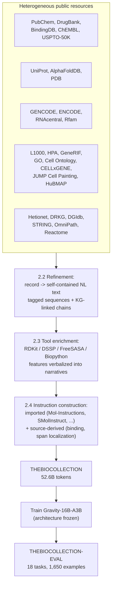

# TheBioCollection — Technical Report

> **THEBIOCOLLECTION: Unified Pre-Training Scale LLM Corpus for Biology**
> Seo, Hwang, Lee, Shin, Park, Kim, Lee, Ahn, Han, Jung — Trillion Labs, KAIST, SK Biopharmaceuticals, Lunit, AIGEN Sciences (2026)
> [arXiv:2607.08803](https://arxiv.org/abs/2607.08803)

This is a technical read-through of the paper. Unlike the other reports in this
folder (ESM, AlphaFold, RosettaFold, MedGemma), the artifact here is not a novel
architecture — it is a **corpus and a matched evaluation suite**, applied to an
existing, architecturally frozen LLM (`Gravity-16B-A3B`). The paper's entire
argument is that data construction, not model design, is the binding constraint
on biological capability in general-purpose LLMs.

## 1. Overview

The core claim: a text-only LLM's inability to reason about proteins, molecules,
genomes, and cells is a **data problem, not an architecture problem**. Public
biological resources (UniProt, PubChem, GENCODE, L1000, knowledge graphs, …) are
enormous but locked in tables, FASTA files, graph edges, and bespoke schemas that
a language model cannot learn from directly. THEBIOCOLLECTION is a pipeline that:

1. **Collects** commercially usable public resources across five domains (small
   molecules, proteins, genomic sequences, cells/pathways, cross-domain knowledge
   graphs).
2. **Refines** each database record into a self-contained natural-language
   description, with symbolic sequences (SMILES, protein/DNA/RNA) wrapped in tag
   tokens (`<smiles>...</smiles>`, `<protein>...</protein>`) so the model sees a
   consistent typed interface.
3. **Enriches** each record with features computed by standard computational
   biology tools (RDKit, DSSP, FreeSASA, Biopython) — not present in the source
   database at all — and renders them as prose narratives with explicit
   provenance.
4. **Constructs instruction data** — both imported from existing instruction
   corpora, and built from scratch for capabilities no existing corpus covers
   (protein binding, DNA/RNA feature localization).
5. Is paired with **THEBIOCOLLECTION-EVAL**, a matched, decontaminated benchmark
   spanning the same five domains plus explicit cross-domain reasoning.

The controlled experiment: hold the architecture fixed (`Gravity-16B-A3B`,
pre-anneal checkpoint), swap only the training corpus, and measure the delta.
Training on THEBIOCOLLECTION **more than doubles** the base model's aggregate
score (0.223 → 0.499) with gains in every domain, while general-language
benchmarks drop by under 1 point on average.

## 2. Technical building blocks

### 2.1 Domain coverage and source resources

| Domain | Source datasets |
|---|---|
| Small molecules | PubChem, DrugBank, BindingDB, ChEMBL, USPTO-50K |
| Proteins | UniProt Knowledgebase, AlphaFoldDB, PDB |
| Genomic sequences | GENCODE, ENCODE, RNAcentral, Rfam |
| Cells/pathways | L1000, Human Protein Atlas, GeneRIF, NCBI Gene, GO/GOA, Cell Ontology, CELLxGENE, JUMP Cell Painting, HuBMAP |
| Cross-domain KGs | Hetionet, DRKG, DGIdb, STRING, OmniPath, Reactome |
| Broad literature (replay only, not counted in the 52.6B) | PubMed, bioRxiv, medRxiv (54.0B tokens) |

### 2.2 Record refinement — the tagging and typing layer

Every structured record becomes a single, self-contained natural-language
paragraph. Two mechanisms carry the information that would otherwise be lost in
translation to prose:

- **Tagging tokens.** Symbolic sequences are wrapped inline: `<smiles>...</smiles>`,
  `<protein>...</protein>`, `<dna>...</dna>`, `<rna>...</rna>`, `<inchi>...</inchi>`.
  This gives the model a typed boundary around a sequence, distinct from the
  surrounding description — the same pattern used by NatureLM and SciReasoner,
  which the paper cites directly as prior art it is following (Wang et al. 2025b;
  Xia et al. 2025).
- **KG-anchored cross-domain chains.** A knowledge graph (Hetionet, DRKG, STRING,
  OmniPath) supplies the *skeleton* of which entities belong together (a typed
  relation: compound–target binding, gene–pathway membership, protein–protein
  interaction, TF–target regulation); the source databases supply the *payload*.
  A single training record can therefore read as a mechanistic chain — a
  protein's function and pathway, the compounds that bind it with measured
  affinities, and the transcriptional response those compounds induce in a named
  cell line — rather than one isolated fact. This is the mechanism the paper
  credits for the cross-domain reasoning gains (§3.5).

### 2.3 Tool-computed feature narratives

The paper's most concrete technical contribution: for each modality, deterministic
computational-biology tools are run over the raw record, and their **numeric or
symbolic output is verbalized into text with explicit provenance**. This exposes
signal that free text (PubMed abstracts, database captions) essentially never
states explicitly.

| Modality | Tool | Computed signal injected into text |
|---|---|---|
| Small molecules | RDKit | Ring/scaffold composition, stereocenters, functional groups, PAINS/Brenk alerts, Murcko scaffold, Bertz complexity, Labute ASA, Kier shape indices, Morgan/MACCS fingerprints |
| Proteins | DSSP, FreeSASA, Biopython, rule-based geometry | Secondary structure, solvent exposure, Ramachandran regions, contact maps, salt bridges, disulfides, π-stacking, cation-π, radius of gyration, relative contact order; combined with UniProt domains/InterPro/Pfam/GO/transmembrane annotations |
| Genomic DNA | pyfaidx, Biopython, GTF/BED handling | GC/CpG content, entropy, homopolymer runs, palindromic k-mers, regulatory-class/assay evidence |
| Genomic RNA | Biopython, codon/ORF analysis | Base composition, GC/AU skew, ORF statistics, polyadenylation motifs, stem-loop candidates |
| Cells (spatial) | AnnData/H5AD, SciPy KD-tree | Spot coordinates, local neighborhood density, nearest-neighbor distance, locally abundant transcripts |
| Cells (morphology) | CellProfiler, pandas/NumPy, scikit-learn | Control-normalized morphology shifts, nearest-morphology retrieval |

This is analogous in spirit to how ESM's contact-prediction head or ESMFold's
distogram head expose *latent* structural signal from a model's internal state
(see [papers/esm/TECHNICAL_REPORT.md](../esm/TECHNICAL_REPORT.md)) — except here
the signal is computed once, deterministically, by an external tool and baked
directly into the pretraining text, rather than learned from attention patterns
at inference time.

### 2.4 Instruction dataset construction

Two sources feed the instruction stream (~30% few-shot, rest zero-shot, following
FLAN):

- **Imported.** Curated public instruction datasets (Mol-Instructions,
  SMolInstruct, MolLangBench, ChEBI-20-MM, ChemData700K, LPM-24, TxGemma,
  ProteinLMBench, BioReason-Pro, Cell2Sentence, PerturBench, Tabula Sapiens) —
  selected for commercial usability and added with tagging tokens.
- **Source-derived (new).** Two families built entirely by the authors because no
  existing corpus covers them:
  - **Protein binding** — computed from protein–ligand (PLINDER), protein–protein
    (PINDER, PPIRef50K, DIPS-Plus, AlphaFold-derived complexes), and
    protein–peptide (Propedia, PPIKB) structures via a **5.0 Å heavy-atom contact
    cutoff** to derive interface residues, yielding tasks like masked
    binding-site recovery, ligand-conditioned scaffolding, and binder generation
    conditioned on target epitope residues. 12M records before context-length
    filtering.
  - **DNA/RNA feature localization** — cast as *exact span-recovery*: given a
    sequence window with exactly one target feature (a cCRE, an open-chromatin
    peak, a splice site, a JASPAR TF motif, an Rfam family, a tRNA anticodon), the
    model must return valid JSON with the feature label, 1-indexed inclusive
    coordinates, and the exact copied subsequence. Every answer is
    programmatically self-checkable — the coordinate/subsequence pair is verified
    deterministically, so label noise is structurally bounded.

### 2.5 Filtering, deduplication, decontamination

Three-stage cleaning applied uniformly across domains:

1. **Validity checks** — malformed molecules/sequences dropped; binding records
   must satisfy contact/interface constraints; DNA/RNA spans kept only when the
   target feature is unambiguously recoverable.
2. **Deduplication** — a stable key per record (normalized text hash, canonical
   molecule ID, sequence hash, genomic coordinate, document ID, or
   instruction-answer hash); any repeat key is dropped.
3. **Decontamination** — THEBIOCOLLECTION-EVAL is held out with task-specific
   exact-match keys: sequence hash/accession/coordinate for genomics, and
   exact/subsequence/**shared 15-mer overlap** exclusion for protein
   binder-generation targets — a stricter bar than exact-match dedup, meant to
   catch near-identical evaluation leakage through overlapping windows.

### 2.6 THEBIOCOLLECTION-EVAL

A companion benchmark, not an afterthought — the paper is explicit that no prior
biological benchmark spans this breadth in one suite. 18 tasks / 1,650 examples,
3-shot for single-domain tasks and **zero-shot for cross-domain tasks** (so the
first hop of a two-hop question cannot be solved by simply pattern-matching a
demonstration). Every subtask that shares a format with a training task keeps
train/test entities disjoint. Metrics are domain-appropriate rather than generic
text-similarity: SMILES validity + fingerprint Tanimoto for molecules, InterPro
precision/recall + ESMFold-derived pLDDT/pTM/ipTM + a **nondegeneracy** metric for
proteins (to catch models that produce syntactically valid but biologically
collapsed repeats like `QVQVQ...`), full-JSON/coordinate/categorical/subsequence
exact match for genomics, and direction accuracy/macro-F1/candidate coverage for
perturbation-response prediction.

## 3. Technical foundations and prerequisites

Understanding why this paper's contribution is meaningful (and where its limits
are) requires several pieces of background that the paper itself treats as given:

- **What a "BioLM" is and why single-modality specialists aren't enough.**
  Modality-specific foundation models — ESM2/ProGen2 for protein sequences
  (see [papers/esm/TECHNICAL_REPORT.md](../esm/TECHNICAL_REPORT.md)), Nucleotide
  Transformer/DNABERT-2 for genomes, Geneformer/scGPT for single cells, Evo for
  cross-modal genomics — are each trained on a domain-specific corpus with a
  domain-specific tokenizer and objective. They cannot answer a question that
  spans domains (e.g., "which pathway does the target of this molecule belong
  to?") because there is no shared representation space. BioLM efforts (NatureLM,
  SciReasoner, LOGOS, TxGemma) instead put every entity type — text, SMILES,
  protein/DNA/RNA sequences — into one language model's token vocabulary. This
  paper adopts that language-interface premise as a given and asks the narrower
  question: *given a fixed architecture already built for this premise, what
  training data actually delivers the capability?*
- **Why database records aren't naturally LLM-trainable.** Structured biological
  databases (UniProt, PubChem, ENCODE) are optimized for programmatic querying,
  not for being read left-to-right as language. Fields are cross-referenced by ID,
  units and thresholds are implicit, and the same fact often needs several joined
  tables (a protein's UniProt entry, its AlphaFold structure, its PDB entries, its
  GO terms) to be complete. The refinement step in this paper — collapsing joined
  records into one self-contained paragraph — is the same problem faced by any
  "corpus for a structured domain" project, and it recurs across all five
  domains here.
- **Computational biology tool outputs as a training signal.** Familiarity with
  what RDKit, DSSP, FreeSASA, and Biopython actually compute is necessary to
  judge how much new information the "tool-computed feature narrative" step
  really adds. These are standard, deterministic, decades-old algorithms (DSSp's
  hydrogen-bond pattern secondary-structure assignment dates to 1983); the paper's
  contribution is not the computation itself but the systematic verbalization of
  its output into pretraining text at corpus scale.
- **Knowledge graphs as a data-integration mechanism.** Hetionet, DRKG, STRING,
  OmniPath, and Reactome each encode typed edges between biological entity types.
  Understanding how these graphs are built and what "compound–target binding" or
  "TF–target regulation" edges actually assert is necessary to evaluate whether
  the cross-domain reasoning task in §3.5 is testing genuine integrative
  understanding or simply testing whether the model memorized which entities
  co-occur in a KG-anchored training chain.
- **Instruction tuning and the FLAN few-shot/zero-shot mixture convention.** The
  ~30%/70% few-shot/zero-shot split, and the choice to evaluate cross-domain tasks
  zero-shot specifically to block surface-level demonstration copying, both
  follow directly from the FLAN collection's documented methodology (Longpre et
  al., 2023) — the paper does not re-derive this, it applies it.
- **The base model, Gravity-16B-A3B.** The paper's causal claim rests entirely on
  this model's **pre-anneal checkpoint having no biological corpus at all** in its
  pretraining. If that premise is wrong or only approximately true, the reported
  deltas overstate the corpus's marginal contribution. The paper does not
  independently audit Gravity's pretraining mixture beyond citing the model card;
  a reader who wants to trust the ablation should verify this claim against
  Trillion Labs' own model documentation.
- **What ESMFold pLDDT/pTM/ipTM and ESM-C embedding similarity actually measure.**
  Several evaluation metrics for protein design (fold confidence, functional
  consistency) are themselves outputs of other pretrained models (ESMFold,
  ESM-C), not ground truth. A reader needs to know these are *proxy* metrics —
  see [papers/esm/TECHNICAL_REPORT.md §9](../esm/TECHNICAL_REPORT.md) for how
  pLDDT/pTM are actually computed — to correctly interpret, e.g., why high pLDDT
  and low nondegeneracy can co-occur (§D.2): a repetitive low-complexity sequence
  can still fold "confidently" under a structure predictor that has learned that
  local pattern, which is exactly the failure mode nondegeneracy is designed to
  catch.

## 4. Main results

| Domain | Base | Ours (THEBIOCOLLECTION) | Δ |
|---|---|---|---|
| Small molecules | 0.223 | 0.513 | +0.290 |
| Proteins | 0.159 | 0.407 | +0.248 |
| Genomic sequences | 0.175 | 0.468 | +0.293 |
| Cells/pathways | 0.335 | 0.609 | +0.274 |
| **Overall** | **0.223** | **0.499** | **+0.276** |

Key findings:

- **Gains concentrate on structured, tool-derived supervision, not literature
  prose.** DNA regulatory/splice-site localization improves +0.382 and protein
  binder design +0.411 — signal that is expensive or impossible to extract from
  free text, but is exactly what the source-derived instruction tasks (§2.4)
  supply.
- **Recognition tasks improve even without task-formatted supervision**, because
  the tool-computed narratives (§2.3) implicitly teach the underlying property/
  identity cues: RDKit descriptors improve molecular property recognition
  (+0.110), marker-gene narratives improve cell-type recognition (+0.110) and
  Hallmark pathway recognition (+0.230).
- **Ablation isolates the corpus's marginal contribution.** A "text-annealing
  only" model (same base, same annealing process, same general scientific text,
  but *no* THEBIOCOLLECTION) already reaches 0.385 overall — most of that lift
  comes from 54.0B tokens of PubMed/bioRxiv/medRxiv prose in the replay mixture,
  which is comparable in scale to THEBIOCOLLECTION itself. Adding THEBIOCOLLECTION
  on top raises this further to 0.499, with the sharpest incremental gains again
  on structured tasks (genomic localization +0.242, binder design +0.348).
- **General language ability is preserved.** Despite biological data dominating
  the training mixture, the THEBIOCOLLECTION model stays within 0.9 points of the
  text-annealing-only model on five standard benchmarks (MMLU, ARC-c, HellaSwag,
  Winogrande, PIQA); the largest single drop is 2.1 points on MMLU.
- **Cross-domain reasoning genuinely improves, not just single-domain
  performance.** On three held-out, name-obfuscated two-hop multiple-choice tasks
  (protein function → pathway, TF function → regulated gene, molecule → target +
  pathway), zero-shot accuracy rises from 0.313 (base) to 0.507 — evidence that
  KG-anchored chain records (§2.2) teach integrative structure, not just
  per-domain facts.
- **Nondegeneracy is the paper's most interesting protein-design finding.** The
  base model collapses to near-zero nondegeneracy (0.05–0.16) on generative
  protein tasks — producing repetitive, biologically implausible sequences that
  can still score deceptively well on pLDDT because structure predictors assign
  high confidence to memorized low-complexity local patterns. THEBIOCOLLECTION
  raises nondegeneracy to 0.93–1.00, at a cost of a *slightly lower* aggregate
  score on text-conditioned functional protein design versus the text-only
  ablation (0.522 vs 0.586) — a case where a single scalar metric would have
  favored the worse model.

## 5. What's still missing / open bottlenecks

The paper is explicit about several of these; others follow from reading the
tables and construction details closely:

- **Cell/pathway coverage is thin relative to the other domains**, and it shows:
  adding THEBIOCOLLECTION on top of text-annealing actually *lowers*
  perturbation-response prediction (0.624 → 0.498 in the ablation, Table 5). The
  authors attribute this directly to under-representation of this task type in
  the corpus and name enriching it as future work — a case where more corpus
  breadth measurably hurt a specific task, not just failed to help it.
- **Protein function prediction sees the smallest gain of any subtask** (0.000 →
  0.055 InterPro exact / 0.075 precision, 0.035 recall — still near zero). The
  paper reads this as a coverage gap: function-prediction instructions are a
  narrow slice of the corpus relative to generation and structure tasks. This is
  arguably the domain where a correct answer matters most for real biological
  utility, and it is the one with the weakest result in the entire paper.
  Note also a data-quality caveat that cuts both ways here: the InterPro-ID task
  metric (precision/recall over multi-label sets) may itself be a harsh metric
  for what is a legitimately hard multi-label prediction problem, independent of
  corpus coverage.
- **Enhancer–promoter interaction and similar structure-dependent pairwise tasks
  sit at chance for every model tested**, including THEBIOCOLLECTION, the base
  model, and the ~1T-parameter comparator cited from related work. This suggests
  a ceiling that no amount of sequence-level corpus construction will break —
  these tasks likely need 3D/structural or regulatory priors that a token-sequence
  interface cannot represent, regardless of how well-curated the text is.
- **SMILES generation validity (89.09%) still trails specialized chemistry
  models** (MolT5: 95.3%) — the corpus improves validity dramatically over the
  base model (which was below 34%) but does not close the gap to a model
  purpose-built for one modality. This is the general specialist-vs-generalist
  trade-off: a unified language interface pays a tax relative to a model that
  only has to be good at one thing.
- **Scalar regression is a recurring weak point** across domains (not deeply
  analyzed in the main text, but visible in the ADMET-style property tasks and
  the perturbation direction/macro-F1 numbers): predicting a continuous value
  through next-token generation is a poor match for the objective, and the paper
  does not propose an architectural fix (e.g., a dedicated regression head) —
  that is explicitly framed as future work belonging to model design, outside
  this paper's corpus-only scope.
- **The corpus-vs-architecture separation is real but imperfect.** The entire
  causal claim depends on Gravity-16B-A3B's pretraining containing *no*
  biological corpus — a premise taken from the base model's own documentation
  rather than independently audited in this paper. If any biological text leaked
  into Gravity's general pretraining, the reported "more than doubles" framing
  would be an overstatement of the corpus's incremental value versus the
  underlying model's prior knowledge.
- **Decontamination is exact-match / near-exact-match based** (hash, coordinate,
  15-mer overlap), not semantic. It is a reasonable and fairly strict bar for
  structured data, but it does not rule out the model having learned to solve a
  benchmark's *format* from thousands of same-format training instructions (e.g.,
  the DNA/RNA span-localization JSON schema is identical between train and eval)
  even where the specific entities are disjoint — some of the large gains on
  format-heavy tasks (splice-site localization: 0.13 → 1.00 full-JSON exact
  match) plausibly reflect learning the output contract as much as learning new
  biology.
- **No wet-lab or experimental validation anywhere in the paper.** Every result
  is either an automatic string/coordinate/fingerprint metric or a proxy score
  from another pretrained model (ESMFold pLDDT/pTM/ipTM, ESM-C embedding
  similarity). Contrast this with the ESM lm-design paper's 228 wet-lab-tested de
  novo protein designs (see [papers/esm/TECHNICAL_REPORT.md §15](../esm/TECHNICAL_REPORT.md))
  — THEBIOCOLLECTION's protein-design gains (binder design 0.234 → 0.645) are
  entirely in-silico, and a designed binder scoring well on ipTM/nondegeneracy
  has not been shown to actually bind anything.
- **Single fixed architecture, single scale.** The entire study holds one 16B
  (A3B — presumably a ~3B-active mixture-of-experts) model fixed. It is unclear
  whether the corpus's relative advantage holds at smaller or much larger scale,
  or whether a differently architected model (with, e.g., native structural
  encoders like MKB's per-modality encoders — see
  [papers/mkb/README.md](../mkb/README.md)) would extract even more value from
  the same corpus, or would make the corpus's text-only framing partially
  redundant.

## Verification

- All claims above are drawn directly from the uploaded paper text
  (arXiv:2607.08803v2, 15 Jul 2026, including Sections 1–5 and Appendices A–F),
  read in full.
- Table numbers in §4 and §5 are reproduced from the paper's Tables 3, 5, 6, 7–10
  and are not independently rerun.
- Cross-references to [papers/esm/TECHNICAL_REPORT.md](../esm/TECHNICAL_REPORT.md)
  and [papers/mkb/README.md](../mkb/README.md) are to other reports in this
  repository; this report does not re-derive their content.
- Suggested follow-up verification for a reader: check the model cards for
  `Gravity-16B-A3B` and `Gravity-16B-A3B-Base` (Trillion Labs, 2026,
  huggingface.co/trillionlabs/Gravity-16B-A3B-Base) to independently confirm the
  "no biological corpus in pretraining" premise the paper's causal argument
  depends on; no public release of THEBIOCOLLECTION or THEBIOCOLLECTION-EVAL was
  linked in the paper text as read, so corpus/benchmark availability should be
  confirmed directly with the authors or via arXiv listing updates.
