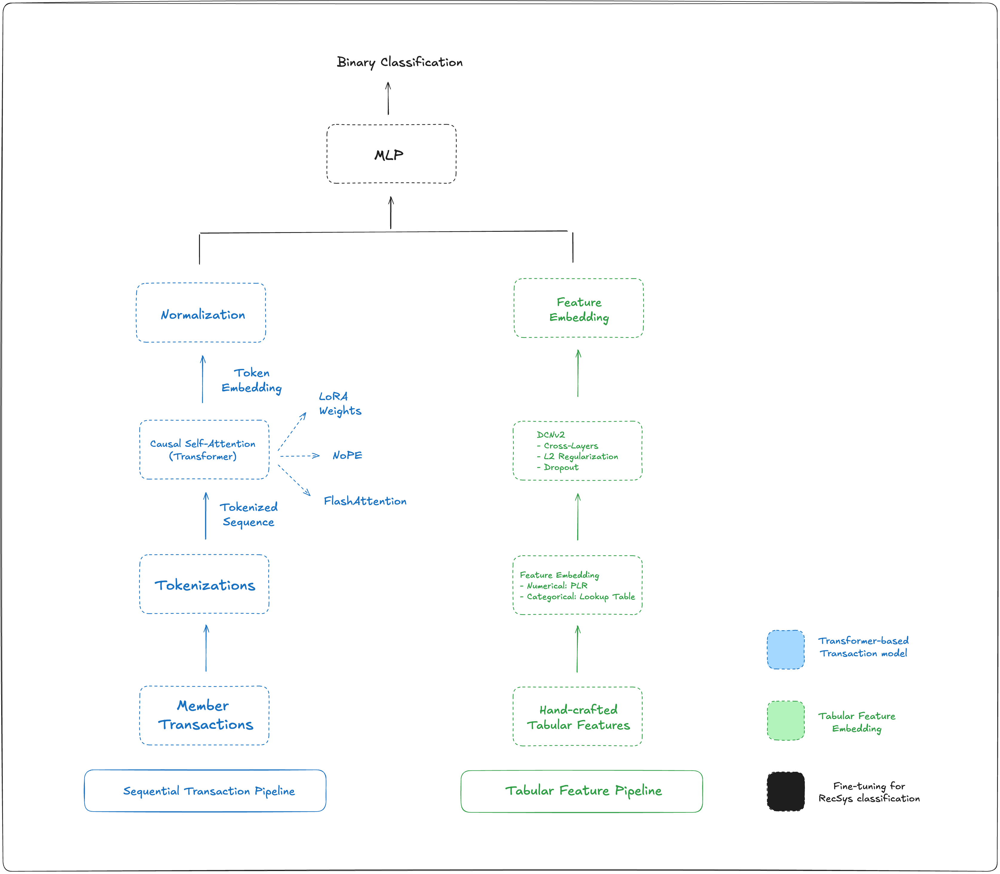

Paper Reading: Your Spending Needs Attention

I've just finished reading the "Your Spending Needs Attention" paper by Nubank.

Not only the results was impressive, but the ML and engineering approach is also very interesting. It shows the power of self-supervised representation learning to automatically understand user behavior from raw data, which made me think how much insightful representations we are missing from not using it (engineering and money trade-off comes to mind).

Transformer-based model:
> Text is All You Need: Individual transactions are tokenized, concatenated into a transaction string, and fed through a Transformer [0] to produce a transaction sequence embedding.
> No Positional Embeddings (NoPE) [1]: drop the temporal information
> FlashAttention [2] + NoPE = Efficient Long Contexts (transaction = ~14 tokens — the sequence get large very fast): the model can train on much larger context lengths

Tabular Features:
> Feature embeddings for numerical and categorical variables
> LightGBM: gradient-boosted tabular modeling
> Deep Cross Network V2 (DCNv2) [3]: learn feature interactions

Fine-Tuning — classification task for RecSys:
> Low-Rank Adaptation (LoRA) [4]: injecting trainable low-rank matrices into attention layers to handle the "overfitting and catastrophic forgetting" issues.
> Late Fusion: freeze the transformer embeddings and use them as static features passed into LightGBM or DCNv2 independently. 
> Joint Fusion (nuFormer): keep the transformer embeddings trainable end-to-end alongside the tabular features.

It's very insightful how joint fusion trains the entire system end-to-end using a DNN, so gradients can flow through the embeddings.

Other insightful ideas from the paper:
> Context window problem: adding more data sources (e.g. financial products) can lead to worse results because of each data source will "compete" for the available tokens for a fixed context window.
> Scaling laws: larger model size, context lengths and data volume lead to improved performance.

---
Paper: https://arxiv.org/abs/2507.23267

---
[0] https://arxiv.org/abs/1706.03762
[1] https://arxiv.org/abs/2305.19466
[2] https://arxiv.org/abs/2205.14135
[3] https://arxiv.org/pdf/2008.13535
[4] https://arxiv.org/abs/2106.09685

---

============================ JOINT FUSION ARCHITECTURE (nuFormer) ============================

      [ SEQUENTIAL TRANSACTION PIPELINE ]                 [ TABULAR FEATURE PIPELINE ]
      -----------------------------------                 ----------------------------
 TODO: Add transaction sources (A, B, C)
             Member Transactions                           Hand-crafted Tabular Features
                      |                                   (e.g., demographics, bureau scores)
                      v                                                 |
            Stringification &                                           |
         Tokenization (BPE, Special)                                    v
                      |                                   +-------------------------------+
                      v                                   |  Feature Embedding Layer      |
             Tokenized Sequence                           |  - Numerical: Periodic Linear |
                      |                                   |    (PLR) Embeddings           |
                      v                                   |  - Categorical: Lookup Table  |
            +-------------------+                         |    Embeddings                 |
            |   Transformer     |                         +-------------------------------+
            |     Layers        | <--- (LoRA weights)                   |
            |  (Causal/GPT)     |                                       v
            +-------------------+                         +-------------------------------+
                      |                                   |  DCNv2 Architecture           |
                      v                                   |  - Cross-Layers               |
           Final Token Embedding                          |  - L2 Regularization          |
                      |                                   |  - Dropout                    |
                      v                                   +-------------------------------+
            +-------------------+                                       |
            |   Normalization   |                                       v
            +-------------------+                          Low-Dimensional Feature Embedding
                      |                                                 |
                      |                                                 |
                      +---------------------> <-------------------------+
                                         |
                                         v
                                [ CONCATENATION ]
                                         |
                                         v
                         +-------------------------------+
                         |    Multi-Layer Perceptron     |
                         |            (MLP)              |
                         +-------------------------------+
                                         |
                                         v
                                  [ FINAL SCORE ]
                               (Binary Classification)
                                         |
                                         v
                      <------------------------------------->
                         [ GRADIENTS PROPAGATE END-TO-END ]